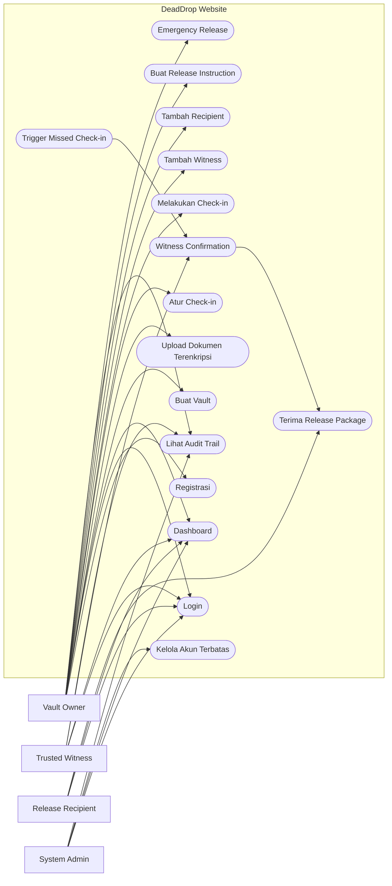
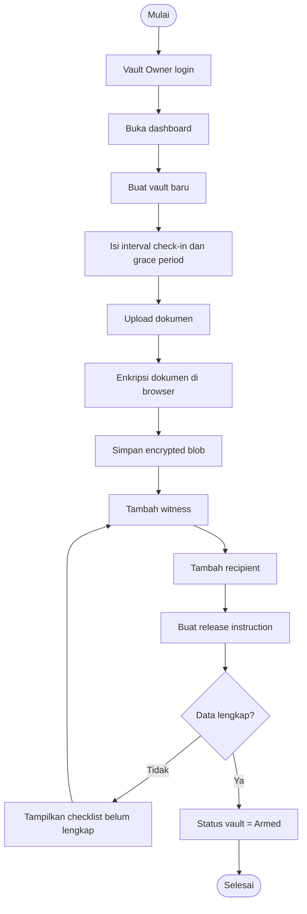
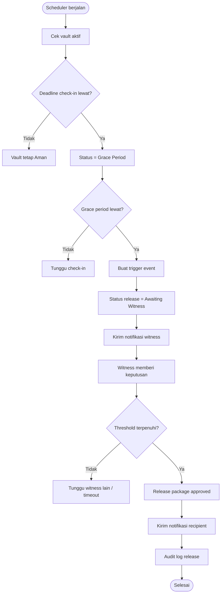
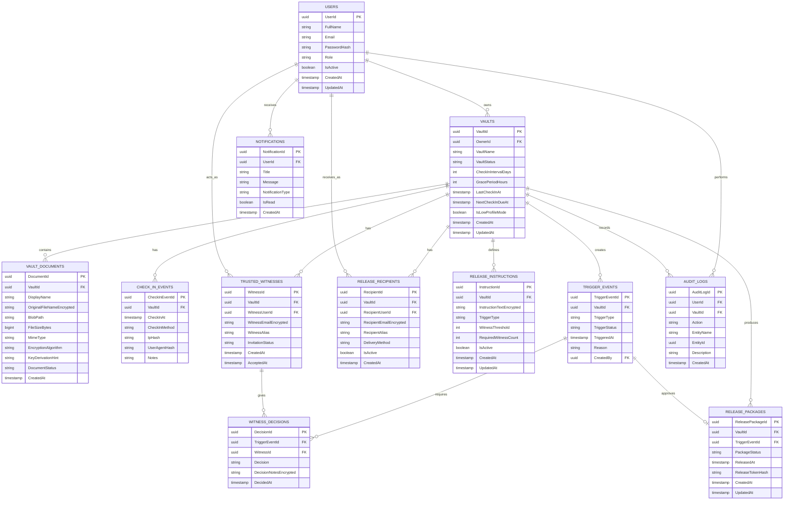

# PRD — DeadDrop

**Nama Produk:** DeadDrop — Privacy-First Digital Dead Man’s Switch Website  
**Kategori Lomba:** Website Development  
**Kompetisi:** FIT Competition 2026  
**Tema:** Digital Impact for Humanitarian Response and Global Well-Being  
**Track:** Track III — Eksploitasi Identitas dan Data  
**Jenis Produk:** Website dinamis berbasis keamanan data, privasi, dan perlindungan bukti digital  
**Target Implementasi MVP:** Live Coding 12 Jam  
**Rekomendasi Stack:** Next.js, TypeScript, Tailwind CSS, WebCrypto API, PostgreSQL/Supabase, Node.js Cron Job, Nodemailer, optional PGP-compatible delivery layer  
**Catatan Etika:** DeadDrop dirancang untuk perlindungan dokumen sensitif, jurnalisme investigatif, advokasi HAM, dan keselamatan pekerja kemanusiaan. Sistem tidak dirancang untuk doxxing, pemerasan, penyebaran data pribadi ilegal, atau publikasi materi berbahaya tanpa verifikasi.

---

# 1. Ringkasan Produk

## 1.1 Nama Produk

**DeadDrop — Privacy-First Digital Dead Man’s Switch Website**

## 1.2 Jenis Produk

DeadDrop adalah website keamanan digital yang membantu jurnalis investigatif, aktivis HAM, whistleblower, pengacara publik, dan pekerja kemanusiaan melindungi dokumen sensitif ketika mereka berada dalam situasi berisiko tinggi.

Website ini menyediakan mekanisme **check-in berkala**, **vault dokumen terenkripsi**, **trusted witness network**, dan **release instruction**. Jika pemilik vault tidak melakukan check-in dalam periode tertentu, sistem dapat memulai proses eskalasi yang melibatkan saksi tepercaya sebelum dokumen dirilis ke penerima yang sudah ditentukan.

Berbeda dari dead man’s switch biasa, DeadDrop tidak langsung merilis dokumen hanya karena pengguna lupa check-in. Sistem dirancang dengan beberapa lapisan pengaman seperti grace period, witness confirmation, manual emergency release, dan audit trail agar risiko false trigger dapat ditekan.

## 1.3 Tujuan Utama

Membangun website yang memungkinkan:

1. Pengguna menyimpan dokumen sensitif secara terenkripsi dari sisi client.
2. Server hanya menyimpan encrypted blob dan metadata minimal.
3. Pengguna membuat jadwal check-in berkala.
4. Pengguna menentukan penerima rilis dokumen sebelum situasi darurat terjadi.
5. Sistem memberi peringatan jika jadwal check-in hampir melewati batas.
6. Sistem memulai eskalasi jika pengguna tidak check-in.
7. Trusted witness dapat memverifikasi apakah rilis dokumen memang perlu dilakukan.
8. Dokumen hanya bisa dirilis jika syarat trigger terpenuhi.
9. Seluruh proses memiliki status yang jelas dan dapat diaudit.
10. MVP dapat dibuat realistis dalam live coding 12 jam tanpa mengorbankan arah konsep utama.

---

# 2. Latar Belakang

Di banyak situasi krisis, bukti digital menjadi hal yang sangat penting. Bukti tersebut dapat berupa dokumen korupsi, rekaman pelanggaran HAM, data trafficking, catatan kekerasan, arsip investigasi, atau dokumen sensitif lain yang bernilai tinggi bagi kepentingan publik.

Namun, orang yang memegang bukti tersebut sering berada dalam posisi rentan. Contohnya:

* jurnalis investigatif yang mendapat tekanan,
* aktivis HAM di wilayah konflik,
* pengacara publik yang mendampingi korban,
* whistleblower korporat atau pemerintahan,
* relawan kemanusiaan yang mendokumentasikan pelanggaran,
* peneliti atau tenaga medis di wilayah berisiko tinggi.

Masalah yang sering terjadi:

* dokumen penting hilang karena perangkat disita,
* bukti tidak pernah sampai ke pihak tepercaya,
* pengguna tidak sempat mengirim dokumen sebelum ditangkap atau menghilang,
* penerima tidak tahu kapan harus membuka dokumen,
* penyimpanan cloud biasa masih menyimpan risiko kebocoran,
* rilis otomatis tanpa validasi dapat memicu kesalahan fatal,
* pengguna tidak punya mekanisme aman untuk mengatur rilis bersyarat.

Karena itu, DeadDrop dibuat sebagai website yang menggabungkan perlindungan dokumen, check-in berkala, trusted witness, dan mekanisme release berbasis kondisi.

Alur utama yang ingin dibangun:

**pengguna membuat vault → upload dokumen terenkripsi → mengatur check-in → memilih witness dan recipient → melakukan check-in berkala → jika tidak check-in, sistem eskalasi → witness memverifikasi → dokumen dirilis sesuai instruksi.**

---

# 3. Kesesuaian dengan Tema dan Track

## 3.1 Kesesuaian dengan Tema Besar

Tema FIT Competition 2026 adalah **Digital Impact for Humanitarian Response and Global Well-Being**. DeadDrop sesuai dengan tema tersebut karena fokus pada perlindungan aktor kemanusiaan dan keamanan informasi sensitif dalam situasi krisis.

DeadDrop mendukung aspek tema berikut:

* respons kemanusiaan non-bencana, terutama perlindungan bukti digital,
* keamanan informasi sensitif,
* perlindungan populasi dan pekerja rentan,
* penggunaan teknologi digital untuk mencegah hilangnya bukti,
* mekanisme berbasis data dan status untuk pengambilan keputusan,
* koordinasi antara pemilik dokumen, witness, dan penerima tepercaya,
* keberlanjutan advokasi melalui preservasi bukti.

## 3.2 Kesesuaian dengan Track III

Track yang dipilih adalah **Track III — Eksploitasi Identitas dan Data**.

Fokus Track III adalah perlindungan jejak digital, privasi, dan autentisitas informasi bagi populasi rentan dalam lingkungan dengan risiko keamanan tinggi.

DeadDrop sesuai dengan Track III karena:

1. **Kerangka Privasi**  
   Website menerapkan client-side encryption, metadata minimization, dan akses berbasis role.

2. **Pertukaran Data Aman**  
   Dokumen tidak langsung dibuka oleh server. Dokumen hanya dapat dirilis melalui skenario yang sudah ditentukan.

3. **Integritas dan Arsitektur Sistem**  
   Sistem memiliki audit trail, status rilis, dan arsitektur secure-by-design untuk mencegah penyalahgunaan data sensitif.

---

# 4. Visi Produk

Menyediakan website perlindungan dokumen sensitif yang:

* aman digunakan oleh pengguna berisiko tinggi,
* tidak menyimpan plaintext dokumen di server,
* memiliki check-in mechanism yang mudah dipahami,
* mengurangi risiko false trigger,
* menyediakan witness network untuk validasi rilis,
* memberikan kontrol penuh kepada pemilik vault,
* memiliki UI minimalis, tenang, dan tidak mencolok,
* realistis dibuat sebagai MVP dalam babak final,
* kuat dari sisi inovasi, keamanan, dan relevansi kemanusiaan.

---

# 5. Tujuan Produk

## 5.1 Tujuan Operasional

* Membantu pengguna menyimpan dokumen sensitif secara aman.
* Menyediakan mekanisme check-in berkala.
* Menyediakan eskalasi jika pengguna tidak melakukan check-in.
* Memungkinkan witness memverifikasi kondisi sebelum release.
* Memungkinkan recipient menerima dokumen sesuai instruksi.
* Mengurangi risiko dokumen hilang ketika pengguna berada dalam bahaya.
* Mengurangi risiko server membaca isi dokumen.
* Memberikan status dan audit trail yang jelas.

## 5.2 Tujuan Kompetisi

DeadDrop dirancang agar kuat pada aspek penilaian lomba:

* relevan dengan tema humanitarian response,
* memiliki urgensi masalah yang kuat,
* memiliki novelty tinggi melalui kombinasi dead man’s switch, client-side encryption, dan witness threshold,
* memiliki keunikan software yang jelas dibanding cloud storage biasa,
* memiliki arsitektur sistem yang matang,
* tetap realistis untuk MVP 12 jam,
* dapat dipresentasikan dengan flow demo yang kuat dan mudah dipahami.

---

# 6. Ruang Lingkup Website

## 6.1 Yang Termasuk dalam Website

1. Landing page low-profile.
2. Login dan registrasi pengguna.
3. Dashboard pengguna.
4. Pembuatan vault.
5. Upload dokumen terenkripsi dari sisi client.
6. Daftar dokumen dalam vault.
7. Pengaturan check-in interval.
8. Check-in manual.
9. Countdown status check-in.
10. Grace period sebelum eskalasi.
11. Manajemen trusted witness.
12. Manajemen recipient.
13. Release instruction.
14. Trigger rule dasar berbasis missed check-in.
15. Witness confirmation.
16. Emergency release now.
17. Status vault.
18. Audit trail aktivitas.
19. Simulasi trigger untuk demo.
20. Dashboard witness.
21. Dashboard recipient.
22. Mode tampilan minimal/low-profile.

## 6.2 Yang Tidak Termasuk dalam MVP

1. Integrasi berita otomatis untuk mendeteksi penangkapan.
2. Web scraping kondisi eksternal.
3. Blockchain.
4. Aplikasi mobile native.
5. Browser extension.
6. Enkripsi hardware security key.
7. Multi-device secure sync kompleks.
8. Full implementation hidden volume seperti VeraCrypt.
9. Public leak portal.
10. Integrasi identitas pemerintah.
11. Secure messaging end-to-end kompleks.
12. Automatic public publishing ke media sosial.

## 6.3 Batasan MVP 12 Jam

Untuk live coding 12 jam, fitur difokuskan pada:

1. login sederhana,
2. dashboard vault owner,
3. upload file dan enkripsi client-side,
4. penyimpanan encrypted blob,
5. check-in timer,
6. release instruction sederhana,
7. witness approval simulasi,
8. trigger missed check-in,
9. email notification ke recipient,
10. audit log,
11. UI dashboard yang jelas.

---

# 7. Role Pengguna

## 7.1 Vault Owner

Vault Owner adalah pengguna utama yang menyimpan dokumen sensitif dan mengatur kondisi rilis.

### Tugas Utama Vault Owner

* Registrasi dan login.
* Membuat vault.
* Upload dokumen ke vault.
* Mengatur jadwal check-in.
* Melakukan check-in berkala.
* Menambah trusted witness.
* Menambah recipient.
* Membuat release instruction.
* Melihat countdown check-in.
* Melihat status vault.
* Melakukan emergency release.
* Melihat audit trail.

## 7.2 Trusted Witness

Trusted Witness adalah pihak tepercaya yang bertugas memberi konfirmasi ketika terjadi trigger.

### Tugas Utama Trusted Witness

* Menerima undangan witness.
* Login ke dashboard witness.
* Melihat permintaan konfirmasi.
* Memberi keputusan confirm atau reject release.
* Menambahkan catatan konfirmasi.
* Melihat riwayat permintaan witness.

## 7.3 Release Recipient

Release Recipient adalah pihak yang ditentukan untuk menerima dokumen jika kondisi rilis terpenuhi.

### Tugas Utama Release Recipient

* Menerima notifikasi rilis.
* Mengakses release package jika diizinkan.
* Melihat instruksi yang disiapkan oleh Vault Owner.
* Mengunduh file terenkripsi atau menerima file yang sudah dirilis sesuai skenario MVP.
* Melihat catatan release.

## 7.4 System Admin

System Admin bertanggung jawab pada operasional sistem, tetapi tidak memiliki akses ke plaintext dokumen.

### Tugas Utama System Admin

* Melihat statistik sistem.
* Mengelola akun bermasalah.
* Melihat audit sistem.
* Menonaktifkan akun jika melanggar ketentuan.
* Tidak dapat membaca isi dokumen vault.
* Tidak dapat memaksa release tanpa aturan sistem.

---

# 8. Matriks Hak Akses

| Fitur | Vault Owner | Trusted Witness | Release Recipient | System Admin |
| --- | ---: | ---: | ---: | ---: |
| Registrasi akun | Ya | Via undangan | Via undangan | Tidak |
| Login | Ya | Ya | Ya | Ya |
| Dashboard | Ya | Ya | Ya | Ya |
| Buat vault | Ya | Tidak | Tidak | Tidak |
| Upload dokumen | Ya | Tidak | Tidak | Tidak |
| Lihat dokumen sendiri | Ya | Tidak | Setelah release | Tidak |
| Baca plaintext dokumen | Hanya owner | Tidak | Setelah release valid | Tidak |
| Atur check-in | Ya | Tidak | Tidak | Tidak |
| Melakukan check-in | Ya | Tidak | Tidak | Tidak |
| Tambah witness | Ya | Tidak | Tidak | Tidak |
| Tambah recipient | Ya | Tidak | Tidak | Tidak |
| Buat release instruction | Ya | Tidak | Tidak | Tidak |
| Emergency release | Ya | Tidak | Tidak | Tidak |
| Konfirmasi release | Tidak | Ya | Tidak | Tidak |
| Terima release package | Tidak | Tidak | Ya | Tidak |
| Lihat audit vault | Ya | Terbatas | Terbatas | Metadata sistem |
| Kelola akun | Tidak | Tidak | Tidak | Terbatas |
| Baca encrypted blob | Tidak berguna tanpa key | Tidak | Tidak | Tidak berguna tanpa key |

---

# 9. Gambaran Umum Alur Website

1. Vault Owner membuka website DeadDrop.
2. Vault Owner registrasi dan login.
3. Vault Owner membuat vault baru.
4. Vault Owner mengatur check-in interval, misalnya 3, 7, atau 14 hari.
5. Vault Owner upload dokumen sensitif.
6. Browser mengenkripsi dokumen sebelum dikirim ke server.
7. Server menyimpan encrypted blob dan metadata minimal.
8. Vault Owner menambahkan trusted witness.
9. Vault Owner menambahkan release recipient.
10. Vault Owner membuat release instruction.
11. Vault Owner melakukan check-in berkala.
12. Jika check-in terlewat, sistem memasuki grace period.
13. Jika grace period tetap terlewat, sistem membuat trigger event.
14. Trusted Witness menerima permintaan konfirmasi.
15. Jika threshold witness terpenuhi, sistem mengaktifkan release package.
16. Recipient menerima notifikasi.
17. Audit log mencatat seluruh perubahan status.

---

# 10. Fitur Utama Website

## 10.1 Landing Page Low-Profile

### Deskripsi

Landing page menjelaskan DeadDrop sebagai privacy-first secure vault tanpa visual yang terlalu mencolok.

### Subfitur

* Hero section sederhana.
* Penjelasan masalah.
* Penjelasan cara kerja.
* Penekanan pada client-side encryption.
* Call-to-action login/register.
* Tanpa publikasi daftar pengguna atau dokumen.

### Output Halaman

| Komponen | Bentuk Tampilan |
| --- | --- |
| Hero | Headline dan subheadline |
| Problem section | Teks ringkas |
| Workflow | Step card |
| Security promise | Card fitur |
| CTA | Tombol masuk |

---

## 10.2 Registrasi dan Login

### Deskripsi

Fitur autentikasi untuk membedakan role dan melindungi akses dashboard.

### Subfitur

* Registrasi Vault Owner.
* Login semua role.
* Logout.
* Validasi email dan password.
* Role-based redirect.
* Session management.
* Akun aktif/nonaktif.

---

## 10.3 Dashboard Vault Owner

### Tujuan

Memberikan gambaran cepat tentang status vault, check-in, witness, recipient, dan risiko release.

### Informasi yang Ditampilkan

**A. Summary Cards**

1. Status vault.
2. Sisa waktu check-in.
3. Jumlah dokumen terenkripsi.
4. Jumlah witness aktif.
5. Jumlah recipient.
6. Status trigger.
7. Status release instruction.

**B. Tabel Cepat**

1. Dokumen terbaru.
2. Witness list.
3. Recipient list.
4. Audit log terbaru.

**C. Alert**

1. Check-in hampir melewati batas.
2. Witness belum menerima undangan.
3. Release instruction belum lengkap.
4. Vault sedang dalam grace period.

---

## 10.4 Encrypted Document Vault

### Deskripsi

Vault adalah tempat penyimpanan dokumen sensitif. Dokumen harus dienkripsi di browser sebelum dikirim ke server.

### Subfitur

* Buat vault.
* Upload dokumen.
* Enkripsi client-side.
* Simpan encrypted blob.
* Lihat daftar dokumen.
* Hapus dokumen.
* Unduh encrypted blob.
* Status dokumen.

### Data Dokumen

* ID dokumen.
* Vault ID.
* Nama file terenkripsi atau disamarkan.
* Ukuran file.
* MIME type.
* Encryption algorithm.
* Encrypted blob path.
* Created at.

---

## 10.5 Check-in Mechanism

### Deskripsi

Check-in adalah mekanisme utama untuk memastikan Vault Owner masih aman dan aktif.

### Subfitur

* Atur interval check-in: 3, 7, 14, atau custom.
* Manual check-in.
* Countdown check-in.
* Grace period.
* Status check-in.
* Simulasi missed check-in untuk demo.

### Status Check-in

1. Aman.
2. Mendekati Deadline.
3. Grace Period.
4. Missed Check-in.
5. Triggered.

---

## 10.6 Release Instruction

### Deskripsi

Release instruction adalah aturan tentang apa yang harus dilakukan jika kondisi release terpenuhi.

### Data Release Instruction

* Vault ID.
* Pesan untuk recipient.
* Daftar dokumen yang akan dirilis.
* Trigger type.
* Witness threshold.
* Delivery method.
* Status aktif.

### Trigger MVP

Trigger utama pada MVP:

```text
Jika Vault Owner tidak check-in sampai deadline + grace period,
maka sistem membuat trigger event dan meminta witness confirmation.
```

### Trigger Lanjutan

Trigger lanjutan untuk versi berikutnya:

* missed check-in + witness confirmation,
* manual emergency release,
* verified external event,
* scheduled release,
* revocation by owner sebelum trigger final.

---

## 10.7 Trusted Witness Network

### Deskripsi

Trusted witness network digunakan untuk mengurangi risiko false trigger. Release tidak langsung dilakukan hanya karena owner lupa check-in.

### Subfitur

* Tambah witness.
* Kirim undangan witness.
* Witness menerima/menolak undangan.
* Threshold approval.
* Witness memberi catatan.
* Riwayat witness decision.

### Contoh Threshold

| Skema | Keterangan |
| --- | --- |
| 1 dari 1 | Cepat, tetapi risiko false trigger tinggi |
| 2 dari 3 | Seimbang untuk keamanan dan validasi |
| 3 dari 5 | Lebih kuat, tetapi lebih lambat |

### Catatan MVP

Pada MVP, Shamir’s Secret Sharing dapat dijelaskan sebagai desain lanjutan. Implementasi live coding dapat menggunakan simulasi threshold approval terlebih dahulu agar realistis.

---

## 10.8 Release Package

### Deskripsi

Release package adalah paket dokumen dan instruksi yang dapat diberikan kepada recipient setelah syarat release terpenuhi.

### Subfitur

* Buat release package.
* Pilih dokumen untuk release.
* Tambah pesan/instruksi.
* Tetapkan recipient.
* Status package.
* Kirim notifikasi release.

### Status Release Package

1. Draft.
2. Armed.
3. Triggered.
4. Awaiting Witness.
5. Approved.
6. Released.
7. Cancelled.

---

## 10.9 Emergency Release Now

### Deskripsi

Fitur untuk Vault Owner merilis dokumen secara manual jika merasa berada dalam ancaman langsung.

### Subfitur

* Tombol emergency release.
* Konfirmasi ganda.
* Ringkasan konsekuensi.
* Aktivasi release package.
* Audit log.
* Notifikasi recipient.

### Validasi

* Owner harus login.
* Owner harus memasukkan passphrase ulang.
* Owner harus mengonfirmasi peringatan.
* Status vault harus aktif.

---

## 10.10 Decoy Workspace / Low-Profile Mode

### Deskripsi

Low-profile mode membuat tampilan website tidak mencolok dan tidak menampilkan informasi sensitif di halaman awal dashboard.

### Subfitur

* Tampilan seperti note workspace sederhana.
* Nama file dapat disamarkan.
* Informasi sensitif tidak ditampilkan di sidebar.
* Vault detail hanya muncul setelah re-authentication.

### Catatan Keamanan

MVP cukup menampilkan mode visual low-profile. Implementasi hidden volume kriptografis penuh tidak termasuk dalam MVP karena kompleks dan membutuhkan audit keamanan serius.

---

## 10.11 Audit Trail

### Deskripsi

Audit trail mencatat aktivitas penting agar perubahan status dapat dilacak.

### Aktivitas yang Dicatat

* Login.
* Upload dokumen.
* Perubahan check-in interval.
* Check-in berhasil.
* Missed check-in.
* Trigger event dibuat.
* Witness memberi keputusan.
* Release package approved.
* Release package dikirim.
* Emergency release.

### Catatan Privasi

Audit trail tidak menyimpan isi dokumen atau plaintext sensitif.

---

## 10.12 Dashboard Witness

### Tujuan

Memudahkan witness melihat permintaan konfirmasi release.

### Informasi yang Ditampilkan

1. Daftar vault yang mengundang witness.
2. Status undangan.
3. Permintaan konfirmasi aktif.
4. Deadline konfirmasi.
5. Tombol confirm/reject.
6. Catatan keputusan.
7. Riwayat keputusan.

---

## 10.13 Dashboard Recipient

### Tujuan

Memudahkan recipient melihat release package yang sudah sah dirilis.

### Informasi yang Ditampilkan

1. Daftar release package.
2. Nama owner atau alias.
3. Pesan release.
4. Waktu release.
5. Daftar file.
6. Tombol download.
7. Catatan integritas.

---

## 10.14 System Admin Dashboard

### Tujuan

Memberikan pengawasan operasional tanpa akses plaintext dokumen.

### Informasi yang Ditampilkan

1. Total user.
2. Total vault.
3. Total encrypted blob.
4. Total trigger event.
5. Total release event.
6. Akun flagged.
7. Audit sistem.

---

# 11. Use Case Utama

## 11.1 Use Case List

1. Registrasi Vault Owner.
2. Login.
3. Buat vault.
4. Upload dokumen terenkripsi.
5. Atur check-in interval.
6. Melakukan check-in.
7. Tambah trusted witness.
8. Tambah recipient.
9. Buat release instruction.
10. Trigger missed check-in.
11. Witness confirmation.
12. Emergency release.
13. Terima release package.
14. Lihat audit trail.
15. Lihat dashboard sesuai role.

---

# 12. Diagram Use Case



---

# 13. Alur Kerja Sistem

## 13.1 Alur Pembuatan Vault

1. Vault Owner login.
2. Vault Owner membuka dashboard.
3. Vault Owner memilih menu Create Vault.
4. Vault Owner mengisi nama vault, interval check-in, dan grace period.
5. Sistem memvalidasi data.
6. Sistem membuat vault dengan status Draft.
7. Vault Owner mengunggah dokumen.
8. Browser mengenkripsi dokumen.
9. Sistem menyimpan encrypted blob.
10. Vault Owner menambahkan witness dan recipient.
11. Vault Owner membuat release instruction.
12. Status vault berubah menjadi Armed.

## 13.2 Alur Check-in

1. Vault Owner login.
2. Dashboard menampilkan countdown check-in.
3. Vault Owner menekan tombol Check-in.
4. Sistem meminta konfirmasi.
5. Sistem memperbarui last check-in time.
6. Sistem menghitung deadline berikutnya.
7. Audit log mencatat check-in berhasil.
8. Status vault kembali Aman.

## 13.3 Alur Missed Check-in dan Witness Confirmation

1. Scheduler mengecek vault aktif.
2. Sistem menemukan vault melewati deadline check-in.
3. Sistem mengubah status menjadi Grace Period.
4. Jika grace period terlewat, sistem membuat trigger event.
5. Status release package menjadi Awaiting Witness.
6. Witness menerima notifikasi.
7. Witness membuka dashboard.
8. Witness memilih confirm atau reject.
9. Jika jumlah confirm memenuhi threshold, release package approved.
10. Sistem mengirim notifikasi ke recipient.
11. Audit log mencatat release event.

## 13.4 Alur Emergency Release

1. Vault Owner login.
2. Vault Owner membuka vault detail.
3. Vault Owner menekan Emergency Release Now.
4. Sistem meminta passphrase ulang dan konfirmasi ganda.
5. Vault Owner menyetujui.
6. Sistem mengubah status release package menjadi Released.
7. Recipient menerima notifikasi.
8. Audit log mencatat emergency release.

---

# 14. Diagram Aktivitas Pembuatan Vault



---

# 15. Diagram Aktivitas Trigger Release



---

# 16. Kebutuhan Fungsional

## 16.1 Modul Registrasi

* Sistem harus memungkinkan pengguna membuat akun Vault Owner.
* Sistem harus memvalidasi email unik.
* Sistem harus menyimpan password dalam bentuk hash.
* Sistem harus membuat profil pengguna setelah registrasi.

## 16.2 Modul Login

* Sistem harus menerima email dan password.
* Sistem harus memvalidasi kredensial.
* Sistem harus mengecek status akun aktif.
* Sistem harus mengarahkan user ke dashboard sesuai role.

## 16.3 Modul Dashboard

* Sistem harus menampilkan dashboard berbeda untuk Vault Owner, Witness, Recipient, dan Admin.
* Dashboard Vault Owner harus menampilkan status vault dan check-in.
* Dashboard Witness harus menampilkan permintaan konfirmasi.
* Dashboard Recipient harus menampilkan release package yang sah.
* Dashboard Admin hanya menampilkan metadata operasional.

## 16.4 Modul Vault

* Vault Owner dapat membuat vault.
* Vault Owner dapat mengubah pengaturan vault selama belum triggered.
* Vault Owner dapat mengaktifkan atau menonaktifkan vault.
* Vault harus memiliki status.
* Vault harus terhubung ke owner.

## 16.5 Modul Encrypted Document

* Vault Owner dapat mengunggah dokumen.
* Dokumen harus dienkripsi sebelum dikirim ke server.
* Server hanya menyimpan encrypted blob.
* Sistem harus menyimpan metadata dokumen minimal.
* Vault Owner dapat menghapus dokumen sebelum release.

## 16.6 Modul Check-in

* Vault Owner dapat mengatur interval check-in.
* Sistem harus menyimpan last check-in.
* Sistem harus menghitung next check-in deadline.
* Sistem harus menampilkan countdown.
* Sistem harus mengubah status jika check-in terlewat.

## 16.7 Modul Witness

* Vault Owner dapat menambah witness.
* Sistem harus mengirim undangan witness.
* Witness dapat menerima atau menolak undangan.
* Witness dapat memberi keputusan confirm/reject saat trigger.
* Sistem harus menghitung threshold witness.

## 16.8 Modul Recipient

* Vault Owner dapat menambah recipient.
* Recipient dapat menerima notifikasi release.
* Recipient hanya dapat mengakses release package setelah status valid.
* Recipient tidak dapat melihat vault sebelum release.

## 16.9 Modul Release Instruction

* Vault Owner dapat membuat release instruction.
* Release instruction harus memiliki trigger type.
* Release instruction harus memiliki recipient minimal satu.
* Release instruction harus memiliki witness threshold jika witness mode aktif.
* Sistem harus menjalankan release berdasarkan status trigger.

## 16.10 Modul Audit Trail

* Sistem harus mencatat aktivitas penting.
* Audit log tidak boleh menyimpan plaintext dokumen.
* Owner dapat melihat audit vault miliknya.
* Admin dapat melihat audit metadata sistem.

---

# 17. Kebutuhan Non-Fungsional

1. Website harus responsif untuk desktop dan mobile browser.
2. Website harus memiliki UI minimalis dan tidak mencolok.
3. Dokumen harus dienkripsi dari sisi client sebelum upload.
4. Server tidak boleh menyimpan plaintext dokumen.
5. Server tidak boleh menyimpan passphrase asli.
6. Password harus disimpan dalam bentuk hash.
7. Role-based access control wajib diterapkan.
8. Data sensitif harus diminimalkan.
9. Sistem harus memiliki audit trail.
10. Sistem harus menampilkan status check-in dengan jelas.
11. Sistem harus cukup ringan untuk demo live coding 12 jam.
12. MVP harus bisa didemokan end-to-end.
13. Semua input wajib divalidasi di frontend dan backend.
14. Desain keamanan harus dijelaskan secara transparan pada proposal.
15. Fitur kriptografi lanjutan harus ditandai sebagai roadmap jika tidak sempat diimplementasikan penuh.

---

# 18. Aturan Bisnis

1. Setiap akun hanya memiliki satu role utama.
2. Vault hanya dapat dibuat oleh Vault Owner.
3. Vault Owner hanya dapat melihat vault miliknya sendiri.
4. Dokumen harus dienkripsi sebelum dikirim ke server.
5. Vault belum dapat diaktifkan jika belum memiliki minimal satu dokumen, satu recipient, dan release instruction.
6. Check-in hanya dapat dilakukan oleh Vault Owner.
7. Missed check-in tidak langsung merilis dokumen; sistem harus masuk grace period terlebih dahulu.
8. Jika witness mode aktif, release membutuhkan jumlah approval sesuai threshold.
9. Recipient tidak dapat mengakses release package sebelum status Released.
10. System Admin tidak dapat membaca plaintext dokumen.
11. Emergency release hanya dapat dilakukan oleh Vault Owner setelah konfirmasi ulang.
12. Vault yang sudah Released tidak dapat kembali menjadi Armed tanpa membuat release package baru.
13. Audit log tidak boleh dihapus oleh user biasa.
14. User nonaktif tidak dapat login.
15. Witness yang belum menerima undangan tidak dihitung dalam threshold.
16. Recipient harus sudah ditentukan sebelum vault armed.
17. Release instruction harus jelas dan tidak boleh kosong.

---

# 19. Validasi Data

* Email tidak boleh kosong.
* Email harus unik.
* Password tidak boleh kosong.
* Password minimal 8 karakter.
* Nama vault tidak boleh kosong.
* Check-in interval harus lebih dari 0 hari.
* Grace period harus lebih dari atau sama dengan 0 jam.
* File dokumen tidak boleh kosong.
* Ukuran file mengikuti batas maksimal sistem.
* Recipient email harus valid.
* Witness email harus valid.
* Witness threshold tidak boleh lebih besar dari jumlah witness aktif.
* Release instruction tidak boleh kosong.
* Emergency release harus meminta konfirmasi ulang.
* Status vault hanya boleh menggunakan status yang ditentukan.
* Status release package hanya boleh menggunakan status yang ditentukan.

---

# 20. Use Case Specification

## 20.1 Use Case — Registrasi Vault Owner

| Elemen | Deskripsi |
| --- | --- |
| Nama | Registrasi Vault Owner |
| Aktor | Vault Owner |
| Tujuan | Membuat akun pengguna utama |
| Prasyarat | Pengguna belum memiliki akun |
| Alur Utama | 1. Pengguna membuka halaman registrasi. 2. Pengguna mengisi nama, email, dan password. 3. Sistem memvalidasi email unik. 4. Sistem menyimpan akun dengan role Vault Owner. 5. Sistem mengarahkan pengguna ke login atau dashboard. |
| Hasil | Akun Vault Owner berhasil dibuat |

## 20.2 Use Case — Buat Vault

| Elemen | Deskripsi |
| --- | --- |
| Nama | Buat Vault |
| Aktor | Vault Owner |
| Tujuan | Membuat ruang penyimpanan dokumen terenkripsi |
| Prasyarat | User login sebagai Vault Owner |
| Alur Utama | 1. Owner membuka menu Create Vault. 2. Owner mengisi nama vault, interval check-in, dan grace period. 3. Sistem memvalidasi data. 4. Sistem membuat vault dengan status Draft. |
| Hasil | Vault baru berhasil dibuat |

## 20.3 Use Case — Upload Dokumen Terenkripsi

| Elemen | Deskripsi |
| --- | --- |
| Nama | Upload Dokumen Terenkripsi |
| Aktor | Vault Owner |
| Tujuan | Menyimpan dokumen sensitif tanpa plaintext di server |
| Prasyarat | Vault sudah dibuat |
| Alur Utama | 1. Owner memilih file. 2. Browser mengenkripsi file. 3. Sistem mengirim encrypted blob ke server. 4. Server menyimpan encrypted blob dan metadata minimal. |
| Hasil | Dokumen tersimpan dalam bentuk terenkripsi |

## 20.4 Use Case — Check-in

| Elemen | Deskripsi |
| --- | --- |
| Nama | Check-in |
| Aktor | Vault Owner |
| Tujuan | Memberi tanda bahwa owner masih aman/aktif |
| Prasyarat | Vault aktif dan belum triggered |
| Alur Utama | 1. Owner membuka dashboard. 2. Owner menekan tombol Check-in. 3. Sistem memperbarui last check-in. 4. Sistem menghitung deadline berikutnya. 5. Audit log mencatat aktivitas. |
| Hasil | Status check-in diperbarui |

## 20.5 Use Case — Witness Confirmation

| Elemen | Deskripsi |
| --- | --- |
| Nama | Witness Confirmation |
| Aktor | Trusted Witness |
| Tujuan | Memvalidasi apakah release perlu dilakukan |
| Prasyarat | Trigger event aktif dan witness mendapat permintaan konfirmasi |
| Alur Utama | 1. Witness login. 2. Witness membuka permintaan aktif. 3. Witness membaca konteks permintaan. 4. Witness memilih confirm atau reject. 5. Sistem menyimpan keputusan. 6. Sistem menghitung threshold. |
| Hasil | Keputusan witness tercatat dan threshold diperbarui |

## 20.6 Use Case — Emergency Release

| Elemen | Deskripsi |
| --- | --- |
| Nama | Emergency Release |
| Aktor | Vault Owner |
| Tujuan | Merilis package secara manual dalam kondisi darurat |
| Prasyarat | Owner login dan vault aktif |
| Alur Utama | 1. Owner membuka vault. 2. Owner menekan Emergency Release Now. 3. Sistem meminta passphrase/konfirmasi ulang. 4. Owner menyetujui. 5. Sistem mengubah status release menjadi Released. 6. Recipient menerima notifikasi. |
| Hasil | Release package aktif dan recipient diberi akses |

## 20.7 Use Case — Terima Release Package

| Elemen | Deskripsi |
| --- | --- |
| Nama | Terima Release Package |
| Aktor | Release Recipient |
| Tujuan | Mengakses dokumen dan instruksi setelah release valid |
| Prasyarat | Release package berstatus Released |
| Alur Utama | 1. Recipient menerima notifikasi. 2. Recipient login atau membuka secure link. 3. Sistem memvalidasi akses. 4. Sistem menampilkan pesan release dan dokumen yang tersedia. |
| Hasil | Recipient dapat mengakses release package |

---

# 21. Desain Database

## 21.1 Daftar Tabel

Versi MVP menggunakan 12 tabel utama:

1. `users`
2. `vaults`
3. `vault_documents`
4. `check_in_events`
5. `trusted_witnesses`
6. `release_recipients`
7. `release_instructions`
8. `trigger_events`
9. `witness_decisions`
10. `release_packages`
11. `audit_logs`
12. `notifications`

Catatan: dashboard tidak membutuhkan tabel khusus karena datanya dihitung dari tabel yang sudah ada menggunakan query.

---

## 21.2 Tabel `users`

Menyimpan akun semua role.

| Kolom | Tipe | Keterangan |
| --- | --- | --- |
| UserId | uuid PK | ID user |
| FullName | varchar | Nama lengkap atau alias |
| Email | varchar unique | Email login |
| PasswordHash | varchar | Password hash |
| Role | varchar | VaultOwner/Witness/Recipient/Admin |
| IsActive | boolean | Status akun |
| CreatedAt | timestamp | Tanggal akun dibuat |
| UpdatedAt | timestamp | Tanggal akun diperbarui |

---

## 21.3 Tabel `vaults`

Menyimpan data vault.

| Kolom | Tipe | Keterangan |
| --- | --- | --- |
| VaultId | uuid PK | ID vault |
| OwnerId | uuid FK | Relasi ke users |
| VaultName | varchar | Nama vault |
| VaultStatus | varchar | Draft/Armed/GracePeriod/Triggered/Released/Disabled |
| CheckInIntervalDays | int | Interval check-in |
| GracePeriodHours | int | Durasi grace period |
| LastCheckInAt | timestamp nullable | Waktu check-in terakhir |
| NextCheckInDueAt | timestamp nullable | Deadline check-in berikutnya |
| IsLowProfileMode | boolean | Status low-profile mode |
| CreatedAt | timestamp | Tanggal dibuat |
| UpdatedAt | timestamp | Tanggal diperbarui |

---

## 21.4 Tabel `vault_documents`

Menyimpan metadata dokumen terenkripsi.

| Kolom | Tipe | Keterangan |
| --- | --- | --- |
| DocumentId | uuid PK | ID dokumen |
| VaultId | uuid FK | Relasi ke vaults |
| DisplayName | varchar | Nama file tampilan |
| OriginalFileNameEncrypted | text nullable | Nama asli dalam bentuk terenkripsi |
| BlobPath | text | Lokasi encrypted blob |
| FileSizeBytes | bigint | Ukuran file |
| MimeType | varchar | MIME type |
| EncryptionAlgorithm | varchar | Contoh AES-256-GCM |
| KeyDerivationHint | varchar nullable | Info derivasi tanpa secret |
| DocumentStatus | varchar | Active/MarkedForRelease/Deleted |
| CreatedAt | timestamp | Tanggal upload |

---

## 21.5 Tabel `check_in_events`

Menyimpan riwayat check-in.

| Kolom | Tipe | Keterangan |
| --- | --- | --- |
| CheckInEventId | uuid PK | ID event |
| VaultId | uuid FK | Relasi ke vaults |
| CheckInAt | timestamp | Waktu check-in |
| CheckInMethod | varchar | Manual/SystemDemo |
| IpHash | varchar nullable | Hash IP untuk audit minimal |
| UserAgentHash | varchar nullable | Hash user agent |
| Notes | text nullable | Catatan opsional |

---

## 21.6 Tabel `trusted_witnesses`

Menyimpan daftar witness untuk vault.

| Kolom | Tipe | Keterangan |
| --- | --- | --- |
| WitnessId | uuid PK | ID witness relation |
| VaultId | uuid FK | Relasi ke vaults |
| WitnessUserId | uuid FK nullable | Akun witness jika sudah terdaftar |
| WitnessEmailEncrypted | text | Email witness terenkripsi |
| WitnessAlias | varchar | Alias witness |
| InvitationStatus | varchar | Pending/Accepted/Rejected/Revoked |
| CreatedAt | timestamp | Tanggal dibuat |
| AcceptedAt | timestamp nullable | Tanggal diterima |

---

## 21.7 Tabel `release_recipients`

Menyimpan penerima release.

| Kolom | Tipe | Keterangan |
| --- | --- | --- |
| RecipientId | uuid PK | ID recipient |
| VaultId | uuid FK | Relasi ke vaults |
| RecipientUserId | uuid FK nullable | Akun recipient jika ada |
| RecipientEmailEncrypted | text | Email recipient terenkripsi |
| RecipientAlias | varchar | Alias recipient |
| DeliveryMethod | varchar | Email/SecureLink |
| IsActive | boolean | Status recipient |
| CreatedAt | timestamp | Tanggal dibuat |

---

## 21.8 Tabel `release_instructions`

Menyimpan instruksi release.

| Kolom | Tipe | Keterangan |
| --- | --- | --- |
| InstructionId | uuid PK | ID instruction |
| VaultId | uuid FK | Relasi ke vaults |
| InstructionTextEncrypted | text | Instruksi terenkripsi |
| TriggerType | varchar | MissedCheckIn/Emergency |
| WitnessThreshold | int | Jumlah witness approval yang dibutuhkan |
| RequiredWitnessCount | int | Jumlah witness minimal |
| IsActive | boolean | Status instruksi |
| CreatedAt | timestamp | Tanggal dibuat |
| UpdatedAt | timestamp | Tanggal diperbarui |

---

## 21.9 Tabel `trigger_events`

Menyimpan event trigger.

| Kolom | Tipe | Keterangan |
| --- | --- | --- |
| TriggerEventId | uuid PK | ID trigger |
| VaultId | uuid FK | Relasi ke vaults |
| TriggerType | varchar | MissedCheckIn/Emergency |
| TriggerStatus | varchar | Created/AwaitingWitness/Approved/Rejected/Released/Cancelled |
| TriggeredAt | timestamp | Waktu trigger |
| Reason | text | Alasan trigger |
| CreatedBy | uuid FK nullable | User/system pembuat |

---

## 21.10 Tabel `witness_decisions`

Menyimpan keputusan witness.

| Kolom | Tipe | Keterangan |
| --- | --- | --- |
| DecisionId | uuid PK | ID keputusan |
| TriggerEventId | uuid FK | Relasi ke trigger_events |
| WitnessId | uuid FK | Relasi ke trusted_witnesses |
| Decision | varchar | Confirm/Reject/Abstain |
| DecisionNotesEncrypted | text nullable | Catatan witness terenkripsi |
| DecidedAt | timestamp | Waktu keputusan |

---

## 21.11 Tabel `release_packages`

Menyimpan package rilis.

| Kolom | Tipe | Keterangan |
| --- | --- | --- |
| ReleasePackageId | uuid PK | ID package |
| VaultId | uuid FK | Relasi ke vaults |
| TriggerEventId | uuid FK nullable | Relasi ke trigger event |
| PackageStatus | varchar | Draft/Armed/AwaitingWitness/Approved/Released/Cancelled |
| ReleasedAt | timestamp nullable | Waktu rilis |
| ReleaseTokenHash | varchar nullable | Hash token akses |
| CreatedAt | timestamp | Tanggal dibuat |
| UpdatedAt | timestamp | Tanggal diperbarui |

---

## 21.12 Tabel `audit_logs`

Menyimpan log aktivitas.

| Kolom | Tipe | Keterangan |
| --- | --- | --- |
| AuditLogId | uuid PK | ID log |
| UserId | uuid FK nullable | User pelaku |
| VaultId | uuid FK nullable | Vault terkait |
| Action | varchar | Nama aksi |
| EntityName | varchar | Nama entitas |
| EntityId | uuid nullable | ID entitas |
| Description | text | Deskripsi aktivitas |
| CreatedAt | timestamp | Tanggal aktivitas |

---

## 21.13 Tabel `notifications`

Menyimpan notifikasi internal.

| Kolom | Tipe | Keterangan |
| --- | --- | --- |
| NotificationId | uuid PK | ID notifikasi |
| UserId | uuid FK | Penerima |
| Title | varchar | Judul |
| Message | text | Isi |
| NotificationType | varchar | CheckIn/Witness/Release/System |
| IsRead | boolean | Status baca |
| CreatedAt | timestamp | Tanggal dibuat |

---

# 22. ERD



---

# 23. Desain Tampilan UI

## 23.1 Konsep UI

Tampilan DeadDrop menggunakan konsep:

* low-profile,
* minimalis,
* tidak mencolok,
* aman,
* fokus pada status,
* mudah digunakan dalam kondisi stres,
* menggunakan visual hierarchy yang jelas,
* tidak menampilkan informasi sensitif secara berlebihan.

## 23.2 Palet Warna

| Elemen | Warna |
| --- | --- |
| Primary Dark | `#0B1020` |
| Secondary Navy | `#172554` |
| Accent Blue | `#2563EB` |
| Safe Green | `#16A34A` |
| Warning Amber | `#F59E0B` |
| Danger Red | `#DC2626` |
| Background | `#F8FAFC` |
| Card | `#FFFFFF` |
| Border | `#E2E8F0` |
| Text Primary | `#0F172A` |
| Text Secondary | `#64748B` |

## 23.3 Warna Status

| Status | Warna Tampilan |
| --- | --- |
| Draft | Abu-abu |
| Armed | Hijau |
| Safe | Hijau |
| Deadline Soon | Kuning |
| Grace Period | Oranye |
| Triggered | Merah |
| Awaiting Witness | Ungu |
| Released | Biru |
| Disabled | Abu-abu |

## 23.4 Halaman Minimal untuk Prototype Figma

Minimal 3 halaman utama:

1. Landing Page Low-Profile.
2. Dashboard Vault Owner.
3. Vault Detail + Check-in Countdown.

Rekomendasi halaman tambahan:

4. Upload Document Flow.
5. Witness Confirmation Page.
6. Release Recipient Page.
7. Audit Trail Page.

---

# 24. Rekomendasi Layout

## 24.1 Layout Landing Page

```text
+-------------------------------------------------------------+
| DeadDrop                                      Login | Register |
+-------------------------------------------------------------+
| Hero: Secure continuity for sensitive evidence              |
| Subtext: Private vault, scheduled check-in, trusted release  |
| CTA: Create secure vault                                    |
|-------------------------------------------------------------|
| Problem: Evidence can disappear when people are silenced     |
|-------------------------------------------------------------|
| How it works: Encrypt -> Check-in -> Verify -> Release       |
|-------------------------------------------------------------|
| Security Cards: Client-side encryption | Witness threshold   |
+-------------------------------------------------------------+
```

## 24.2 Layout Dashboard Vault Owner

```text
+-------------------------------------------------------------+
| DeadDrop | Dashboard                          [Owner Alias]  |
+------------------+------------------------------------------+
| Sidebar          | Card: Vault Status                        |
| - Dashboard      | Card: Next Check-in                       |
| - Vaults         | Card: Documents                           |
| - Witnesses      | Card: Witness Active                      |
| - Recipients     |------------------------------------------|
| - Audit Log      | Countdown Check-in                        |
|                  | [Check-in Now] [Emergency Release]        |
|                  |------------------------------------------|
|                  | Table: Recent Documents                   |
|                  | Table: Recent Audit Logs                  |
+------------------+------------------------------------------+
```

## 24.3 Layout Vault Detail

```text
+-------------------------------------------------------------+
| Vault: Project Orion Evidence               Status: Armed   |
| Next Check-in: 3 days 04 hours                              |
|-------------------------------------------------------------|
| Check-in Panel                                               |
| [Check-in Now] [Change Interval] [Emergency Release Now]     |
|-------------------------------------------------------------|
| Documents                                                   |
| Name | Size | Status | Uploaded At | Action                  |
|-------------------------------------------------------------|
| Witness Network                                             |
| Alias | Status | Last Decision                                |
|-------------------------------------------------------------|
| Release Instruction                                         |
| Trigger | Threshold | Recipients | Status                      |
+-------------------------------------------------------------+
```

## 24.4 Layout Witness Confirmation

```text
+-------------------------------------------------------------+
| Witness Confirmation Request                                |
| Vault Alias: Case Archive 01                                |
| Trigger: Missed check-in                                    |
| Deadline: 12 hours remaining                                |
|-------------------------------------------------------------|
| Context Summary                                             |
| Owner has missed check-in after grace period                 |
|-------------------------------------------------------------|
| [Confirm Release] [Reject Release] [Need More Time]          |
| Notes field                                                 |
+-------------------------------------------------------------+
```

---

# 25. Ide Copywriting Utama

## 25.1 Headline

**Evidence should not disappear when people do.**

## 25.2 Subheadline

DeadDrop helps at-risk journalists, human rights workers, and whistleblowers protect sensitive evidence through encrypted vaults, scheduled check-ins, and trusted release verification.

## 25.3 Value Proposition

* Encrypt before upload.
* Check in before the deadline.
* Let trusted witnesses verify emergencies.
* Release only when conditions are met.
* Keep servers blind to sensitive content.

---

# 26. Risiko dan Solusi

## 26.1 Risiko

* False trigger dapat merilis dokumen terlalu cepat.
* Pengguna lupa check-in.
* Witness tidak merespons tepat waktu.
* Implementasi kriptografi terlalu kompleks untuk MVP.
* Ide dapat dianggap sensitif secara etis jika tidak dijelaskan dengan hati-hati.
* Penerima release dapat menyalahgunakan dokumen.
* Server tetap menyimpan metadata yang bisa berisiko.

## 26.2 Solusi

* Gunakan grace period sebelum trigger.
* Gunakan witness threshold.
* Kirim reminder sebelum deadline.
* MVP menggunakan enkripsi client-side sederhana dan menjelaskan desain kriptografi lanjutan sebagai roadmap.
* Tambahkan ethical use policy.
* Release hanya ke recipient yang sudah ditentukan, bukan publik otomatis.
* Terapkan metadata minimization.
* Jelaskan bahwa admin tidak bisa membaca isi dokumen.
* Gunakan audit trail untuk transparansi status.

---

# 27. Rencana Implementasi MVP 12 Jam

## 27.1 Prioritas Utama

1. Setup project Next.js.
2. Setup database.
3. Buat login sederhana.
4. Buat dashboard Vault Owner.
5. Buat create vault.
6. Buat upload dokumen dan client-side encryption.
7. Simpan encrypted blob.
8. Buat check-in timer.
9. Buat witness dan recipient management sederhana.
10. Buat trigger missed check-in simulasi.
11. Buat witness confirmation.
12. Buat release notification simulasi/email.
13. Buat audit log.
14. Polishing UI.

## 27.2 Pembagian Waktu

| Waktu | Fokus |
| --- | --- |
| Jam 1 | Setup project, routing, layout |
| Jam 2 | Database schema dan seed data |
| Jam 3 | Auth sederhana dan role guard |
| Jam 4 | Dashboard Vault Owner |
| Jam 5 | CRUD vault dan setting check-in |
| Jam 6 | Upload file dan WebCrypto encryption |
| Jam 7 | Document list dan metadata |
| Jam 8 | Witness dan recipient management |
| Jam 9 | Check-in timer dan status vault |
| Jam 10 | Trigger simulation dan witness confirmation |
| Jam 11 | Release package dan audit log |
| Jam 12 | UI polish, responsive, demo flow |

---

# 28. Acceptance Criteria

## 28.1 Landing Page

* User dapat membuka landing page.
* Informasi konsep DeadDrop tampil jelas.
* Tombol login/register tersedia.

## 28.2 Login

* User dapat login dengan akun valid.
* User diarahkan ke dashboard sesuai role.
* User tidak dapat mengakses halaman role lain.

## 28.3 Vault

* Vault Owner dapat membuat vault.
* Vault Owner dapat mengatur interval check-in.
* Status vault tampil jelas.

## 28.4 Dokumen

* Vault Owner dapat upload file.
* File dienkripsi di browser sebelum dikirim.
* Server menyimpan encrypted blob dan metadata.
* Dokumen tampil di daftar vault.

## 28.5 Check-in

* Countdown check-in tampil.
* Vault Owner dapat melakukan check-in.
* Sistem memperbarui next deadline.
* Audit log mencatat check-in.

## 28.6 Trigger dan Witness

* Sistem dapat mensimulasikan missed check-in.
* Witness dapat memberi keputusan confirm/reject.
* Sistem menghitung threshold approval.
* Status release berubah sesuai keputusan.

## 28.7 Release Package

* Release package dapat berubah menjadi Released jika syarat terpenuhi.
* Recipient dapat melihat release package setelah status valid.
* Audit log mencatat release.

---

# 29. Keunggulan Ide untuk Proposal

DeadDrop kuat untuk proposal karena:

1. Masalahnya spesifik dan tidak generik.
2. Relevan dengan Track III tentang privasi, identitas, dan keamanan data.
3. Memiliki novelty tinggi melalui kombinasi dead man’s switch, client-side encryption, dan trusted witness threshold.
4. Berbeda dari cloud storage, notes app, atau secure drive biasa.
5. Punya konteks kemanusiaan yang jelas: jurnalis, aktivis HAM, whistleblower, dan pekerja krisis.
6. MVP tetap realistis untuk dibuat dalam 12 jam.
7. UI/UX bisa dibuat kuat karena fokus pada dashboard, countdown, status, dan emergency flow.
8. Database berelasi jelas.
9. Arsitektur secure-by-design dapat dijelaskan dengan baik.
10. Risiko dan etika bisa dibahas matang sehingga proposal terlihat dewasa.

---

# 30. Kesimpulan

DeadDrop adalah ide website yang kuat untuk FIT Competition 2026 karena menggabungkan keamanan digital, perlindungan bukti, respons kemanusiaan, dan privasi data dalam satu solusi yang fokus.

Nilai utama DeadDrop bukan hanya menyimpan dokumen, tetapi memastikan dokumen penting tetap memiliki jalur aman untuk sampai ke pihak tepercaya ketika pemiliknya berada dalam risiko. Dengan client-side encryption, check-in mechanism, trusted witness network, dan release instruction, DeadDrop menjadi solusi website yang relevan, inovatif, dan realistis untuk Track III — Eksploitasi Identitas dan Data.

Untuk babak final, MVP dapat difokuskan pada upload terenkripsi, check-in timer, trigger simulasi, witness approval, dan release notification. Dengan scope tersebut, DeadDrop tetap feasible dibuat dalam 12 jam tetapi terlihat kuat secara konsep, teknis, dan dampak kemanusiaan.
