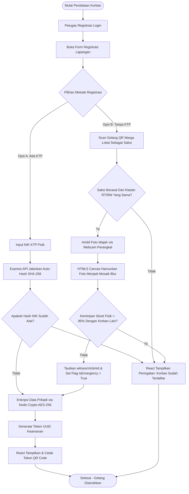
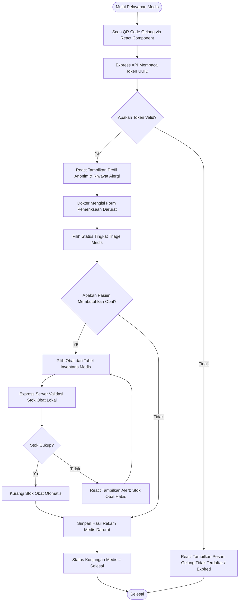
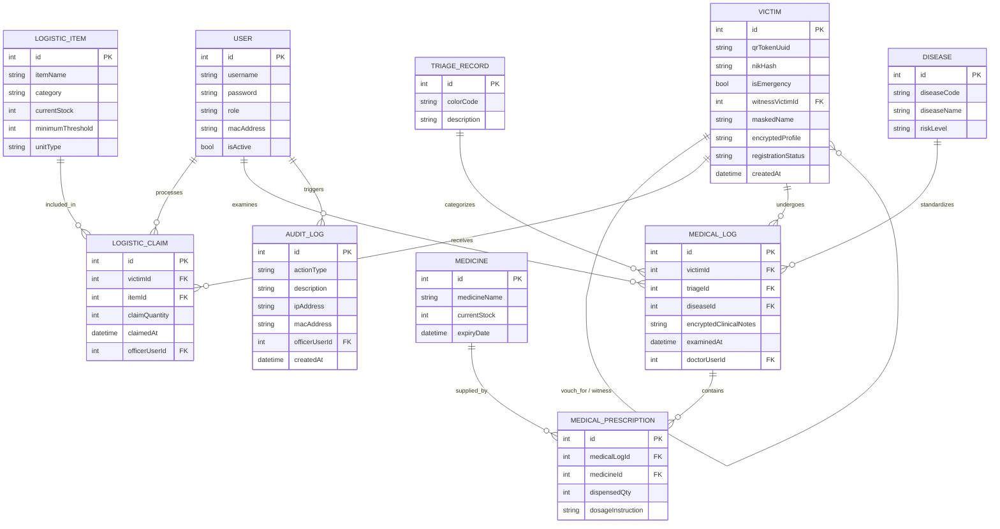
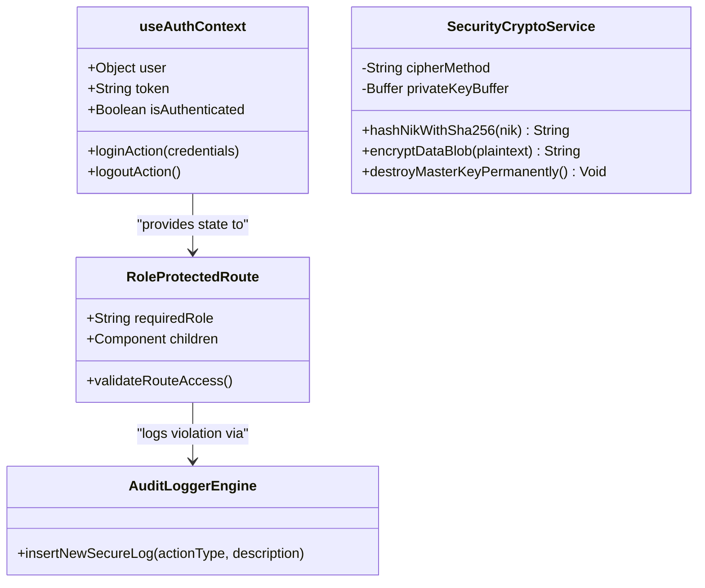
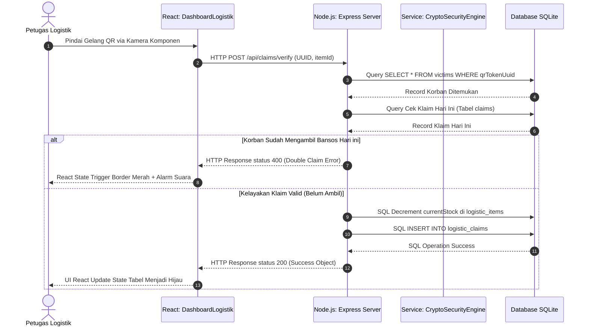
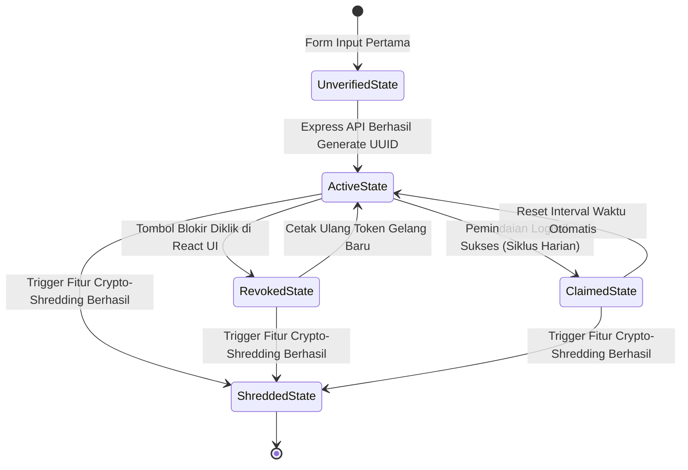
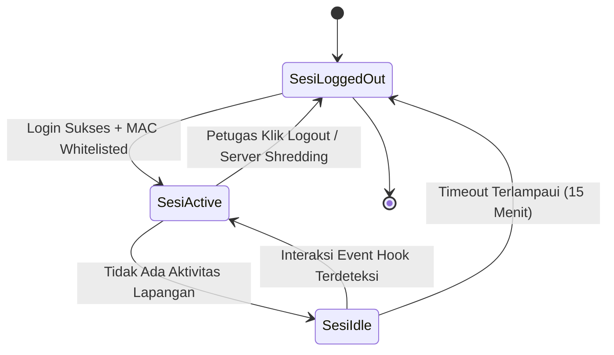

# PRODUCT REQUIREMENT DOCUMENT (PRD)
## SADANA — SISTEM AMAN DISTRIBUSI BANTUAN DAN MANAJEMEN BENCANA

---

**Platform:** Web Application (Responsive Dashboard) menggunakan Next.js (App Router) + Tailwind CSS + Context API</br>
**Backend Lokal:** Node.js (Express.js Router) + Prisma ORM Client Engine</br>
**Database:** SQLite (Local Server Portable / Single-File Database Engine)</br>
**Tema UI:** High-Contrast Safety (Biru Tua, Orange, Putih)</br>
**Role Auth:** Komandan Posko (Admin), Petugas Registrasi, Petugas Logistik, Petugas Medis

---

# 1. Ringkasan Produk

## 1.1 Nama Produk
**SADANA — Sistem Aman Distribusi Bantuan dan Manajemen Bencana**

## 1.2 Jenis Produk
SADANA adalah platform manajemen operasional penanggulangan bencana berbasis web dengan arsitektur *Offline-First* dan *Secure-by-Design*. Sistem ini dioperasikan sepenuhnya oleh petugas di lapangan secara internal menggunakan jaringan *mesh* atau lokal tanpa ketergantungan internet penuh untuk mengelola pendaftaran korban, distribusi bantuan logistik, rekam medis darurat, analitik data terenkripsi, serta pelacakan forensik aktivitas internal demi mencegah eksploitasi data populasi rentan.

## 1.3 Tujuan Utama
Meningkatkan efisiensi dan keamanan tata kelola posko bencana melalui implementasi:
1. **Registrasi Anonim Berbasis Kriptografi:** Petugas registrasi mendata korban menggunakan NIK/IKD/Paspor yang langsung diubah menjadi hash unik sekali pakai ($\text{SHA-256}$) dipadukan dengan garam dinamis di RAM server guna meminimalkan risiko eksploitasi identitas.
2. **Identifikasi Berbasis Token Fisik (QR Wristband):** Korban mendapatkan gelang identitas QR Code yang berfungsi sebagai kunci otorisasi anonim untuk mengklaim logistik bantuan dan layanan medis harian.
3. **Pemisahan Hak Akses Ketat (RBAC):** Petugas logistik hanya dapat melihat kelayakan klaim bantuan, sedangkan petugas medis hanya memiliki akses ke rekam medis darurat tanpa mengetahui identitas asli korban.
4. **Mekanisme Pasca-Bencana Aman (Crypto-Shredding):** Sistem menyediakan fitur penghancuran kunci enkripsi (*Master Key*) secara instan dari memori RAM setelah masa tanggap darurat selesai untuk memastikan tidak ada jejak digital data sensitif yang tertinggal pada perangkat lokal lapangan.
5. **Arsitektur Jaringan Tangguh (Offline-First):** Memastikan sistem dapat bekerja 100% menggunakan server lokal portabel (seperti laptop utama atau Raspberry Pi) yang dihubungkan melalui router Wi-Fi lokal di area bencana tanpa koneksi internet.
6. **Global Search Terproteksi untuk Komandan:** Menyediakan modul pencarian terpusat berbasis kriptografi *client-side tokenization* yang hanya dapat diakses oleh akun Komandan Posko, di mana setiap aktivitas pencarian wajib dicatat oleh sistem ke dalam *Append-Only Audit Log*.

---

# 2. Latar Belakang

Pada situasi darurat pascabencana alam atau krisis kemanusiaan, alur birokrasi distribusi bantuan sosial (bansos) konvensional sering kali mewajibkan pengumpulan dokumen fisik berupa fotokopi KTP atau Kartu Keluarga (KK). Lembaran dokumen fisik ini biasanya menumpuk secara acak di posko-posko darurat tanpa sistem pengamanan yang memadai. Petugas lapangan yang kurang terlatih (OKNUM) juga kerap mencatat data pribadi korban menggunakan media digital publik seperti Google Sheets yang dibagikan secara bebas melalui grup WhatsApp.

Kondisi tersebut menciptakan celah eksploitasi data yang sangat masif bagi oknum tidak bertanggung jawab. Kasus pencurian identitas (*identity theft*) terhadap korban bencana untuk keperluan pengajuan pinjaman online (pinjol) ilegal, pemerasan, hingga penipuan terstruktur marak terjadi karena minimnya pengamanan data pada sektor akar rumput kemanusiaan.

Di sisi lain, tantangan infrastruktur di area bencana seperti putusnya aliran listrik dan hilangnya sinyal telekomunikasi membuat aplikasi berbasis *cloud server* konvensional sama sekali tidak dapat diandalkan. Oleh karena itu, SADANA hadir menggunakan kombinasi teknologi React dan Node.js sebagai solusi platform manajemen internal posko bencana yang menggabungkan kecepatan operasional lapangan, ketangguhan *offline*, dan proteksi enkripsi data tingkat tinggi untuk menjamin bantuan sampai ke tangan yang tepat tanpa mengorbankan privasi para korban.

---

# 3. Visi Produk

Menyediakan sistem informasi internal penanggulangan bencana yang:
* **Zero-Trust Data Protection:** Mengutamakan privasi korban melalui metode enkripsi end-to-end, minimalisasi data, dan pemisahan role petugas secara absolut pada state management React.
* **Disaster-Ready Architecture:** Mampu beroperasi secara instan di area minim infrastruktur menggunakan pendekatan *Offline-First* berbasis jaringan lokal dengan runtime portable yang ringan.
* **High-Speed Operations:** Mengurangi antrean fisik posko melalui integrasi pemindaian QR Code berbasis client-side stream memanfaatkan performa Virtual DOM React.
* **Academic & Competitive Power:** Menjadi proyek perangkat lunak unggulan yang mendemonstrasikan penerapan konsep JavaScript/TypeScript modern, manajemen basis data relasional yang aman, serta implementasi nyata dari kriteria *Track III (Eksploitasi Identitas dan Data)* pada FIT Competition 2026.

---

# 4. Tujuan Produk

## 4.1 Tujuan Operasional
* Mempercepat proses pendataan korban di posko darurat menggunakan komponen form terikat (*Controlled Components*) pada React.
* Menyediakan fitur *vouching* (penjaminan) terstruktur berbasis klaster wilayah (*Cluster-Bound Co-Signing*) untuk memvalidasi korban luar domisili atau tanpa dokumen identitas (turis/tamu/korban hanyut) tanpa membuka celah fraud saksi bayaran.
* Mencegah terjadinya duplikasi klaim bantuan sosial harian melalui pencatatan transaksi berbasis token QR tunggal yang divalidasi secara otomatis melalui *Smart Allocation State Hooks* pada REST API Node.js.
* Memfasilitasi pelayanan medis darurat yang cepat dengan integrasi rekam medis anonim.
* Memberikan visualisasi data agregat (grafik logistik dan statistik kesehatan menggunakan Recharts) kepada Komandan Posko untuk mempermudah pengambilan keputusan taktis tanpa mengekspos data pribadi korban.

## 4.2 Tujuan Akademik
Menunjukkan keahlian tim dalam merekayasa perangkat lunak modern yang menerapkan prinsip:
* **Encapsulation:** Mengunci properti sensitif dan fungsi kriptografi di dalam modul backend Node.js yang aman.
* **Inheritance & Component Composition:** Mengatur variasi komponen UI serta state pengguna menggunakan pola komposisi komponen React tingkat lanjut menggantikan inheritance klasik.
* **Polymorphic Authorization:** Menentukan fungsionalitas menu dasbor secara dinamis berdasarkan pengondisian role user yang dikirim melalui token JWT lokal.
* **Abstraction & Clean Architecture:** Memisahkan logika enkripsi data kemanusiaan dari lapisan presentasi UI dengan menggunakan *Custom Hooks*, *Axios Interceptors*, dan *Repository Pattern*.

---

# 5. Ruang Lingkup Sistem

## 5.1 Yang Termasuk dalam Sistem
1. Registrasi akun petugas lapangan oleh Komandan Posko.
2. Login multi-role menggunakan JWT (JSON Web Token) lokal yang di-decode oleh Express middleware dan diverifikasi kecocokan alamat MAC fisik perangkat.
3. Dashboard fungsional berdasarkan role (Komandan, Registrasi, Logistik, Medis) memanfaatkan routing dinamis React Router v6.
4. Manajemen akun petugas lapangan oleh Komandan Posko.
5. Pendaftaran korban regular (menggunakan NIK/IKD) dengan sistem auto-hashing SHA-256 yang dibumbui garam dinamis memori server.
6. Pendaftaran korban darurat tanpa dokumen menggunakan skema penjaminan saksi warga lokal klaster wilayah (*Cluster-Bound Witnessing*).
7. Modul penjaminan ganda rujukan saksi independent (*Co-Signing Witness*) bagi warga luar domisili/turis.
8. Modul penapisan duplikasi fisik anonim (*Perceptual Mosaic Matching Check*) menggunakan canvas API sisi klien.
9. Modul distribusi logistik otomatis (*Smart Allocation State Hooks*) tanpa menu ceklis manual operator lapangan.
10. Modul penanganan medis (Scan QR -> pemeriksaan klinis darurat/triage -> rekam medis anonim).
11. Master data barang logistik bantuan (stok, kategori, ambang batas minimum).
12. Master data klasifikasi penyakit darurat posko (ICD-10 sederhana).
13. Master data obat-obatan apotek darurat posko.
14. Fitur resep atau pemberian obat darurat oleh petugas medis.
15. Fitur penangguhan/revokasi token QR gelang yang dilaporkan hilang melalui event handler React.
16. Fitur global search eksklusif akun Komandan Posko berbasis *Client-Side Tokenization Search*.
17. Fitur *Append-Only Secure Audit Log* (Tabel Ke-12) untuk mencatat histori login, manipulasi token, pencarian data, dan eksekusi penghancuran sistem.
18. Fitur *Mnemonic Phrase Recovery* (pemulihan gelang hilang menggunakan 3 kata kunci).
19. Fitur *Crypto-Shredding* (Penghancuran Master Key) di memori RAM server Node.js via interaksi dasbor Komandan.

## 5.2 Yang Tidak Termasuk dalam Sistem
1. Pembayaran keuangan online atau pencairan BLT tunai secara langsung.
2. Integrasi BPJS atau sistem rujukan rumah sakit besar luar daerah.
3. Integrasi laboratorium klinis kompleks.
4. Notifikasi WhatsApp/SMS publik (demi mencegah pelacakan posisi korban).
5. Tanda tangan digital bersertifikasi nasional.
6. Multi-cabang posko lintas negara yang kompleks.
7. Aplikasi mobile native (sistem murni web-responsive dashboard).
8. Pelacakan lokasi GPS korban secara real-time (anti-surveillance).
9. Telemedicine jarak jauh.

---

# 6. Role Pengguna

## 6.1 Komandan Posko (Admin Utama)
Komandan bertanggung jawab terhadap seluruh operasional taktis, pemantauan logistik, dan keamanan data di posko darurat.

### Tugas Utama Komandan
* Login ke sistem dan memverifikasi kesesuaian MAC Address perangkat server.
* Mengaktifkan dan mengonfigurasi master data operasional lapangan.
* Mengoperasikan fitur *Global Search* terproteksi untuk pelacakan entitas korban krisis.
* Mengakses rekam jejak digital forensik pada tabel *AuditLog*.
* Mengatur ambang batas kuota harian logistik dan pasokan obat.
* Mengeksekusi perintah *Crypto-Shredding* ketika misi tanggap darurat resmi ditutup.

## 6.2 Petugas Registrasi
Petugas front-office yang bertugas mendata korban selamat saat pertama kali datang ke posko.

### Tugas Utama Petugas Registrasi
* Melakukan verifikasi fisik wajah korban dan mencocokkannya dengan dokumen yang dibawa.
* Menginput data korban reguler (NIK di-hash instan, data dienkripsi AES-256).
* Menginput data korban tanpa dokumen menggunakan skema penjaminan saksi warga lokal klaster wilayah (*Cluster-Bound Witnessing*).
* Memproses verifikasi saksi gari warga independent (*Co-Signing Witness*) untuk kasus pengungsi luar daerah.
* Melakukan cetak gelang fisik berisi token QR Code UUID v4.

## 6.3 Petugas Logistik
Petugas gudang atau tenda pembagian bahan makanan, pakaian, dan perlengkapan tidur.

### Tugas Utama Petugas Logistik
* Mengelola master data stok barang logistik masuk dari para donatur.
* Memindai gelang QR korban menggunakan webcam laptop atau barcode scanner.
* Memvalidasi kelayakan jatah bansos melalui trigger visual otomasi *Smart Allocation State Hooks*.
* Memeriksa visual siluet mosaik wajah korban yang tampil di dashboard saat gelang di-scan.
* Melakukan konfirmasi penyerahan bantuan (stok gudang otomatis berkurang).

## 6.4 Petugas Medis (Dokter / Perawat)
Tenaga kesehatan darurat yang berjaga di tenda kesehatan posko bencana.

### Tugas Utama Petugas Medis
* Memindai gelang QR pasien untuk membuka dashboard pemeriksaan medis.
* Melihat riwayat medis masa lalu pasien secara anonim (alergi obat dan penyakit kronis).
* Mengisi keluhan kesehatan saat ini dan menentukan status warna *Triage* (Merah/Kuning/Hijau/Hitam).
* Memilih kode penyakit dari klasifikasi penyakit darurat.
* Memasukkan resep obat yang diberikan kepada pasien (mengurangi stok apotek darurat).

---

# 7. Matriks Hak Akses

| Fitur Utama | Komandan Posko | Petugas Registrasi | Petugas Logistik | Petugas Medis |
| :--- | :---: | :---: | :---: | :---: |
| Registrasi akun petugas baru | **Ya** | Tidak | Tidak | Tidak |
| Login & Whitelisting Perangkat | **Ya** | **Ya** | **Ya** | **Ya** |
| Global Search Terenkripsi | **Ya** | Tidak | Tidak | Tidak |
| Akses Forensik Tabel AuditLog | **Ya** | Tidak | Tidak | Tidak |
| Pendaftaran Korban Baru (KTP) | Tidak | **Ya** | Tidak | Tidak |
| Pendaftaran Darurat (Tanpa KTP) | Tidak | **Ya** | Tidak | Tidak |
| Cetak Gelang QR Wristband | Tidak | **Ya** | Tidak | Tidak |
| Blokir / Re-issue Gelang Hilang | Tidak | **Ya** | Tidak | Tidak |
| Kelola Master Stok Logistik | **Ya** | Tidak | **Ya** | Tidak |
| Pemindaian QR Klaim Logistik | Tidak | Tidak | **Ya** | Tidak |
| Deteksi Klaim Ganda | Tidak | Tidak | **Ya** | Tidak |
| Input Hasil Pemeriksaan Medis | Tidak | Tidak | Tidak | **Ya** |
| Menentukan Kategori Triage | Tidak | Tidak | Tidak | **Ya** |
| Input Resep & Kurangi Stok Obat | Tidak | Tidak | Tidak | **Ya** |
| Mengakses Riwayat Medis Pasien | Tidak | Tidak | Tidak | **Ya** |
| Trigger Fitur Crypto-Shredding | **Ya** | Tidak | Tidak | Tidak |

---

# 8. Gambaran Umum Alur Sistem


```

[Korban Datang] ──> (Pos Registrasi: Pilihan KTP atau Tanpa Dokumen)
│
├──> [Ada KTP] ──> SHA-256 Salted Hashing NIK ────┐
└──> [Tanpa ID] ──> Klaster Saksi + Mosaic Foto ──┼──> [Express API Layer]
│          │
▼          ▼
[Petugas Medis: Isi Triage] <── (Cetak Gelang QR Uuid) ──> [Petugas Logistik: Scan]  [AuditLog (Tabel 12)]
│                                                          │          (Append-Only)
▼                                                          ▼
(Simpan Histori Medis Anonim)                              (Smart Allocation State)
│
▼
[Misi Selesai] ──> (Komandan Eksekusi Crypto-Shredding) ──> [Kunci Master Musnah, SQLite Terkunci]

```

---

# 9. Fitur Utama Sistem

## 9.1 Registrasi dan Login Petugas
Gerbang pengamanan masuk aplikasi SADANA yang mencocokkan kredensial petugas, memvalidasi alamat fisik MAC Address laptop operasional yang digunakan di lapangan, serta mengunci jejak log masuk ke database.
* Login multi-role (Komandan, Registrasi, Logistik, Medis).
* Proteksi password menggunakan library hash `bcryptjs` di backend Node.js.
* React Router Routes Guard untuk menyaring akses URL browser berdasarkan payload role JWT token.
* Validasi kecocokan MAC Address laptop petugas dengan daftar whitelist dari Komandan Posko.
* Force-logout otomatis (*State Clearing Session Timeout*) jika React client tidak mendeteksi aktivitas user selama 15 menit menggunakan React Hooks `useEffect`.
* Registrasi otomatis jejak login berhasil maupun login gagal ke dalam tabel `AuditLog`.

## 9.2 Dashboard Berdasarkan Role
Tampilan visual dashboard dirancang menggunakan komponen terpisah memanfaatkan pola komposisi komponen React.

### 9.2.1 Dasbor Komandan Posko (Pusat Kendali)
* **Summary Cards:** Total korban terdata (Regular vs Darurat Tanpa Dokumen), total komoditas bantuan aman (durasi hari ketahanan pangan), grafik tren infeksi penyakit tertinggi harian (menggunakan Recharts), dan jumlah petugas aktif.
* **Tabel Cepat:** Notifikasi barang logistik di bawah ambang batas minimum, penarikan histori pelacakan aktivitas forensik sistem (`AuditLog`), dan log penanganan medis darurat.
* **Fitur Taktis:** Kolom komponen *Global Search* eksklusif Komandan, Tombol darurat merah *Crypto-Shredding* dengan konfirmasi modal pop-up berbasis state React, tombol sinkronisasi biner data terenkripsi lokal ke cloud pusat.

### 9.2.2 Dasbor Petugas Registrasi
* **Summary Cards:** Korban terdaftar hari ini, gelang QR aktif tercetak, sisa kuota voucher darurat offline.
* **Form Utama:** Form Registrasi Regular (Input NIK -> auto-hashing SHA-256) dan Form Registrasi Darurat (Tanpa KTP -> Verifikasi saksi penjamin klaster + Capture wajah mosaik) menggunakan dynamic state binding.
* **Panel Pemulihan (Recovery):** Input verifikasi 3 kata kunci *Mnemonic Phrase* untuk cetak ulang gelang hilang.

### 9.2.3 Dasbor Petugas Logistik
* **Summary Cards:** Total paket bansos keluar hari ini, sisa stok sembako di posko, antrean logistik yang belum terlayani.
* **Komponen Utama:** Jendela pemindai kamera aktif (`<QrReader/>` component React) terintegrasi library `html5-qrcode`, panel status otomasi *Smart Allocation State Hooks* (Warna Hijau = Klaim Valid, Warna Merah = Double Claim / Gelang Ditangguhkan), panel foto siluet mosaik wajah korban pembawa gelang.

### 9.2.4 Dasbor Petugas Medis
* **Summary Cards:** Pasien menanti antrean kesehatan, pasien selesai tertangani dokter hari ini, ketersediaan obat kritis di apotek darurat.
* **Tabel Antrean:** Nomor antrean pasien medis berdasarkan token gelang QR anonim.
* **Form Rekam Medis:** Input diagnosa rekam medis, status warna triage, dan input resep obat darurat.

## 9.3 Manajemen Akun Petugas
Digunakan Komandan Posko untuk mengontrol pembuatan kredensial baru petugas lapangan dan mendaftarkan whitelist hardware laptop operasional.
* Tambah akun petugas baru (dengan penetapan role).
* Edit data profil operasional petugas.
* Menonaktifkan akun petugas secara instan melalui panel kontrol React.
* Memasukkan alamat fisik MAC Address laptop petugas.

## 9.4 Registrasi Korban & Hashing NIK
Fitur pendataan di gerbang utama posko yang mengonversi nomor NIK secara otomatis menggunakan kriptografi satu arah SHA-256 dipadukan salt dinamis RAM server.
* Validasi format panjang digit NIK (harus tepat 16 digit).
* Enkripsi hash satu arah SHA-256 dengan *Master Salt Key* di RAM server sebelum dikirimkan ke database SQLite.
* Enkripsi simetris `AES-256-CBC` untuk kolom alamat dan nomor telepon korban.

## 9.5 Vouching Saksi Komunitas & Klaster Wilayah
Mengakomodasi penanganan pendaftaran bagi korban yang kehilangan seluruh dokumen identitas melalui jaminan saksi tetangga yang sah dan terikat wilayah.
* Pemindaian QR gelang milik warga lokal terdaftar sebagai saksi penjamin yang terverifikasi KTP aslinya.
* Pengecekan silang klaster wilayah saksi di backend Express, saksi hanya boleh menjamin korban yang mengaku tinggal di lingkungan RT/RW yang sama dengan dirinya.
* Pembatasan kuota penjaminan maksimal 3 orang korban darurat per satu saksi warga lokal.

## 9.6 Pemindaian QR & Smart Allocation Logistik
Pemrosesan asinkronus scan gelang QR untuk pencairan barang logistik darurat tanpa input manual operator gudang.
* Decoding string token UUID v4 dari gambar pemindaian kamera (`html5-qrcode`).
* Pemanggilan backend endpoint `/api/claims/verify`, otomasi pengisian state checkbox oleh *Smart Allocation State Hooks*: Makanan otomatis tercentang jika lolos window parameter waktu, Sembako otomatis tercentang jika KK belum mengambil jatah mingguan, Sandang otomatis tercentang jika record pendaftaran berada pada siklus awal darurat.
* Eksekusi satu klik penyerahan bantuan memotong stok gudang secara bersamaan memanfaatkan `db.$transaction`.

## 9.7 Triage Medis & Rekam Medis Anonim
Klasifikasi kegawatan pasien bencana dan penyimpanan rekam jejak klinis darurat secara anonim.
* Pilihan Kategori Triage Berwarna (Merah = Kritis, Kuning = Sedang, Hijau = Ringan, Hitam = Meninggal Dunia) menggunakan komponen tombol radio.
* Enkripsi AES-256 pada kolom catatan klinis pasien.
* Pengikatan catatan medis ke token UUID gelang anonim korban, bukan identitas nama aslinya.

## 9.8 Manajemen Penyakit (ICD-10 Sederhana)
Master data klasifikasi jenis penyakit darurat bencana untuk mempermudah input dokter.
* Tambah master jenis penyakit posko.
* Validasi kode penyakit ICD-10 unik.
* Dropdown pencarian penyakit aktif pada form rekam medis dokter.

## 9.9 Manajemen Obat
Master data inventaris pasokan obat-obatan di apotek posko darurat.
* Input stok obat masuk.
* Validasi tanggal kedaluwarsa (*expiry date*) obat darurat.
* Alert stok obat rendah di dashboard medis.

## 9.10 Resep & Pengurangan Stok Otomatis
Integrasi pemberian obat darurat oleh dokter dengan pengurangan stok riil apotek posko.
* Input kuantitas butir/botol obat pada rekam medis.
* Validasi ketersediaan stok apotek.
* Pengurangan stok obat secara aman memanfaatkan database transaction Prisma (`$transaction`).

## 9.11 Emergency Mnemonic Phrase
Sistem pemulihan gelang hilang tanpa menggunakan data nama atau dokumen korban.
* Generator acak 3 kata kunci dari kamus bahasa sederhana saat pertama kali korban mendaftar.
* Pencetakan kata kunci pemulihan pada struk kertas kecil terpisah.
* Kueri pencarian record korban berdasarkan input 3 kata kunci pemulihan.

## 9.12 Crypto-Shredding
Mekanisme pertahanan aktif yang memusnahkan kemampuan dekripsi database SQLite lokal.
* Penghapusan file kunci master dari RAM server lokal Node.js.
* Overwrite acak sebanyak 3 siklus berturut-turut pada sektor penyimpanan fisik kunci master.
* Force-logout semua sesi petugas lapangan.

## 9.13 Local Hot-Standby Replication
Sistem cadangan asinkronus lokal untuk menjamin operasional posko bebas dari kendala *single point of failure*.
* Penyerapan asinkronus data SQLite terenkripsi harian di latar belakang browser laptop petugas logistik.
* Deklarasi otomatis laptop petugas lapangan menjadi Master Server baru jika server pusat padam.

## 9.14 SOP Kertas Kriptografis
Voucher fisik penjamin distribusi bansos manual saat seluruh komputer posko lumpuh total.
* Generator kode numerik unik voucher menggunakan algoritma HOTP (HMAC-Based One-Time Password).
* Sinkronisasi data kueri numerik voucher saat komputer menyala kembali.

## 9.15 Global Search Eksklusif Komandan Posko
Modul pencarian global data korban krisis yang hanya hidup dan aktif pada akun Komandan Posko.
* Eksekusi kueri berdasarkan metode *Client-Side Tokenization*: browser mengubah input teks pencarian NIK juri/korban secara instan menjadi Hash SHA-256 Salted sebelum dikirimkan ke server.
* Otomasi pencatatan entitas pencarian, data pelaku, IP Address, dan stempel waktu ke database `AuditLog`.

## 10. Use Case Utama

1. **UC-01:** Registrasi Petugas Lapangan Baru oleh Komandan.
2. **UC-02:** Login Petugas Lapangan & Whitelisting MAC Address.
3. **UC-03:** Registrasi Korban Regular (Auto-Hash NIK).
4. **UC-04:** Registrasi Darurat Tanpa KTP (Saksi Komunitas / Witness Vouching).
5. **UC-05:** Pembuatan & Pencetakan Gelang QR Token Kemanusiaan.
6. **UC-06:** Pemindaian Gelang QR & Klaim Logistik Bantuan harian via *Smart Allocation State Hooks*.
7. **UC-07:** Input Triage Medis & Rekam Medis Anonim pasien.
8. **UC-08:** Pemantauan Grafik Agregat Logistik & Medis oleh Komandan.
9. **UC-09:** Sinkronisasi Manual Database Lokal ke Cloud Pusat.
10. **UC-10:** Eksekusi Fitur Crypto-Shredding Pasca-Bencana oleh Komandan.
11. **UC-11:** Perekaman Jejak Forensik Keamanan Sistem (*Secure Append-Only Audit Trail*).
12. **UC-12:** Pencarian Data Terenkripsi Komando (*Global Client-Side Tokenization Search*).

---

# 11. Diagram Use Case

```mermaid
flowchart LR
    K[Komandan Posko]
    PR[Petugas Registrasi]
    PL[Petugas Logistik]
    PM[Petugas Medis]

    subgraph SADANA[Sistem Informasi SADANA]
        UC1([UC-01: Kelola Akun Petugas])
        UC2([UC-02: Login & Whitelisting])
        UC3([UC-03: Registrasi Korban & Hash NIK])
        UC4([UC-04: Registrasi Darurat Tanpa KTP])
        UC5([UC-05: Cetak Gelang QR])
        UC6([UC-06: Scan QR & Smart Logistik])
        UC7([UC-07: Input Triage & Medis Anonim])
        UC8([UC-08: Pantau Grafik Agregat Posko])
        UC10([UC-10: Eksekusi Crypto-Shredding])
        UC11([UC-11: Append Audit Trail Automata])
        UC12([UC-12: Global Search Terproteksi])
    end

    K --> UC1
    K --> UC2
    PR --> UC2
    PL --> UC2
    PM --> UC2

    PR --> UC3
    PR --> UC4
    PR --> UC5

    PL --> UC6
    PM --> UC7

    K --> UC8
    K --> UC10
    K --> UC12
    
    UC12 --> UC11 : <<include>>
    UC6 --> UC11 : <<include>>
    UC10 --> UC11 : <<include>>

```

---

# 12. Alur Kerja Sistem

## 12.1 Alur Registrasi Korban & Penutupan Celah Fraud Saksi Ganda

1. Korban tanpa dokumen mendatangi pos pendaftaran utama. Petugas membuka menu registrasi darurat.
2. Korban diwajibkan menunjuk saksi tetangga lokal. Gelang QR saksi dipindai. Express backend memeriksa keaslian KTP saksi dan mencocokkan klaster wilayah RT/RW aslinya. Jika korban mengaku dari wilayah yang berbeda, sistem menolak.
3. Untuk pengungsi luar daerah (turis/kerabat tamu), sistem mengaktifkan skema *Co-Signing*: mewajibkan pemindaian gelang 2 orang saksi warga lokal berbeda yang terverifikasi tidak berada dalam satu KK yang sama.
4. Kamera webcam menangkap foto wajah korban darurat, elemen HTML5 Canvas langsung me-render pixelate mosaik siluet abstrak Base64. Backend menjalankan *Perceptual Hashing Check* membandingkan piksel mosaik baru dengan seluruh database korban darurat 24 jam terakhir. Jika kemiripan siluet fisik $>95\%$, sistem mengunci diri untuk mencegah manipulasi satu orang mendaftar berkali-kali memakai identitas berbeda.
5. Jika lolos validasi, sistem menerbitkan gelang QR berisi token UUID v4 dan mencetak struk kertas 3 kata sandi *Mnemonic Phrase*.

## 12.2 Alur Distribusi Logistik via Smart Allocation Hooks & Audit Logs

1. Korban membawa gelang QR ke tenda logistik, mengarahkan gelang ke modul kamera.
2. React client menangkap token UUID dan menembak REST API Express `/api/claims/verify`.
3. Backend Server Actions menguji hak kelayakan korban, me-render *Smart Allocation Hooks* secara asinkronus ke screen petugas: Makanan otomatis tercentang jika lolos jendela parameter waktu (jika duplikasi klaim: kotak terkunci merah, muncul pop-up warning, alarm audio berdering 2 detik). Sembako otomatis tercentang jika KK belum mengambil jatah mingguan. Sandang otomatis tercentang jika record pendaftaran berada pada siklus awal darurat.
4. Petugas logistik klik satu tombol "Konfirmasi Penyerahan", sistem mengeksekusi `db.$transaction` memotong stok gudang komoditas terkait bersamaan.
5. Express server mencatat log transaksi anonim beserta identitas operator gudang ke database `AuditLog` sebelum mengembalikan response sukses ke React client.

---

# 13. Diagram Aktivitas Registrasi & Vouching Darurat



---

# 14. Diagram Aktivitas Pelayanan Medis Darurat



---

# 15. Kebutuhan Fungsional

## 15.1 Modul Registrasi & Autentikasi Petugas

* Sistem harus menerima input username, password, dan MAC Address untuk otorisasi login.
* Password wajib di-hash menggunakan algoritma `bcryptjs` sebelum disimpan di basis data SQLite lokal.
* React Router Routes Guard harus membatasi akses petugas berdasarkan JWT token yang valid.

## 15.2 Modul Kriptografi Lapangan (Security Engine)

* Sistem harus melakukan Hashing SHA-256 Salted dinamis di memori RAM server pada NIK korban saat proses registrasi.
* Sistem harus mengenkripsi kolom data profil dan gambar siluet wajah menggunakan algoritma AES-256-CBC.
* Sistem harus mengintegrasikan pengolahan canvas pixelate mosaik di sisi front-end React sebelum gambar wajah dikirimkan ke backend.

## 15.3 Modul Manajemen Logistik & Smart Allocation Hooks

* Sistem harus menggenerasi penentuan state checkbox pembarian bantuan secara asinkronus otomatis tanpa intervensi klik operator gudang logistik.
* Pengurangan stok logistik harian harus menggunakan transaksi database aman (`db.$transaction`) untuk mencegah *data race conditions*.
* Sistem harus menolak transaksi penyerahan bansos dan membunyikan alarm audio 2 detik jika state menangkap data duplikasi klaim harian (`alreadyClaimed`).

## 15.4 Modul Secure Append-Only Audit Log (Tabel Ke-12)

* Sistem harus secara otomatis merekam setiap aktivitas sensitif sistem (pencarian global search, kegagalan otentikasi login, revokasi token gelang, dan eksekusi crypto-shredding) ke tabel `AuditLog`.
* Sistem Express backend harus mengunci kueri penulisan tabel `AuditLog` murni bersifat *Append-Only* (Hanya mengizinkan perintah SQL `INSERT`). Semua fungsi query `UPDATE` dan `DELETE` diblokir total secara hardcode.

---

# 16. Kebutuhan Non-Fungsional

1. **Kompatibilitas Browser:** Aplikasi web SADANA harus berjalan mulus di browser modern (Google Chrome, Firefox) pada laptop petugas lapangan.
2. **Kesiapan Jaringan Offline:** Sistem harus dapat berjalan 100% secara lokal pada protokol HTTP tanpa ketergantungan pada koneksi WAN internet.
3. **Response Time Verifikasi:** Proses pemindaian QR gelang hingga validasi kelayakan logistik di database SQLite lokal tidak boleh melebihi durasi 1.5 detik per orang untuk mencegah penumpukan massa antrean.
4. **Desain UI Responsif:** Menggunakan Tailwind CSS tema kontras tinggi yang ramah untuk pencahayaan darurat di area bencana.
5. **Keamanan Local Storage:** Kunci enkripsi utama wajib diisolasi di memori RAM server Node.js dan tidak boleh ditulis dalam file konfigurasi SSD lokal.

---

# 17. Aturan Bisnis (Business Rules)

1. Kredensial login petugas lapangan hanya sah jika diakses dari perangkat laptop dengan alamat MAC Address yang di-whitelist oleh Komandan.
2. NIK korban regular yang dimasukkan wajib di-hash satu arah secara instan dan NIK asli dibuang dari memori RAM server.
3. Korban berstatus darurat tanpa dokumen identitas wajib memiliki relasi penjamin saksi warga lokal klaster wilayah (`witnessVictimId`).
4. Satu orang warga lokal pemilik KTP sah hanya diperbolehkan menjadi penjamin saksi maksimal untuk 3 orang korban darurat.
5. Modul pencarian data *Global Search* dikunci secara ketat dan hanya diaktifkan eksklusif pada panel akun Komandan Posko.
6. Tabel basis data `AuditLog` diatur murni bersifat *Append-Only* (hanya bisa `INSERT`), tidak ada user tingkat apa pun yang bisa memanipulasi atau menghapus jejak forensik tersebut.
7. Perintah penghancuran data (*Crypto-Shredding*) bersifat mutlak dan merusak kunci dekripsi secara permanen (tidak dapat dibatalkan).

---

# 18. Validasi Data

* Username petugas lapangan tidak boleh kosong dan harus unik di database.
* Format NIK korban regular wajib tervalidasi tepat berisi 16 digit angka numerik.
* Sistem harus menolak scan gelang QR jika token UUID di database SQLite terdeteksi berstatus `REVOKED` atau `EXPIRED`.
* Hasil tangkapan foto wajah pada registrasi darurat wajib lolos penapisan *Perceptual Hashing Check* dengan ambang batas kecocokan siluet fisik $<95\%$ terhadap data korban lain.
* Modul *Global Search* Komandan hanya memproses kueri jika input NIK tervalidasi lengkap 16 digit angka untuk dikonversi menjadi token hash.
* Form rekam medis darurat dokter wajib diisi dengan status klasifikasi warna Triage sebelum disimpan.

---

# 19. Use Case Specification

## 19.1 Use Case — Registrasi Korban (Auto-Hash NIK)

| Elemen Spesifikasi | Deskripsi Detail |
| --- | --- |
| **Nama Use Case** | Registrasi Korban (Auto-Hash NIK) |
| **Aktor Utama** | Petugas Registrasi |
| **Tujuan** | Mendaftarkan identitas korban bencana secara aman tanpa mengeksploitasi data pribadi asli. |
| **Prasyarat** | Petugas telah login ke sistem lokal SADANA dan komputer terhubung ke printer gelang. |
| **Alur Utama Kerja** | 1. Petugas membuka form input pendaftaran korban krisis pada aplikasi React.<br>

<br>2. Petugas memasukkan nama inisial, tanggal lahir, dan nomor NIK asli.<br>

<br>3. Express API layer mendeteksi input NIK dan melakukan konversi enkripsi satu arah SHA-256 menggunakan `crypto.createHash` yang dipadukan dengan Master RAM Salt.<br>

<br>4. Sistem memeriksa apakah string hash tersebut sudah ada di tabel database lokal.<br>

<br>5. Jika unik, data pribadi dienkripsi dengan AES-256-CBC dan disimpan ke database SQLite.<br>

<br>6. Sistem menerbitkan UUID v4 baru sebagai representasi token gelang digital korban. |
| **Kondisi Akhir** | Profil korban tersimpan dengan aman, identitas asli tersembunyi, dan gelang QR siap dicetak. |

## 19.2 Use Case — Global Search Terproteksi Komandan Posko

| Elemen Spesifikasi | Deskripsi Detail |
| --- | --- |
| **Nama Use Case** | Global Search Terproteksi Komandan Posko |
| **Aktor Utama** | Komandan Posko (Admin Utama) |
| **Tujuan** | Melakukan pelacakan entitas korban krisis secara aman menggunakan metode tokenisasi tanpa membuka enkripsi basis data secara massal. |
| **Prasyarat** | Akun Komandan Posko aktif dan berhasil tervalidasi login di dashboard pusat kendali. |
| **Alur Utama Kerja** | 1. Komandan membuka komponen panel "Global Search" di dashboard utama.<br>

<br>2. Komandan memasukkan 16 digit nomor NIK korban yang dicari.<br>

<br>3. React UI client secara instan melakukan enkripsi hash SHA-256 Salted dinamis pada input teks tersebut sebelum dilempar ke jaringan lokal.<br>

<br>4. REST API Express mencatat aktivitas kueri pencarian, IP Address, payload hash, dan data Komandan ke tabel `AuditLog` (Append-Only).<br>

<br>5. Sistem mencocokkan payload hash ke database SQLite, lalu me-render profil korban, status jatah bansos, dan riwayat klinis ter-masking di monitor Komandan. |
| **Kondisi Akhir** | Data korban berhasil ditemukan, kerahasiaan database tetap terjaga, dan jejak pencarian terkunci permanen di log forensik siber. |

---

# 20. Desain Database (Prisma ORM SQLite Schema)

## 20.1 Definisi Berkas `schema.prisma` Lengkap (12 Tabel Utama)

Sistem SADANA beroperasi penuh secara lokal menggunakan **12 tabel relasional terintegrasi** yang didefinisikan sebagai berikut:

```prisma
datasource db {
  provider = "sqlite"
  url      = "file:./sadana_local.db"
}

generator client {
  provider = "prisma-client-js"
}

model User {
  id         Int             @id @default(autoincrement())
  username   String          @unique
  password   String
  role       String          // "Komandan" | "Registrasi" | "Logistik" | "Medis"
  macAddress String
  isActive   Boolean         @default(true)
  claims     LogisticClaim[]
  medLogs    MedicalLog[]
  auditLogs  AuditLog[]
}

model Victim {
  id                 Int                 @id @default(autoincrement())
  qrTokenUuid        String              @unique
  nikHash            String?             // Nullable untuk alur Tanpa Dokumen
  isEmergency        Boolean             @default(false)
  witnessVictimId    Int?                // Hubungan Saksi (Web of Trust)
  maskedName         String              // Alias acak
  encryptedProfile   String              // Foto mosaik Base64 + data terenkripsi AES
  registrationStatus String              // "Lokal" | "Luar_Domisili" | "Emergency_Unverified"
  createdAt          DateTime            @default(now())
  claims             LogisticClaim[]
  medicalLogs        MedicalLog[]
  witnessedVictims   Victim[]            @relation("VictimWitness")
  witnessGuarantor   Victim?             @relation("VictimWitness", fields: [witnessVictimId], references: [id])
}

model LogisticItem {
  id               Int             @id @default(autoincrement())
  itemName         String
  category         String          // "Makanan" | "Pakaian" | "Tenda"
  currentStock     Int
  minimumThreshold Int
  unitType         String          // "KG" | "Dus" | "Pcs"
  claims           LogisticClaim[]
}

model LogisticClaim {
  id            Int          @id @default(autoincrement())
  victimId      Int
  itemId        Int
  claimQuantity Int
  claimedAt     DateTime     @default(now())
  officerUserId Int
  victim        Victim       @relation(fields: [victimId], references: [id])
  item          LogisticItem @relation(fields: [itemId], references: [id])
  officer       User         @relation(fields: [officerUserId], references: [id])
}

model Disease {
  id          Int          @id @default(autoincrement())
  diseaseCode String       @unique
  diseaseName String
  riskLevel   String       // "Rendah" | "Sedang" | "Tinggi"
  medicalLogs MedicalLog[]
}

model TriageRecord {
  id          Int          @id @default(autoincrement())
  colorCode   String       // "Merah" | "Kuning" | "Hijau" | "Hitam"
  description String
  medicalLogs MedicalLog[]
}

model MedicalLog {
  id                     Int                  @id @default(autoincrement())
  victimId               Int
  triageId               Int
  diseaseId              Int
  encryptedClinicalNotes String
  examinedAt             DateTime             @default(now())
  doctorUserId           Int
  victim                 Victim               @relation(fields: [victimId], references: [id])
  triage                 TriageRecord         @relation(fields: [triageId], references: [id])
  disease                Disease              @relation(fields: [diseaseId], references: [id])
  doctor                 User                 @relation(fields: [doctorUserId], references: [id])
  prescriptions          MedicalPrescription[]
}

model Medicine {
  id            Int                  @id @default(autoincrement())
  medicineName  String
  currentStock  Int
  expiryDate    DateTime
  prescriptions MedicalPrescription[]
}

model MedicalPrescription {
  id                Int        @id @default(autoincrement())
  medicalLogId      Int
  medicineId        Int
  dispensedQty      Int
  dosageInstruction String
  medicalLog        MedicalLog @relation(fields: [medicalLogId], references: [id])
  medicine          Medicine   @relation(fields: [medicineId], references: [id])
}

model SystemKey {
  id             Int    @id @default(autoincrement())
  keyTokenCipher String
  keyStatus      String // "Aktif_Komando" | "Terhancurkan_Sadd"
}

model AuditLog {
  id            Int      @id @default(autoincrement())
  actionType    String   // "LOGIN_SUCCESS" | "GLOBAL_SEARCH_NIK" | "TOKEN_REVOKED" | "CRYPTO_SHREDDING"
  description   String
  ipAddress     String
  macAddress    String
  officerUserId Int?     // Nullable untuk log automata sistem / login gagal
  createdAt     DateTime @default(now())
  officer       User?    @relation(fields: [officerUserId], references: [id])
}

```

---

## 20.2 Tabel `User`

| Nama Kolom | Tipe Data | Aturan / Keterangan |
| --- | --- | --- |
| id | Int (PK) | Auto Increment |
| username | String | Unik, digunakan untuk login petugas |
| password | String | Terenkripsi menggunakan algoritma bcryptjs |
| role | String | Komandan / Registrasi / Logistik / Medis |
| macAddress | String | Validasi fisik perangkat keras laptop petugas |
| isActive | Boolean | Status keaktifan akun petugas di lapangan |

## 20.3 Tabel `Victim`

| Nama Kolom | Tipe Data | Aturan / Keterangan |
| --- | --- | --- |
| id | Int (PK) | Auto Increment |
| qrTokenUuid | String | Unik, token acak UUID v4 yang dicetak ke gelang |
| nikHash | String | Hasil enkripsi satu arah SHA-256 dari NIK korban (Nullable) |
| isEmergency | Boolean | Menandai alur darurat tanpa dokumen |
| witnessVictimId | Int (FK) | Berelasi ke tabel `Victim` sendiri (Nullable) |
| maskedName | String | Nama inisial samaran korban (contoh: Korban_KS) |
| encryptedProfile | Text | Data alamat, telepon, dan mosaik foto terenkripsi AES-256 |
| registrationStatus | String | Lokal / Luar_Domisili / Emergency_Unverified |
| createdAt | DateTime | Waktu pendaftaran pertama di posko |

## 20.4 Tabel `witnessedVictims` (Representasi Relasional `Victim` Self-Relation)

| Nama Kolom | Tipe Data | Aturan / Keterangan |
| --- | --- | --- |
| id | Int (PK) | Auto Increment |
| victimId | Int (FK) | Merujuk ke korban darurat tanpa dokumen |
| witnessId | Int (FK) | Merujuk ke korban lokal pemilik KTP sah selaku saksi |
| vouchNotes | Text | Catatan deskripsi alasan penjaminan darurat |

## 20.5 Tabel `LogisticItem`

| Nama Kolom | Tipe Data | Aturan / Keterangan |
| --- | --- | --- |
| id | Int (PK) | Auto Increment |
| itemName | String | Nama komoditas barang bantuan logistik |
| category | String | Pangan / Sandang / Perlengkapan Tidur |
| currentStock | Int | Jumlah kuantitas fisik riil sisa di gud |
| minimumThreshold | Int | Batas minimum stok sebelum memicu alarm sistem |
| unitType | String | Satuan barang (KG / Dus / Pcs / Paket) |

## 20.6 Tabel `LogisticClaim`

| Nama Kolom | Tipe Data | Aturan / Keterangan |
| --- | --- | --- |
| id | Int (PK) | Auto Increment |
| victimId | Int (FK) | Berelasi ke tabel `Victim` |
| itemId | Int (FK) | Berelasi ke tabel `LogisticItem` |
| claimQuantity | Int | Kuantitas jatah barang bantuan yang diserahkan |
| claimedAt | DateTime | Waktu pemindaian entitas transaksi bansos |
| officerUserId | Int (FK) | Berelasi ke tabel `User` selaku operator logistik |

## 20.7 Tabel `Disease`

| Nama Kolom | Tipe Data | Aturan / Keterangan |
| --- | --- | --- |
| id | Int (PK) | Auto Increment |
| diseaseCode | String | Unik, Kode ringkas penanda ICD-10 posko krisis |
| diseaseName | String | Nama jenis penyakit darurat tanggap krisis |
| riskLevel | String | Tingkat keparahan (Rendah / Sedang / Menular Tinggi) |

## 20.8 Tabel `TriageRecord`

| Nama Kolom | Tipe Data | Aturan / Keterangan |
| --- | --- | --- |
| id | Int (PK) | Auto Increment |
| colorCode | String | Kode klasifikasi internasional (Merah/Kuning/Hijau/Hitam) |
| description | Text | Indikator klinis penentu tingkat keparahan medis |

## 20.9 Tabel `MedicalLog`

| Nama Kolom | Tipe Data | Aturan / Keterangan |
| --- | --- | --- |
| id | Int (PK) | Auto Increment |
| victimId | Int (FK) | Berelasi anonim ke token UUID tabel `Victim` |
| triageId | Int (FK) | Berelasi ke tabel `TriageRecord` |
| diseaseId | Int (FK) | Berelasi ke tabel `Disease` |
| encryptedClinicalNotes | Text | Catatan rekam rekam medis darurat terenkripsi AES-256 |
| examinedAt | DateTime | Waktu penanganan klinis darurat oleh dokter |
| doctorUserId | Int (FK) | Berelasi ke tabel `User` penanda dokter pemeriksa |

## 20.10 Tabel `Medicine`

| Nama Kolom | Tipe Data | Aturan / Keterangan |
| --- | --- | --- |
| id | Int (PK) | Auto Increment |
| medicineName | String | Nama pasokan obat-obatan apotek darurat posko |
| currentStock | Int | Jumlah sisa kuantitas butir/botol stok obat |
| expiryDate | DateTime | Tanggal batas kedaluwarsa pasokan obat |

## 20.11 Tabel `MedicalPrescription`

| Nama Kolom | Tipe Data | Aturan / Keterangan |
| --- | --- | --- |
| id | Int (PK) | Auto Increment |
| medicalLogId | Int (FK) | Berelasi ke tabel `MedicalLog` |
| medicineId | Int (FK) | Berelasi ke tabel `Medicine` |
| dispensedQty | Int | Jumlah volume obat yang diberikan ke pasien |
| dosageInstruction | String | Aturan regulasi takaran pakai obat harian |

## 20.12 Tabel `SystemKey`

| Nama Kolom | Tipe Data | Aturan / Keterangan |
| --- | --- | --- |
| id | Int (PK) | Auto Increment |
| keyTokenCipher | Text | Parameter enkripsi master lokal di RAM server |
| keyStatus | String | Indikator status (Aktif_Komando / Terhancurkan_Sadd) |

## 20.13 Tabel `AuditLog` (Tabel Ke-12 - Secure Append-Only)

| Nama Kolom | Tipe Data | Aturan / Keterangan |
| --- | --- | --- |
| id | Int (PK) | Auto Increment Primary Key |
| actionType | String | "LOGIN_SUCCESS", "GLOBAL_SEARCH_NIK", "TOKEN_REVOKED", "CRYPTO_SHREDDING" |
| description | String | Narasi log forensik (e.g., "Komandan executed global search for hash...") |
| ipAddress | String | Alamat IP Address stasiun kerja petugas |
| macAddress | String | Alamat fisik MAC Address kartu jaringan laptop petugas |
| officerUserId | Int (FK) | Hubungan kunci relasi ke tabel `User` penanggung jawab (Nullable) |
| createdAt | DateTime | Stempel waktu penulisan log forensik siber |

---

# 21. Entity Relationship Diagram (ERD)



---

# 22. Desain Berorientasi Objek (OOP Design)

## 22.1 Encapsulation (Enkapsulasi)

Seluruh kelas dan modul penanganan database JavaScript/TypeScript tidak diizinkan mengekspos variabel internalnya secara bebas. Perubahan data inventaris stok obat atau data status token gelang hanya dapat dimodifikasi melalui method enkapsulasi terstruktur di dalam backend API layer. Keamanan enkripsi master key diisolasi secara internal di memori RAM dan tidak ditulis ke media SSD.

## 22.2 Component Composition (Padanan Inheritance)

Pewarisan rute dan otorisasi menu visual di sisi React diselesaikan menggunakan pola komposisi komponen (*Component Composition*) untuk mewarisi fungsionalitas menu navigasi dan keamanan dasbor secara dinamis:

* `<DashboardLayout>` (Root Component)
* `<RoleProtectedRoute role="Komandan">` -> Menampilkan panel komandan
* `<RoleProtectedRoute role="Logistik">` -> Menampilkan scanner logistik


## 22.3 Polymorphic State Rendering

Polimorfisme diterapkan pada element antarmuka dashboard. Express routing middleware dan React Context state me-render menu navigasi, tombol aksi, dan grafik analitik yang berbeda secara dinamis berdasarkan penguraian payload role JWT token yang terdeteksi aktif saat sesi login petugas.

## 22.4 Abstraction (Abstraksi)

Abstraksi diwujudkan melalui arsitektur pemisahan *Interface Service Layer* dan *Prisma Client*. Handler UI React tidak pernah mengetahui bagaimana kueri SQL ditulis atau bagaimana database melakukan enkripsi. Presentasi UI murni hanya memanggil rute aksi asinkronus abstrak menggunakan *custom hooks* seperti `useVictimRegistration()` atau `useLogisticClaim()`.

---

# 23. Daftar Class Utama Sistem

## 23.1 useAuthContext (React Custom Hooks)

* **State:** `user: object`, `token: string`, `isAuthenticated: boolean`, `loading: boolean`
* **Method:** `loginAction(credentials: object): void`, `logoutAction(): void`, `checkPermission(requiredRole: string): boolean`

## 23.2 SecureVictimProfile (TypeScript Class Model)

* **Atribut:** `qrTokenUuid: string`, `nikHash: string`, `isEmergency: boolean`, `maskedName: string`, `encryptedProfile: string`
* **Method:** `generateTokenWristband(): string`, `applyDataMasking(): void`, `decryptProfileData(ramKey: string): string`

## 23.3 HighSecurityCryptoEngine (Node.js Class Engine)

* **Atribut:** `private cipherAlgorithm: string`, `private masterKeySystem: Buffer`
* **Method:** `static hashNikWithSha256(nik: string): string`, `encryptDataBlob(plaintext: string): string`, `destroyMasterKeyPermanently(): void`

## 23.4 EmergencyMedicalUnit (TypeScript Class Model)

* **Atribut:** `medicalLogId: number`, `triageLevel: string`, `clinicalDiagnosisCode: string`
* **Method:** `assignTriageColor(): string`, `appendPrescription(medicineId: number, qty: number): void`

---

# 24. Diagram Class



---

# 25. Diagram Sequence

## 25.1 Sequence — Pemindaian & Otorisasi Klaim Logistik Bantuan



---

# 26. Diagram Status (State Diagram)

## 26.1 State Management Status Gelang Korban pada React



## 26.2 State Urutan Sesi Petugas Lapangan



---

# 27. Struktur Arsitektur Proyek (React & Node Monorepo Stack)

```text
SADANA_REACT/
├── backend/
│   ├── config/
│   │   └── database.js          # Inisialisasi DB driver SQLite
│   ├── controllers/
│   │   ├── authController.js    # Logika otentikasi & token biner
│   │   ├── claimController.js   # Pemotongan transaksional & deteksi ganda
│   │   ├── medicalController.js # Manajemen rekam rekam medis anonim
│   │   └── victimController.js  # Registrasi auto-hash & vouching
│   ├── middleware/
│   │   ├── authMiddleware.js    # Penguncian endpoint via token JWT
│   │   └── deviceWhitelist.js   # Pemeriksaan alamat fisik MAC Address
│   ├── models/
│   │   └── schema.prisma        # Prisma data model definition
│   ├── services/
│   │   ├── cryptoService.js     # Mesin enkripsi bawaan Node crypto
│   │   └── logisticService.php  # Padanan berkas logic penanganan barang
│   ├── index.js                 # Entry point Express engine port lokal
│   └── package.json
├── frontend/
│   ├── public/
│   ├── src/
│   │   ├── assets/
│   │   ├── components/
│   │   │   ├── DashboardLayout.jsx         # Layout pembatas sidebar menu
│   │   │   ├── QrCodeScannerComponent.jsx  # Modul kamera html5-qrcode
│   │   │   ├── RoleProtectedRoute.jsx      # Route guard client-side React
│   │   │   └── TriageSelector.jsx          # Tombol radio status triage
│   │   ├── context/
│   │   │   └── AuthContext.jsx             # Global state token & user account
│   │   ├── hooks/
│   │   │   └── useLocalStorage.js          # Backup offline cache browser
│   │   ├── views/
│   │   │   ├── CommandDashboard.jsx        # Panel statistik Recharts komandan
│   │   │   ├── LogisticDashboard.jsx       # Panel scanner klaim sembako
│   │   │   ├── MedicalDashboard.jsx        # Panel triage & resep dokter
│   │   │   ├── RegistrationDashboard.jsx   # Panel form pendaftaran korban
│   │   │   └── LoginView.jsx               # Gerbang masuk login petugas
│   │   ├── App.jsx                  # Main router switcher
│   │   ├── index.css                # Tailwind utility integration
│   │   └── main.jsx                 # Client-side Virtual DOM mounting
│   ├── package.json
│   └── vite.config.js
└── README.md

```

---

# 28. Desain Tampilan Antarmuka (UI Design)

## 28.1 Palet Warna Tailwind CSS Keselamatan & Keamanan Posko

```javascript
// tailwind.config.js
module.exports = {
  theme: {
    extend: {
      colors: {
        primaryBlue: '#0B1E36',   // Biru Navy Tua Komando
        rescueOrange: '#FF6B00',  // Orange Penyelamatan BNPB
        safetyGreen: '#10B981',   // Hijau Status Valid
        alertRed: '#EF4444',      // Merah Triage Kritis
        brightPanel: '#FFFFFF',   // Putih Bersih Kontras
        darkText: '#050F1A'       // Hitam Pekat Keterbacaan Tinggi
      }
    }
  }
}

```

## 28.2 Sistem Indikator Status Warna Triage Medis & Logistik

* **Status Klaim Valid / Triage Hijau:** `#10B981` (badge hijau)
* **Klaim Ganda Terdeteksi / Triage Kuning:** `#F59E0B` (badge kuning)
* **Stok Obat Habis / Triage Merah:** `#EF4444` (badge merah)
* **Gelang Ditangguhkan / Triage Hitam:** `#111827` (badge hitam)

---

# 29. Rekomendasi Layout Komponen Dasbor

## 29.1 Layout Dashboard Komandan Posko (Pusat Kendali + Global Search Component)

```text
+-----------------------------------------------------------------------------+
| SADANA | DASBOR KOMANDAN PUSAT KENDALI                   [Admin: Budi_Kom]  |
+-----------------------------------------------------------------------------+
| COMPONENT GLOBAL SEARCH KELAS JUARA (EXCLUSIF KOMANDAN):                    |
| Masukkan 16 Digit NIK Korban: [ 3201xxxxxxxxxxxx ] -> [ TOMBOL: CARI DATA ] |
| Hasil Tokenisasi Search Match: Terbaca Anonim: Korban-Alpha-712 [Detail]    |
|-----------------------------------------------------------------------------|
| TREN EPIDEMIOLOGI PENYAKIT (RECHARTS):     | HISTORI PANEL FORENSIK (AUDIT):|
| (Grafik batang sebaran penyakit tertinggi) | - Officer #2 executed Search    |
| - ISPA   : [====================] 124 Ksus | - Officer #1 triggered Shredder |
| - Diare  : [==============] 85 Kasus       | - Warning: Login Fail MAC #3F   |
|-----------------------------------------------------------------------------|
| PANEL DARURAT KEAMANAN:                                                     |
| [ !!! TOMBOL MERAH: AKHIRI MISI & HANCURKAN KUNCI KRIPTOGRAFI LOKAL !!! ]   |
+-----------------------------------------------------------------------------+

```

---

# 30. Query Data Dasbor yang Disarankan

Akselerasi kueri menggunakan Express server terintegrasi database transaction Prisma Engine:

## 30.1 API Endpoint Pencarian Global Search Terproteksi Komandan Posko

```javascript
// backend/controllers/commanderController.js
const crypto = require('crypto');
const db = require('../config/database'); // Prisma Client Instance

exports.executeClientTokenizationSearch = async (req, res) => {
    const { secureClientNikHash, requesterOfficerId, ipAddress, macAddress } = req.body;

    try {
        // 1. Catat paksa ke dalam tabel AuditLog secara Append-Only (hardcode block update/delete)
        await db.auditLog.create({
            data: {
                actionType: "GLOBAL_SEARCH_NIK",
                description: `Commander Officer ID #${requesterOfficerId} executed secure faceted lookup for payload hash: ${secureClientNikHash}`,
                ipAddress: ipAddress,
                macAddress: macAddress,
                officerUserId: requesterOfficerId
            }
        });

        // 2. Kueri pencarian record korban berdasarkan kecocokan hash simetris
        const victimData = await db.victim.findUnique({
            where: { nikHash: secureClientNikHash },
            include: { claims: true, medicalLogs: true }
        });

        if (!victimData) {
            return res.status(404).json({ status: 'NOT_FOUND', message: 'Entitas data tidak diketemukan.' });
        }

        // Return data aman ter-masking untuk konsumsi monitor Komandan Posko
        return res.status(200).json({
            status: 'MATCH_FOUND',
            victim: {
                maskedName: victimData.maskedName,
                registrationStatus: victimData.registrationStatus,
                createdAt: victimData.createdAt,
                claimsCount: victimData.claims.length
            }
        });

    } catch (error) {
        return res.status(500).json({ status: 'SERVER_ERROR', message: error.message });
    }
};

```

---

# 31. Pembagian Tugas Kelompok (2 Orang + AI Agent)

## 31.1 Anggota Tim 1 — Core Architect & Back-End Security Master

* Inisialisasi runtime Node.js Express, konfigurasi basis data SQLite via Prisma ORM.
* Penulisan algoritma hashing SHA-256 dan enkripsi data `crypto.createCipheriv` di backend.
* Penulisan REST API endpoints serta penanganan logic transaksi database logistik, rekam medis, dan otomasi penulisan `AuditLog` append-only.
* Pembuatan modul destruktif *Crypto-Shredding* untuk menghapus buffer private key dari memori server.

## 31.2 Anggota Tim 2 — Front-End React Developer & UI/UX Expert

* Setup workspace React menggunakan Vite, instalasi Tailwind CSS, dan pembuatan sistem router (React Router v6).
* Pembuatan sistem global state AuthContext untuk menangani login multi-role, Route Guards, dan component *Global Search Interface* khusus Komandan.
* Integrasi component scanner kamera web menggunakan library npm `html5-qrcode`.
* Slicing layout dashboard petugas lapangan serta penanganan responsive design dan notifikasi modal pop-up interaktif.

---

# 32. Skenario Jalannya Demo Presentasi Juri FIT Competition 2026

1. **Simulasi Korban Tanpa Dokumen:** Anggota Tim 2 menyamar sebagai pengungsi yang hanyut dan kehilangan KTP. Anggota Tim 1 mendaftarkannya di front-end React dengan memilih mode "Registrasi Darurat", memindai gelang QR warga lokal penjamin klaster wilayah, lalu menangkap gambar wajah via webcam. Juri diperlihatkan terminal database Node.js tempat data wajah terbukti langsung tersimpan dalam kondisi terenkripsi mosaik Base64 abstrak ter-hash (`ciphertext`).
2. **Uji Coba Validasi Klaim Ganda:** Token QR tersebut diarahkan ke kamera scanner di halaman dashboard React logistik. Pemindaian pertama sukses dan memotong stok barang. Petugas langsung memindai ulang untuk kedua kalinya. React UI dengan instan memicu bunyi alarm dan menampilkan border merah berkedip akibat response code 400 dari Express API, membuktikan keandalan sistem proteksi.
3. **Momen Eksklusif Global Search Komandan & Audit Log Proof:** Masuk ke akun Komandan Posko. Masukkan 16 digit NIK tiruan uji coba di kolom *Global Search*. Sistem melakukan client-side hashing dan menampilkan profil samaran korban. Buka isi tabel basis data `AuditLog`, buktikan di depan juri bahwa baris pelacakan pencarian terukir permanen secara real-time dan tidak bisa dimanipulasi oleh siapa pun.
4. **Simulasi Akhir Misi (Crypto-Shredding Trigger):** Komandan Posko menekan tombol merah darurat di React dashboard. Server Express mengeksekusi penghapusan kunci enkripsi utama di RAM lokal. Seluruh data sensitif di database terbukti rusak total menjadi karakter acak tidak terbaca, menutup presentasi dengan dewan juri.

---

# 33. Analisis Risiko Teknis & Solusi Lapangan

## 33.1 Risiko Teknis Operasional Lapangan

* Kegagalan penulisan basis data SQLite lokal (*Data Corruption*) akibat perangkat laptop server pusat posko mati mendadak kehabisan pasokan daya listrik harian.
* Kunci enkripsi utama bocor ke pihak luar jika laptop operasional petugas registrasi lapangan hilang dicuri fisik oleh spekulan bansos.

## 33.2 Solusi Aktif Kontingensi (Fail-Safe)

* **Local Hot-Standby Replication:** Mengonfigurasi database engine dengan fitur komit transaksional penuh (`db.$transaction`), serta memanfaatkan fitur sinkronisasi data tertunda melalui IndexedDB di sisi web browser React jika koneksi lokal terputus.
* **RAM-Only Key Deployment:** Menggunakan teknik isolasi memori pada server Node.js. Kunci master enkripsi tidak ditulis di dalam file teks konfigurasi statis, melainkan di-load ke dalam variabel memori RAM server saat aplikasi booting via USB key fisik. Jika laptop dimatikan secara paksa atau dicuri, memori RAM kehilangan daya listrik, kunci enkripsi terhapus otomatis, dan database lokal terkunci rapat selamanya.

---

# 34. Rekomendasi Implementasi Bertahap

Urutan pengerjaan modular bersama kemitraan AI Agent selama rentang waktu kompetisi luring 12 jam:

1. Inisialisasi boilerplate Vite React + Tailwind CSS dan setup server Express backend beserta struktur tabel database lokal SQLite via Prisma ORM.
2. Penulisan REST API registrasi dan modul enkripsi bawaan Node.js crypto di sisi backend.
3. Pembuatan sistem global state AuthContext dan Route Guard pada komponen React front-end.
4. Slicing layout dinamis dashboard operasional petugas registrasi.
5. Slicing layout dinamis dashboard operasional petugas logistik terikat trigger *Smart Allocation Hooks*.
6. Slicing layout dinamis dashboard operasional petugas medis dan triage selector.
7. Slicing layout dinamis dashboard operasional Komandan Posko lengkap dengan komponen terisolasi *Global Search UI*.
8. Integrasi komponen kamera pemindai `html5-qrcode` di sisi React client.
9. Implementasi modul penapisan klaster saksi warga lokal (*Cluster-Bound Witnessing*) dan co-signing pada endpoint API registrasi.
10. Pembuatan middleware automata penulisan log forensik pada backend database `AuditLog`.
11. Pembersihan sisa bug asinkronus React state dan gladi bersih simulasi demo di depan juri.

---
