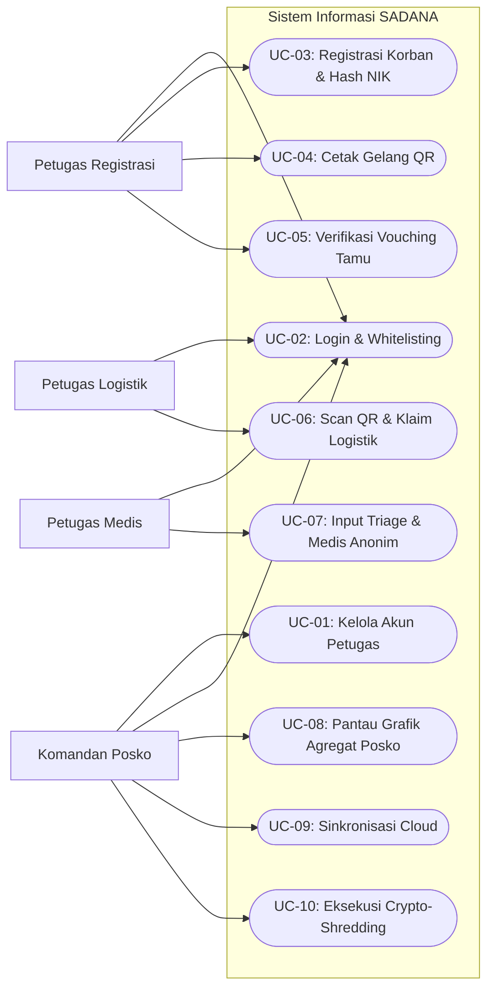
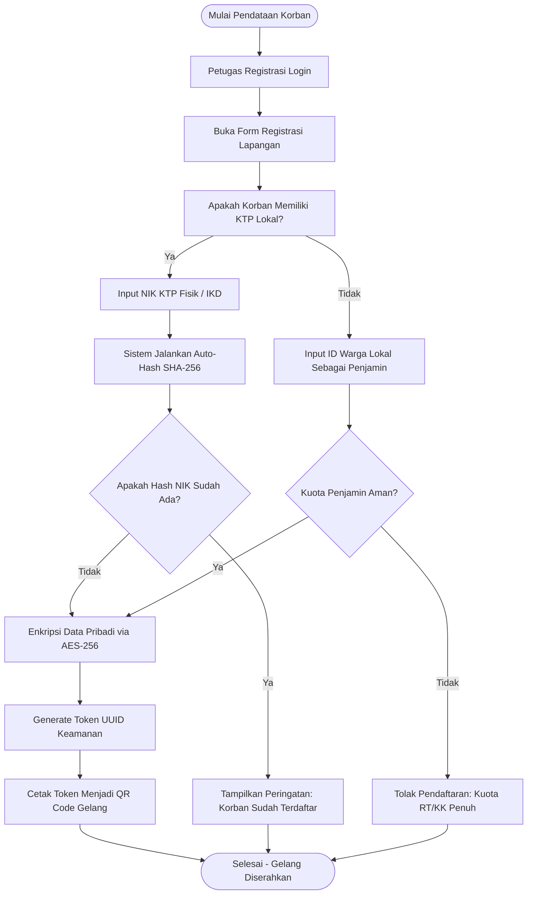
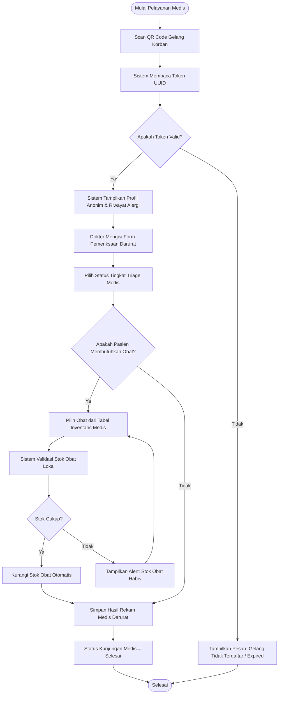
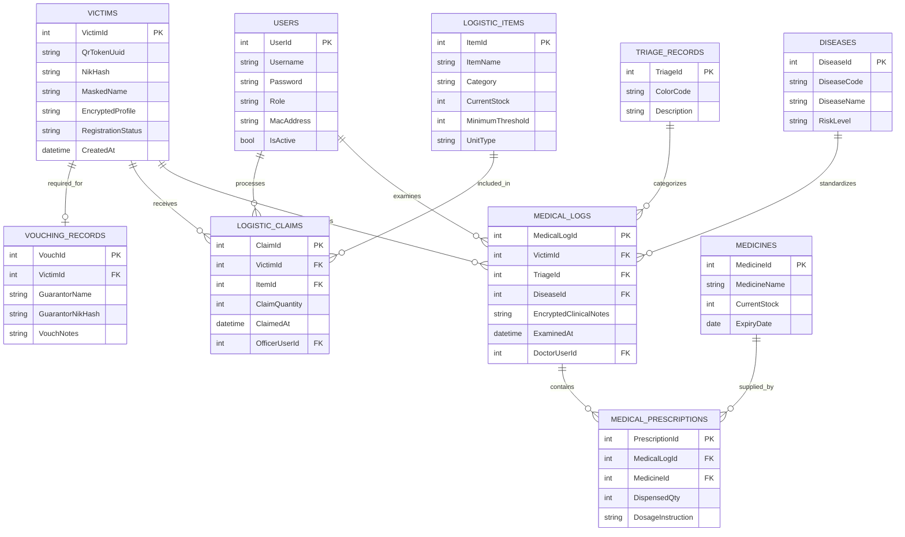
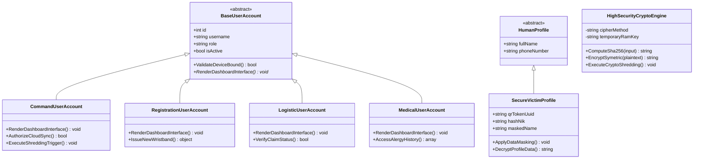
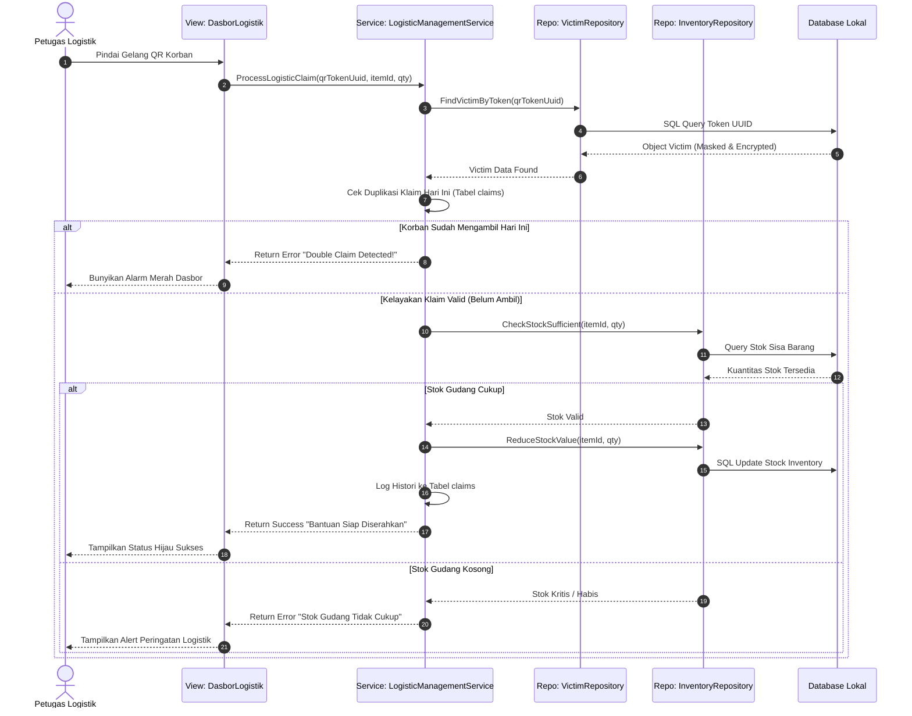
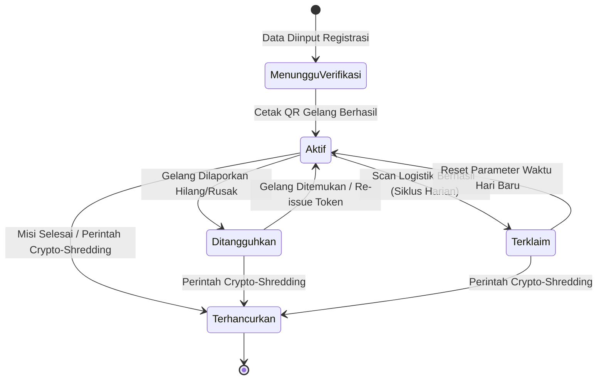

# PRD — Sistem Aman Distribusi Bantuan dan Manajemen Bencana (SADANA)

**Platform:** Web Application (Responsive Dashboard) menggunakan Laravel 11 + Tailwind CSS + Livewire
**Database:** PostgreSQL / MySQL (Local Server Portable & Cloud Sync Stack)
**Tema UI:** High-Contrast Safety (Biru Tua Komando, Orange Penyelamatan, Putih Bersih, dan Hijau Indikator)
**Role:** Komandan Posko (Admin), Petugas Registrasi, Petugas Logistik, Petugas Medis

---

# 1. Ringkasan Produk

## 1.1 Nama Produk

**SADANA — Sistem Aman Distribusi Bantuan dan Manajemen Bencana**

## 1.2 Jenis Produk

SADANA adalah platform manajemen operasional penanggulangan bencana berbasis web dengan arsitektur *Offline-First* dan *Secure-by-Design*. Sistem ini dioperasikan sepenuhnya oleh petugas di lapangan secara internal menggunakan jaringan *mesh* atau lokal tanpa ketergantungan internet penuh untuk mengelola pendaftaran korban, distribusi bantuan logistik, rekam medis darurat, dan analitik data terenkripsi demi mencegah eksploitasi data populasi rentan.

## 1.3 Tujuan Utama

Meningkatkan efisiensi dan keamanan tata kelola posko bencana melalui implementasi:
1. **Registrasi Anonim Berbasis Kriptografi:** Petugas registrasi mendata korban menggunakan NIK/IKD/Paspor yang langsung diubah menjadi hash unik sekali pakai (SHA-256) guna meminimalkan risiko eksploitasi identitas.
2. **Identifikasi Berbasis Token Fisik (QR Wristband):** Korban mendapatkan gelang identitas QR Code yang berfungsi sebagai kunci otorisasi anonim untuk mengklaim logistik bantuan dan layanan medis harian.
3. **Pemisahan Hak Akses Ketat (RBAC):** Petugas logistik hanya dapat melihat kelayakan klaim bantuan, sedangkan petugas medis hanya memiliki akses ke rekam medis darurat tanpa mengetahui identitas asli korban.
4. **Mekanisme Pasca-Bencana Aman (Crypto-Shredding):** Sistem menyediakan fitur penghancuran kunci enkripsi (*Master Key*) secara instan setelah masa tanggap darurat selesai untuk memastikan tidak ada jejak digital data sensitif yang tertinggal pada perangkat lokal lapangan.
5. **Arsitektur Jaringan Tangguh (Offline-First):** Memastikan sistem dapat bekerja 100% menggunakan server lokal portabel (seperti laptop utama atau Raspberry Pi) yang dihubungkan melalui router Wi-Fi lokal di area bencana tanpa koneksi internet.

---

# 2. Latar Belakang

Pada situasi darurat pascabencana alam atau krisis kemanusiaan, alur birokrasi distribusi bantuan sosial (bansos) konvensional sering kali mewajibkan pengumpulan dokumen fisik berupa fotokopi KTP atau Kartu Keluarga (KK). Lembaran dokumen fisik ini biasanya menumpuk secara acak di posko-posko darurat tanpa sistem pengamanan yang memadai. Petugas lapangan yang kurang terlatih juga kerap mencatat data pribadi korban menggunakan media digital publik seperti Google Sheets yang dibagikan secara bebas melalui grup WhatsApp.

Kondisi tersebut menciptakan celah eksploitasi data yang sangat masif bagi oknum tidak bertanggung jawab. Kasus pencurian identitas (*identity theft*) terhadap korban bencana untuk keperluan pengajuan pinjaman online (pinjol) ilegal, pemerasan, hingga penipuan terstruktur marak terjadi karena minimnya pengamanan data pada sektor akar rumput kemanusiaan.

Di sisi lain, tantangan infrastruktur di area bencana seperti putusnya aliran listrik dan hilangnya sinyal telekomunikasi membuat aplikasi berbasis *cloud server* konvensional sama sekali tidak dapat diandalkan. Oleh karena itu, SADANA hadir sebagai solusi platform manajemen internal posko bencana yang menggabungkan kecepatan operasional lapangan, ketangguhan *offline*, dan proteksi enkripsi data tingkat tinggi untuk menjamin bantuan sampai ke tangan yang tepat tanpa mengorbankan privasi para korban.

---

# 3. Visi Produk

Menyediakan sistem informasi internal penanggulangan bencana yang:
* **Zero-Trust Data Protection:** Mengutamakan privasi korban melalui metode enkripsi end-to-end, minimalisasi data, dan pemisahan role petugas secara absolut.
* **Disaster-Ready Architecture:** Mampu beroperasi secara instan di area minim infrastruktur menggunakan pendekatan *Offline-First* berbasis jaringan lokal.
* **High-Speed Operations:** Mengurangi antrean fisik posko melalui integrasi pemindaian QR Code yang cepat.
* **Academic & Competitive Power:** Menjadi proyek perangkat lunak unggulan yang mendemonstrasikan penerapan konsep Object-Oriented Programming (OOP) tingkat lanjut, manajemen basis data relasional yang aman, serta implementasi nyata dari kriteria *Track III (Eksploitasi Identitas dan Data)* pada FIT Competition 2026.

---

# 4. Tujuan Produk

## 4.1 Tujuan Operasional
* Mempercepat proses pendataan korban di posko darurat menggunakan metode digital terenkripsi.
* Menyediakan fitur *vouching* (penjaminan) terstruktur untuk memvalidasi korban luar domisili (turis/tamu) tanpa mengabaikan aspek akuntabilitas.
* Mencegah terjadinya duplikasi klaim bantuan sosial harian melalui pencatatan transaksi berbasis token QR tunggal.
* Memfasilitasi pelayanan medis darurat yang cepat dengan integrasi rekam medis anonim.
* Memberikan visualisasi data agregat (grafik logistik dan statistik kesehatan) kepada Komandan Posko untuk mempermudah pengambilan keputusan taktis tanpa mengekspos data pribadi korban.

## 4.2 Tujuan Akademik
Menunjukkan keahlian tim dalam merekayasa perangkat lunak modern yang menerapkan prinsip:
* **Encapsulation:** Mengunci properti sensitif seperti kunci enkripsi melalui enkapsulasi class yang ketat.
* **Inheritance:** Mengatur variasi role petugas dan profil pengguna melalui hierarki kelas yang bersih.
* **Polymorphic Authorization:** Menentukan fungsionalitas menu dasbor secara dinamis berdasarkan tipe *subclass* user yang aktif.
* **Abstraction & Clean Architecture:** Memisahkan logika enkripsi data kemanusiaan dari lapisan presentasi UI dengan menggunakan *Pattern Service* dan *Repository*.

---

# 5. Ruang Lingkup Sistem

## 5.1 Yang Termasuk dalam Sistem
1. Otentikasi dan login multi-role untuk petugas internal posko.
2. Dasbor analitik real-time yang disesuaikan berdasarkan hak akses role petugas.
3. Modul registrasi korban (Input data identitas primer -> hashing otomatis -> konversi ke token QR).
4. Modul manajemen penjaminan (*Vouching System*) bagi warga non-domisili / turis menggunakan akun verifikator lokal (RT/RW/Pengelola).
5. Modul distribusi logistik (Scan QR -> validasi kelayakan klaim harian -> potong stok barang otomatis).
6. Modul penanganan medis (Scan QR -> pemeriksaan klinis darurat/triage -> rekam medis anonim).
7. Master data barang logistik bantuan (stok, kategori, ambang batas minimum).
8. Master data klasifikasi penyakit darurat untuk mempermudah input dokter.
9. Fitur penangguhan/revokasi token QR gelang yang dilaporkan hilang.
10. Fitur simulasi sinkronisasi data lokal-ke-cloud (*Local-to-Cloud Database Synchronization*) saat internet tersedia.
11. Fitur *Crypto-Shredding* (Penghancuran Master Key) via interaksi dasbor Komandan Posko untuk menghapus kemampuan dekripsi basis data lokal.

## 5.2 Yang Tidak Termasuk dalam Sistem
1. Aplikasi komersial untuk masyarakat umum / korban (aplikasi murni bersifat internal operasional).
2. Sistem e-commerce pembelanjaan barang bansos.
3. Integrasi sistem pembayaran bank atau dompet digital.
4. Pengiriman notifikasi SMS/WhatsApp ke nomor pribadi korban (guna menjaga kerahasiaan nomor telepon).
5. Fitur pelacakan lokasi GPS korban secara real-time (anti-surveillance).
6. Manajemen multi-cabang posko lintas negara yang kompleks.

---

# 6. Role Pengguna

## 6.1 Komandan Posko (Admin Utama)
Penanggung jawab tertinggi operasional taktis militer/sipil di area bencana.
* **Tugas Utama:**
  * Mengelola pembuatan dan penonaktifan akun petugas lapangan.
  * Memantau dasbor agregat stok logistik dan grafik penyebaran penyakit di posko.
  * Mengatur kuota maksimal distribusi bantuan per Kepala Keluarga.
  * Menyetujui atau membatalkan hak akses perangkat server lokal portabel.
  * Mengeksekusi perintah *Crypto-Shredding* ketika misi tanggap darurat dinyatakan berakhir.

## 6.2 Petugas Registrasi
Petugas front-office di gerbang utama posko darurat.
* **Tugas Utama:**
  * Memvalidasi identitas fisik korban (KTP/IKD/Paspor/Tamu).
  * Menginput data ke form pendaftaran digital untuk diubah menjadi *ciphertext* oleh sistem.
  * Mencatat penjamin lokal jika korban merupakan warga luar domisili.
  * Melakukan *generate* dan mencetak QR Code pada gelang fisik korban.

## 6.3 Petugas Logistik
Petugas gudang atau pos pembagian barang bantuan makanan, pakaian, dan tenda.
* **Tugas Utama:**
  * Mengelola kuantitas stok barang masuk dari donatur.
  * Memindai QR Code gelang korban menggunakan webcam laptop atau barcode scanner.
  * Memeriksa status kelayakan klaim bantuan korban pada sistem.
  * Melakukan input data pengambilan bantuan (sistem otomatis memotong stok gudang).

## 6.4 Petugas Medis (Dokter / Perawat)
Tenaga kesehatan di posko kesehatan lapangan darurat.
* **Tugas Utama:**
  * Menerima pasien korban bencana berdasarkan pemindaian QR gelang.
  * Melihat riwayat klinis anonim, alergi obat, dan penyakit kronis korban terdahulu.
  * Mengisi data *triage* (tingkat kegawatan medis: Merah, Kuning, Hijau, Hitam).
  * Menginput diagnosis penyakit utama dan mencatat obat yang diberikan lapangan.

---

# 7. Matriks Hak Akses

| Fitur Utama Sistem | Komandan Posko | Petugas Registrasi | Petugas Logistik | Petugas Medis |
| :--- | :---: | :---: | :---: | :---: |
| Pembuatan Akun Petugas | **Ya** | Tidak | Tidak | Tidak |
| Lihat Grafik Statistik Agregat | **Ya** | Tidak | Tidak | Tidak |
| Pendaftaran Korban Baru | Tidak | **Ya** | Tidak | Tidak |
| Cetak QR Wristband | Tidak | **Ya** | Tidak | Tidak |
| Verifikasi Korban Non-Domisili | Tidak | **Ya** | Tidak | Tidak |
| Kelola Master Stok Logistik | **Ya** | Tidak | **Ya** | Tidak |
| Pemindaian QR Klaim Logistik | Tidak | Tidak | **Ya** | Tidak |
| Lihat Riwayat Klaim Logistik | **Ya** | Tidak | **Ya** | Tidak |
| Input Data Triage & Medis | Tidak | Tidak | Tidak | **Ya** |
| Lihat Rekam Medis Anonim | Tidak | Tidak | Tidak | **Ya** |
| Trigger Sinkronisasi Cloud | **Ya** | Tidak | Tidak | Tidak |
| Trigger Fitur Crypto-Shredding | **Ya** | Tidak | Tidak | Tidak |

---

# 8. Gambaran Umum Alur Sistem


```

[Korban Datang] ──> (Pos Registrasi: Input KTP/Tamu) ──> [Sistem: Hashing SHA-256 + Enkripsi AES]
│
▼
[Petugas Medis: Isi Rekam Medis] <── (Cetak QR Wristband) ──> [Petugas Logistik: Scan QR Klaim Bansos]
│                                                                 │
▼                                                                 ▼
(Simpan Histori Medis Anonim)                                     (Otomatis Potong Stok Gudang)
│
▼
[Misi Selesai] ──> (Komandan Jalankan Crypto-Shredding) ──> [Database Lokal Terkunci Selamanya]

```

---

# 9. Fitur Utama Sistem

## 9.1 Otentikasi & Proteksi Sesi Internal
* **Deskripsi:** Fitur gerbang masuk petugas posko yang menggunakan pengamanan token sesi lokal di dalam memori RAM server lapangan.
* **Subfitur:**
  * Login Multi-Role dengan proteksi enkripsi password bcrypt.
  * Otomatisasi pemutusan sesi (*Session Timeout*) jika perangkat tidak mendeteksi aktivitas petugas selama 15 menit.
  * Validasi kecocokan MAC Address laptop petugas dengan daftar putih (*Whitelisting*) yang diizinkan oleh Komandan Posko.

## 9.2 Dasbor Informasi Taktis Berbasis Role
Setiap petugas diarahkan ke halaman dasbor khusus yang menyajikan informasi fungsional tanpa membuang waktu operasional.

### 9.2.1 Dasbor Komandan Posko (Pusat Kendali)
* **Summary Cards:** Total korban terdata, total logistik aman (hari), grafik tren penyakit tertinggi, jumlah petugas aktif di lapangan.
* **Tabel Cepat:** Log sinkronisasi data ke cloud, alert stok barang logistik kritis di bawah batas minimum.
* **Fitur Taktis:** Tombol merah darurat *Crypto-Shredding* dengan konfirmasi kata sandi ganda.

### 9.2.2 Dasbor Petugas Registrasi
* **Summary Cards:** Jumlah korban yang berhasil didaftarkan hari ini, jumlah token QR aktif, statistik korban lokal vs luar daerah.
* **Form Utama:** Input data cepat terintegrasi pembaca kartu IKD/KTP digital.

### 9.2.3 Dasbor Petugas Logistik
* **Summary Cards:** Total bantuan keluar hari ini, sisa stok beras/air bersih/pakaian, daftar donatur terbaru.
* **Komponen Utama:** Jendela pemindaian kamera aktif (*Live Scanner Web*) untuk membaca gelang korban secara instan.

### 9.2.4 Dasbor Petugas Medis
* **Summary Cards:** Pasien dalam antrean darurat, total pasien tertangani hari ini, grafik statistik status warna *triage*.
* **Tabel Utama:** Daftar nomor antrean medis anonim beserta rincian keluhan awal krisis.

---

## 9.3 Manajemen Kriptografi & Masking Identitas (Fitur Inti Track III)
* **Deskripsi:** Modul pengolah data di balik layar (*back-end processing*) yang mengamankan privasi korban semenjak data diinput pertama kali.
* **Spesifikasi Teknis:**
  * **Algoritma Hashing:** Mengubah NIK korb menjadi `hash('sha256', $nik)` untuk memvalidasi duplikasi data tanpa menyimpan teks NIK asli ke database.
  * **Data Masking:** Data nama korban diubah menjadi inisial acak pada tampilan visual petugas logistik dan medis (contoh: "Ahmad Jailani" hanya terbaca sebagai "Korban AJ - ID 982").
  * **Dynamic Encryption:** Informasi alamat dan nomor telepon dienkripsi menggunakan metode `AES-256-CBC` dengan kunci dinamis yang disimpan di memori RAM server, bukan pada file konfigurasi `.env` statis.

---

## 9.4 Modul Penjaminan Korban Luar Domisili (Vouching System)
* **Deskripsi:** Mengakomodasi kebutuhan hukum bantuan kemanusiaan bagi turis atau warga luar daerah yang kehilangan dokumen identitas saat krisis terjadi.
* **Aturan Kerja:**
  * Petugas registrasi memilih opsi "Warga Luar Daerah/Tanpa KTP".
  * Sistem meminta input data akun "Penjamin Lokal" (bisa berupa nomor KK warga lokal pemilik tempat menginap, ID petugas pengelola hotel, atau ID Ketua RT setempat).
  * Sistem membatasi kuota penjaminan (*Vouching Quota Limitation*) maksimal 3 orang per kepala keluarga lokal untuk memitigasi kecurangan pencairan bansos oleh spekulan.

---

## 9.5 Modul Manajemen Logistik & Validasi Klaim Ganda
* **Deskripsi:** Mengontrol keluar masuknya komoditas logistik posko dan mendeteksi upaya penipuan klaim ganda bantuan.
* **Subfitur:**
  * Inventory Management (Tambah stok, input nama donatur, konversi satuan kemasan).
  * Pembatasan Frekuensi Klaim: Saat QR Code gelang discan, sistem mengecek tabel `logistic_claims`. Jika korban sudah mengambil jatah makan siang pada hari tersebut, sistem memunculkan warna merah (*Alert: Double Claim Detected*).

---

## 9.6 Modul Rekam Medis Darurat & Triage Posko
* **Deskripsi:** Membantu penanganan medis taktis tanpa mengabaikan kerahasiaan riwayat kesehatan masa lalu pasien krisis.
* **Subfitur:**
  * Penentuan Kategori Triage (Merah = Kritis, Kuning = Cedera Berat, Hijau = Ringan, Hitam = Meninggal Dunia).
  * Pencatatan riwayat alergi obat darurat yang terenkripsi dalam tabel terpisah yang hanya dapat didekripsi oleh kunci privat milik dokter pemeriksa yang sah.

---

# 10. Use Case Utama

1. **UC-01:** Registrasi Petugas Lapangan Baru oleh Komandan.
2. **UC-02:** Login Petugas dan Whitelisting Perangkat Server Lokal.
3. **UC-03:** Pendaftaran Korban dengan Sistem Auto-Hashing NIK.
4. **UC-04:** Pembuatan dan Pencetakan Gelang QR Token Kemanusiaan.
5. **UC-05:** Validasi Penjaminan (*Vouching*) Korban Luar Domisili.
6. **UC-06:** Pemindaian QR dan Pengambilan Jatah Logistik Bantuan.
7. **UC-07:** Input Hasil Pemeriksaan Klinis dan Penentuan Status Triage.
8. **UC-08:** Pemantauan Grafik Agregat Inventaris oleh Komandan Posko.
9. **UC-09:** Sinkronisasi Manual Data Posko Lokal ke Server Cloud Pusat.
10. **UC-10:** Penghancuran Kunci Enkripsi Komando (*Crypto-Shredding Trigger*).

---

# 11. Diagram Use Case



---

# 12. Alur Kerja Sistem

## 12.1 Alur Registrasi Korban dan Penerbitan Gelang Identitas

1. Korban mendatangi meja pendaftaran posko.
2. Petugas Registrasi membuka Form Pendaftaran pada web aplikasi SADANA lokal.
3. Petugas menginput data nama, tanggal lahir, dan nomor KTP/Paspor.
4. Di sisi *back-end*, sistem memproses nomor KTP menggunakan fungsi kriptografi SHA-256 menjadi string acak sepanjang 64 karakter.
5. Sistem memeriksa ke dalam database apakah string hash tersebut sudah terdaftar sebelumnya.
6. Jika aman, nama korban dienkripsi dengan metode AES-256, kemudian sistem menerbitkan kode token acak (UUID v4) yang dicetak menjadi QR Code pada gelang fisik korban.

## 12.2 Alur Distribusi Logistik dan Pencegahan Klaim Ganda

1. Korban membawa gelang QR ke tenda logistik untuk mengambil jatah makan harian.
2. Petugas Logistik mengarahkan gelang QR ke kamera barcode scanner laptop.
3. Sistem memvalidasi token QR ke tabel `victims`.
4. Jika token valid, sistem membaca status kelayakan pada hari itu melalui query ke tabel `logistic_claims`.
5. Apabila korban terdeteksi sudah mengambil haknya dalam parameter waktu yang ditentukan (misal: Kategori Makan Siang pukul 11:00 - 14:00), sistem menolak dan membunyikan alarm visual di dasbor petugas logistik.
6. Jika belum, petugas menyerahkan barang bantuan, menekan tombol "Konfirmasi Penyerahan", dan stok komoditas di tabel `medicines/goods` otomatis berkurang secara real-time.

---

# 13. Diagram Aktivitas Registrasi & Vouching



---

# 14. Diagram Aktivitas Pelayanan Medis Darurat



---

# 15. Kebutuhan Fungsional

## 15.1 Modul Kriptografi Lapangan (Security Engine)

* Sistem harus langsung melakukan hashing satu arah pada data NIK/Paspor di memori RAM sebelum query SQL dikirimkan ke database lokal.
* Sistem harus mengenkripsi kolom alamat dan nomor telepon menggunakan kunci enkripsi simetris dinamis.
* Sistem harus menyediakan mekanisme pengecekan berkala terhadap integritas tabel database untuk mendeteksi manipulasi data luar.

## 15.2 Modul Penanganan Jaringan Offline-First

* Sistem harus dapat berjalan normal menggunakan protokol komunikasi lokal HTTP tanpa koneksi internet WAN.
* Sistem harus menyediakan fitur penyimpanan *Queue* lokal di dalam IndexedDB browser petugas apabila laptop operator kehilangan koneksi ke server router lokal portabel untuk sementara waktu.
* Sistem harus mendukung ekspor data terenkripsi ke dalam format file biner terkompresi (.bin) untuk dipindahkan secara manual menggunakan flashdisk ke posko pusat apabila sinkronisasi online mengalami kegagalan total.

---

# 16. Kebutuhan Non-Fungsional

1. **Sistem Operasi Perangkat:** Aplikasi berbasis web harus kompatibel dengan browser modern (Google Chrome / Mozilla Firefox) yang berjalan di OS Windows, Linux, maupun macOS pada laptop lapangan petugas.
2. **Kecepatan Respons Pemanduan:** Proses pembacaan QR Code lewat webcam hingga validasi database tidak boleh melebihi waktu 1,5 detik per orang untuk mencegah kerumunan massa di tenda posko.
3. **Desain Antarmuka (UI):** Menggunakan framework Tailwind CSS dengan tema kontras tinggi yang ramah untuk penggunaan di bawah sinar matahari langsung maupun kondisi pencahayaan tenda darurat yang redup.
4. **Keamanan Database Lokal:** Hak akses root database pada server laptop portabel wajib dilindungi kata sandi acak berkekuatan tinggi yang di-generate otomatis saat instalasi sistem pertama kali.

---

# 17. Aturan Bisnis (Business Rules)

1. Satu nomor token QR gelang hanya boleh terikat pada satu profil identitas korban yang valid di dalam sistem.
2. Petugas lapangan dilarang keras memiliki hak akses untuk mengekspor atau melihat daftar tabel database secara keseluruhan (*No Bulk Data Export for Officers*).
3. Validasi status klaim bantuan logistik harian didasarkan pada zona waktu lokal server posko darurat tempat barang tersebut didistribusikan.
4. Otoritas penjaminan (*Vouching*) warga non-domisili hanya dapat diberikan oleh pengguna sistem yang memiliki tingkat verifikasi akun minimal setingkat Kepala Urusan Desa atau Petugas Registrasi Internal Senior.
5. Perintah penghancuran data (*Crypto-Shredding*) bersifat merusak secara permanen dan tidak dapat dibatalkan (*Irreversible Command*). Begitu tombol ditekan, data yang terenkripsi tidak akan pernah bisa dibaca lagi selamanya.

---

# 18. Validasi Data

* Field Nama Korban tidak boleh mengandung karakter angka atau simbol khusus.
* Panjang data NIK KTP wajib tepat berisi 16 digit angka numerik.
* Sistem harus menolak pemindaian QR gelang jika status token di database telah diatur menjadi `Ditangguhkan / Hilang`.
* Jumlah input pengambilan logistik bantuan tidak boleh bernilai negatif atau bernilai lebih besar daripada sisa stok riil yang tercatat di sistem gudang.
* Catatan klasifikasi rekam medis darurat wajib memiliki status kode *triage* yang jelas sebelum data pemeriksaan dapat disimpan oleh dokter.

---

# 19. Use Case Specification

## 19.1 Use Case — Registrasi Korban & Auto-Hash NIK

| Elemen Spesifikasi | Deskripsi Detail |
| --- | --- |
| **Nama Use Case** | Registrasi Korban & Auto-Hash NIK |
| **Aktor Utama** | Petugas Registrasi |
| **Tujuan** | Mendaftarkan identitas korban bencana secara aman tanpa mengeksploitasi data pribadi asli. |
| **Prasyarat** | Petugas telah login ke sistem lokal SADANA dan komputer terhubung ke printer gelang. |
| **Alur Utama Kerja** | 1. Petugas membuka form input pendaftaran korban krisis.<br>

<br>2. Petugas memasukkan nama inisial, tanggal lahir, dan nomor NIK asli.<br>

<br>3. Sistem mendeteksi input NIK dan melakukan konversi enkripsi satu arah SHA-256 secara real-time di memori RAM.<br>

<br>4. Sistem memeriksa apakah string hash tersebut sudah ada di tabel database lokal.<br>

<br>5. Jika unik, data pribadi dienkripsi dengan AES-256 dan disimpan ke database.<br>

<br>6. Sistem menerbitkan UUID v4 baru sebagai representasi token gelang digital korban. |
| **Kondisi Akhir** | Profil korban tersimpan dengan aman, identitas asli tersembunyi, dan gelang QR siap dicetak. |

## 19.2 Use Case — Eksekusi Fitur Crypto-Shredding Pasca-Bencana

| Elemen Spesifikasi | Deskripsi Detail |
| --- | --- |
| **Nama Use Case** | Eksekusi Fitur Crypto-Shredding Pasca-Bencana |
| **Aktor Utama** | Komandan Posko (Admin Utama) |
| **Tujuan** | Menghancurkan kunci enkripsi utama secara permanen untuk mengunci database lokal selamanya dari risiko kebocoran data. |
| **Prasyarat** | Masa tanggap darurat bencana telah resmi dinyatakan selesai oleh pemerintah pusat. |
| **Alur Utama Kerja** | 1. Komandan Posko membuka menu Pengaturan Keamanan Tingkat Tinggi di Dasbor Utama.<br>

<br>2. Komandan menekan tombol merah bertuliskan "Akhiri Misi & Hancurkan Kunci Enkripsi Lokal".<br>

<br>3. Sistem memunculkan jendela pop-up peringatan keras dan meminta input kata sandi konfirmasi.<br>

<br>4. Komandan memasukkan kata sandi rahasia komando.<br>

<br>5. Sistem mengeksekusi fungsi penghapusan file kunci enkripsi (*Master Key*) menggunakan metode pengisian data acak (*shredding overwrite*) sebanyak 3 siklus berturut-turut pada sektor penyimpanan fisik.<br>

<br>6. Sistem memutus koneksi database dan melakukan force-logout pada seluruh sesi petugas aktif. |
| **Kondisi Akhir** | Database lokal terkunci secara absolut menjadi teks acak yang mustahil didekripsi kembali selamanya. Perangkat laptop lapangan kini aman dikembalikan ke instansi asal. |

---

# 20. Desain Database

## 20.1 Daftar Tabel Utama Sistem

Sistem SADANA beroperasi menggunakan **11 tabel relasional utama** berikut:

1. `users`: Menyimpan kredensial otentikasi akun internal petugas posko.
2. `victims`: Menyimpan data profil korban yang telah di-hash dan di-masking.
3. `vouching_records`: Mencatat data histori penjaminan korban luar domisili / tanpa dokumen.
4. `logistic_items`: Menyimpan daftar komoditas barang bantuan logistik kemanusiaan di gudang.
5. `logistic_claims`: Mencatat log histori pemindaian klaim komoditas logistik harian korban.
6. `diseases`: Master data klasifikasi jenis penyakit darurat krisis di posko lapangan.
7. `triage_records`: Mencatat pengelompokan tingkat kegawatan pasien medis bencana.
8. `medical_logs`: Menyimpan detail hasil pemeriksaan rekam medis darurat anonim oleh dokter.
9. `medicines`: Menyimpan master data obat-obatan medis darurat di apotek posko.
10. `medical_prescriptions`: Menghubungkan rekam medis dengan obat-obatan yang diserahkan ke korban.
11. `system_keys`: Menyimpan data parameter enkripsi lokal yang dikunci di dalam memori RAM server.

---

## 20.2 Tabel `users`

| Nama Kolom | Tipe Data | Aturan / Keterangan |
| --- | --- | --- |
| UserId | int PK | Auto Increment |
| Username | varchar(50) | Unik, digunakan untuk login petugas |
| Password | varchar(255) | Terenkripsi menggunakan algoritma bcrypt |
| Role | varchar(30) | Komandan / Registrasi / Logistik / Medis |
| MacAddress | varchar(17) | Validasi fisik perangkat keras laptop petugas |
| IsActive | bit | Status keaktifan akun petugas di lapangan |

## 20.3 Tabel `victims`

| Nama Kolom | Tipe Data | Aturan / Keterangan |
| --- | --- | --- |
| VictimId | int PK | Auto Increment |
| QrTokenUuid | varchar(36) | Unik, token acak UUID v4 yang dicetak ke gelang |
| NikHash | varchar(64) | Hasil enkripsi satu arah SHA-256 dari NIK korban |
| MaskedName | varchar(10) | Nama inisial samaran korban (contoh: Korban_KS) |
| EncryptedProfile | text | Data alamat dan telepon yang dienkripsi AES-256 |
| RegistrationStatus | varchar(20) | Lokal / Luar_Domisili / Ditangguhkan |
| CreatedAt | datetime | Waktu pendaftaran pertama di posko |

## 20.4 Tabel `vouching_records`

| Nama Kolom | Tipe Data | Aturan / Keterangan |
| --- | --- | --- |
| VouchId | int PK | Auto Increment |
| VictimId | int FK | Berelasi ke tabel `victims` |
| GuarantorName | varchar(100) | Nama lengkap warga lokal atau petugas penjamin |
| GuarantorNikHash | varchar(64) | Hash KTP dari pihak yang memberikan jaminan |
| VouchNotes | text | Alasan penjaminan (contoh: Turis, dokumen hilang) |

## 20.5 Tabel `logistic_items`

| Nama Kolom | Tipe Data | Aturan / Keterangan |
| --- | --- | --- |
| ItemId | int PK | Auto Increment |
| ItemName | varchar(100) | Nama barang bantuan (contoh: Beras, Selimut, Air) |
| Category | varchar(50) | Makanan / Pakaian / Tenda / Kebersihan |
| CurrentStock | int | Kuantitas sisa stok riil di gudang posko |
| MinimumThreshold | int | Batas minimum stok sebelum memicu alert sistem |
| UnitType | varchar(20) | Satuan komoditas (KG / Dus / Pcs / Paket) |

## 20.6 Tabel `logistic_claims`

| Nama Kolom | Tipe Data | Aturan / Keterangan |
| --- | --- | --- |
| ClaimId | int PK | Auto Increment |
| VictimId | int FK | Berelasi ke tabel `victims` |
| ItemId | int FK | Berelasi ke tabel `logistic_items` |
| ClaimQuantity | int | Jumlah komoditas yang diserahkan ke korban |
| ClaimedAt | datetime | Waktu pemindaian dan pengambilan bantuan |
| OfficerUserId | int FK | Berelasi ke tabel `users` (Petugas Logistik) |

## 20.7 Tabel `diseases`

| Nama Kolom | Tipe Data | Aturan / Keterangan |
| --- | --- | --- |
| DiseaseId | int PK | Auto Increment |
| DiseaseCode | varchar(10) | Unik, Kode ICD-10 ringkas (contoh: DHF, ISPA) |
| DiseaseName | varchar(100) | Nama penyakit dalam istilah kedokteran lapangan |
| RiskLevel | varchar(20) | Rendah / Sedang / Tinggi / Menular Kritis |

## 20.8 Tabel `triage_records`

| Nama Kolom | Tipe Data | Aturan / Keterangan |
| --- | --- | --- |
| TriageId | int PK | Auto Increment |
| ColorCode | varchar(15) | Merah (Kritis) / Kuning / Hijau / Hitam |
| Description | text | Gejala klinis penentu keputusan klasifikasi |

## 20.9 Tabel `medical_logs`

| Nama Kolom | Tipe Data | Aturan / Keterangan |
| --- | --- | --- |
| MedicalLogId | int PK | Auto Increment |
| VictimId | int FK | Berelasi ke tabel `victims` (Koneksi Anonim) |
| TriageId | int FK | Berelasi ke tabel `triage_records` |
| DiseaseId | int FK | Berelasi ke tabel `diseases` |
| EncryptedClinicalNotes | text | Catatan medis darurat yang dienkripsi AES-256 |
| ExaminedAt | datetime | Waktu pemeriksaan klinis di tenda medis |
| DoctorUserId | int FK | Berelasi ke tabel `users` (Petugas Medis) |

## 20.10 Tabel `medicines`

| Nama Kolom | Tipe Data | Aturan / Keterangan |
| --- | --- | --- |
| MedicineId | int PK | Auto Increment |
| MedicineName | varchar(100) | Nama obat-obatan darurat (contoh: Parasetamol) |
| CurrentStock | int | Jumlah kuantitas stok butir/botol obat tersedia |
| ExpiryDate | date | Tanggal kadaluwarsa obat lapangan |

## 20.11 Tabel `medical_prescriptions`

| Nama Kolom | Tipe Data | Aturan / Keterangan |
| --- | --- | --- |
| PrescriptionId | int PK | Auto Increment |
| MedicalLogId | int FK | Berelasi ke tabel `medical_logs` |
| MedicineId | int FK | Berelasi ke tabel `medicines` |
| DispensedQty | int | Jumlah obat yang diberikan ke pasien |
| DosageInstruction | varchar(100) | Aturan pakai darurat (contoh: 3x1 Sesudah Makan) |

## 20.12 Tabel `system_keys`

| Nama Kolom | Tipe Data | Aturan / Keterangan |
| --- | --- | --- |
| KeyId | int PK | Auto Increment |
| KeyTokenCipher | text | Token kunci enkripsi utama yang dikunci sistem |
| KeyStatus | varchar(20) | Aktif_Komando / Terhancurkan_Sadd |

---

# 21. Entity Relationship Diagram (ERD)



---

# 22. Desain Berorientasi Objek (OOP Design)

## 22.1 Encapsulation (Enkapsulasi)

Seluruh kelas data model tidak diizinkan mengekspos variabel internalnya secara publik. Modifikasi data wajib melalui metode setter khusus yang divalidasi. Contoh: Kelas `Medicine` melundungi properti `CurrentStock` sehingga pengurangan stok akibat pemberian resep obat tidak bisa bernilai minus. Status enkripsi pada kelas `Victim` ditangani secara internal pada level siklus hidup enkapsulasi objek model sebelum operasi tulis basis data dipanggil.

## 22.2 Inheritance (Pewarisan)

Pewarisan struktur diimplementasikan untuk mengelola hak otentikasi pengguna sistem dan profil personil lapangan.

### Sektor Kelas Akun Sistem:

* `BaseUserAccount` (Abstract Class)
* `CommandUserAccount` (Subclass Komandan Posko)
* `RegistrationUserAccount` (Subclass Petugas Registrasi)
* `LogisticUserAccount` (Subclass Petugas Logistik)
* `MedicalUserAccount` (Subclass Petugas Medis)


### Sektor Kelas Profil Kemanusiaan:

* `HumanProfile` (Abstract Class)
* `OfficerProfile` (Subclass Profil Lengkap Petugas)
* `SecureVictimProfile` (Subclass Profil Aman Korban Terenkripsi)


## 22.3 Polymorphism (Polimorfisme)

Polimorfisme digunakan pada sistem otorisasi visual antarmuka dasbor. Method `RenderDashboardInterface()` yang dideklarasikan pada abstract class `BaseUserAccount` akan menghasilkan struktur menu navigasi, hak edit data, dan skema warna dasbor yang sepenuhnya berbeda pada masing-masing subclass petugas saat dipanggil oleh mesin rendering Laravel Livewire di lapangan.

## 22.4 Abstraction (Abstraksi)

Abstraksi diwujudkan melalui arsitektur pemisahan *Interface Service Layer* dan *Repository Pattern*. Kelas pengontrol UI tidak pernah tahu bagaimana logika database ditulis atau bagaimana data dienkripsi fisik. Pengontrol hanya berkomunikasi dengan interface abstrak seperti `ISecurityCryptoService`, `ILogisticManagementService`, dan `IMedicalEmergencyService`.

---

# 23. Daftar Class Utama Sistem

## 23.1 BaseUserAccount (Abstract Class)

* **Atribut:** `int id`, `string username`, `string role`, `string macAddress`, `bool isActive`
* **Method:** `abstract public function RenderDashboardInterface()`, `public function ValidateDeviceBound()`

## 23.2 SecureVictimProfile (Class)

* **Atribut:** `string qrToken`, `string hashNik`, `string maskedName`, `string rawEncryptedBlob`
* **Method:** `public function GenerateTokenWristband()`, `public function ApplyDataMasking()`, `public function DecryptProfileData(string $ramKey)`

## 23.3 HighSecurityCryptoEngine (Class)

* **Atribut:** `private $cipherAlgorithm`, `private $masterKeySystem`
* **Method:** `public static function ComputeSha256(string $input)`, `public function EncryptSymetric(string $plaintext)`, `public function ExecuteCryptoShredding()`

## 23.4 EmergencyMedicalUnit (Class)

* **Atribut:** `int logId`, `string triageLevel`, `string clinicalDiagnosisCode`
* **Method:** `public function AssignTriageColor()`, `public function AppendPrescription(int $medicineId, int $qty)`

---

# 24. Diagram Class



---

# 25. Diagram Sequence

## 25.1 Sequence — Pemindaian & Otorisasi Klaim Logistik Bantuan



---

# 26. Diagram Status (State Diagram)

## 26.1 Siklus Hidup Token QR Gelang Korban (Track III)



---

# 27. Struktur Arsitektur Proyek (Laravel Core Clean Stack)

Struktur direktori proyek SADANA diatur secara terintegrasi menggunakan komponen berbasis Service-Repository agar memudahkan pengerjaan kolaborasi 2 orang dibantu AI Agent secara paralel:

```text
SADANA/
├── app/
│   ├── Actions/
│   │   └── Fortify/
│   ├── Helpers/
│   │   ├── CryptoHelper.php
│   │   ├── NetworkMeshHelper.php
│   │   └── TriageColorHelper.php
│   ├── Http/
│   │   ├── Controllers/
│   │   │   └── LocalSyncController.php
│   │   └── Livewire/
│   │       ├── DashboardCommand.php
│   │       ├── DashboardRegistration.php
│   │       ├── DashboardLogistic.php
│   │       ├── DashboardMedical.php
│   │       ├── VictimRegistrationForm.php
│   │       ├── LogisticScanner.php
│   │       └── MedicalTriageUnit.php
│   ├── Models/
│   │   ├── User.php
│   │   ├── Victim.php
│   │   ├── VouchingRecord.php
│   │   ├── LogisticItem.php
│   │   ├── LogisticClaim.php
│   │   ├── Disease.php
│   │   ├── MedicalLog.php
│   │   ├── Medicine.php
│   │   └── Prescription.php
│   ├── Repositories/
│   │   ├── BaseRepositoryInterface.php
│   │   ├── UserRepository.php
│   │   ├── VictimRepository.php
│   │   ├── LogisticRepository.php
│   │   └── MedicalRepository.php
│   └── Services/
│       ├── SecurityCryptoService.php
│       ├── LogisticManagementService.php
│       └── MedicalEmergencyService.php
├── database/
│   ├── migrations/
│   │   ├── 2026_06_01_000001_create_users_table.php
│   │   ├── 2026_06_01_000002_create_victims_table.php
│   │   ├── 2026_06_01_000003_create_vouching_records_table.php
│   │   ├── 2026_06_01_000004_create_logistic_items_table.php
│   │   ├── 2026_06_01_000005_create_logistic_claims_table.php
│   │   └── 2026_06_01_000006_create_medical_logs_table.php
│   └── seeders/
├── info/
│   └── GuideBook_Web_Development.pdf
├── resources/
│   └── views/
│       ├── layouts/
│       │   └── app.blade.php
│       └── livewire/
│           ├── dashboard-command.blade.php
│           ├── dashboard-registration.blade.php
│           ├── dashboard-logistic.blade.php
│           ├── dashboard-medical.blade.php
│           └── components/
│               └── scan-alert-modal.blade.php
├── routes/
│   └── web.php
└── tailwind.config.js

```

---

# 28. Desain Tampilan Antarmuka (UI Design)

## 28.1 Palet Warna Keselamatan & Keamanan Posko

Desain visual mengutamakan kejelasan tingkat tinggi (*high-contrast accessibility*) demi kenyamanan mata petugas di lapangan yang bekerja di bawah kondisi ekstrem.

| Nama Elemen UI | Kode Hex Warna | Representasi Psikologis Visual |
| --- | --- | --- |
| **Primary Blue** | `#0B1E36` | Biru Navy Tua Komando: Tegas, Profesional, Resmi |
| **Rescue Orange** | `#FF6B00` | Orange Rescue: Identitas Penyelamatan, Aksi Cepat |
| **Light Alert Background** | `#F0F5FA` | Abu-Abu Putih Bersih: Nyaman Dibaca, Fokus Data |
| **Card Panel Bright** | `#FFFFFF` | Putih Murni: Kontras Maksimal Terhadap Teks |
| **Text Dark Core** | `#050F1A` | Hitam Gelap Pekat: Memudahkan Pembacaan Cepat |
| **Text Secondary Muted** | `#526273` | Abu-Abu Redup: Keterangan Tambahan / Sub-Judul |

## 28.2 Sistem Indikator Status Warna Triage Medis & Logistik

| Kondisi Operasional Lapangan | Warna Badge Visual | Tampilan Hex Kode |
| --- | --- | --- |
| Status Aman / Klaim Valid / Triage Hijau | Hijau Sukses | `#10B981` |
| Peringatan / Klaim Ganda Terdeteksi / Triage Kuning | Kuning Peringatan | `#F59E0B` |
| Bahaya Kritis / Stok Habis / Triage Merah | Merah Darurat | `#EF4444` |
| Token Ditangguhkan / Korban Meninggal (Triage Hitam) | Hitam Absolut | `#111827` |

---

# 29. Rekomendasi Layout Komponen Dasbor

## 29.1 Tata Letak Dasbor Petugas Logistik (Tenda Pembagian Bansos)

```text
+-----------------------------------------------------------------------------+
| SADANA | OPERASIONAL LOGISTIK POSKO 01                   [Petugas: Budi_Log] |
+-----------------------+-----------------------------------------------------+
| MENU NAVIGASI         | ZONA LIVE SCANNER WEBCAM (AKTIF)                     |
| [*] Dasbor Utama      | +-------------------------------------------------+ |
| [ ] Master Stok       | | [KAMERA SCANNER MEMINDAI TOKEN GELANG QR...]   | |
| [ ] Log Klaim Harian  | +-------------------------------------------------+ |
|                       | Status Deteksi Terakhir: [ KLAIM VALID - HIJAU ]    |
|-----------------------+-----------------------------------------------------|
| SUMMARY STOK GUDANG   | TABEL UTAMA HISTORI PENYERAHAN BANTUAN HARI INI     |
| - Beras: 420 KG [Aman]| ID Token | Inisial Korban | Komoditas | Waktu Klaim |
| - Air: 12 Dus  [KRITIS| #QR-0912 | Korban_AH      | Paket Semb| 13:14:02 WIB|
| - Tenda: 5 Pcs  [Aman]| #QR-0841 | Korban_LM      | Selimut   | 13:10:55 WIB|
+-----------------------+-----------------------------------------------------+

```

---

# 30. Query Data Dasbor yang Disarankan (Eloquent Pseudocode)

Untuk memastikan performa aplikasi web berjalan ringan di server portabel berspesifikasi rendah, query analitik menggunakan agregasi efisien:

## 30.1 Perhitungan Metrik Ringkas Dasbor Komandan

```php
// Menghitung jumlah korban berhak menerima bansos hari ini tanpa mengekspos data pribadi
$totalKorbanTerdata = Victim::where('registration_status', '!=', 'Ditangguhkan')->count();

// Alert stok logistik kritis di bawah batas ambang minimum
$itemKritisAlert = LogisticItem::whereRaw('current_stock <= minimum_threshold')->get();

// Menghitung grafik tren infeksi penyakit menular tertinggi di posko medis harian
$trenPenyakit = MedicalLog::select('disease_id', DB::raw('count(*) as total'))
    ->whereDate('examined_at', Carbon::today())
    ->groupBy('disease_id')
    ->orderBy('total', 'desc')
    ->take(5)
    ->get();

```

## 30.2 Pencegahan Klaim Ganda pada Controller Pos Logistik

```php
public function verifyAndProcessClaim($scannedToken, $requestedItemId, $officerId)
{
    $victim = Victim::where('qr_token_uuid', $scannedToken)->first();
    
    if (!$victim) {
        return response()->json(['status' => 'ERROR', 'message' => 'Token Tidak Dikenali!']);
    }

    // Query mengecek apakah token ini sudah mengambil jenis barang yang sama hari ini
    $alreadyClaimed = LogisticClaim::where('victim_id', $victim->id)
        ->where('item_id', $requestedItemId)
        ->whereDate('claimed_at', Carbon::today())
        ->exists();

    if ($alreadyClaimed) {
        return response()->json(['status' => 'WARNING', 'message' => 'Double Claim Terdeteksi!']);
    }

    // Eksekusi pemotongan stok jika lolos validasi klaim ganda
    return DB::transaction(function () use ($victim, $requestedItemId, $officerId) {
        $item = LogisticItem::lockForUpdate()->find($requestedItemId);
        $item->decrement('current_stock', 1);

        LogisticClaim::create([
            'victim_id' => $victim->id,
            'item_id' => $requestedItemId,
            'claim_quantity' => 1,
            'claimed_at' => Carbon::now(),
            'officer_user_id' => $officerId
        ]);

        return response()->json(['status' => 'SUCCESS', 'message' => 'Klaim Berhasil Disimpan.']);
    });
}

```

---

# 31. Pembagian Tugas Kelompok (2 Orang + AI Agent)

## 31.1 Anggota Tim 1 — Core Architect, Security & Back-End Engine

* **Fokus Kerja:**
* Inisialisasi framework Laravel, setup struktur database, dan penulisan file migrasi tabel relasional.
* Implementasi sistem keamanan kriptografi: Algoritma hash SHA-256 untuk NIK dan enkripsi AES-256 pada `SecurityCryptoService`.
* Merekayasa logika anti-klaim ganda memanfaatkan transaksi database aman (`DB::transaction`).
* Membangun fungsi destruktif *Crypto-Shredding Engine* pada kontrol utama admin.


* **Tanggung Jawab File Model & Service:** `User.php`, `Victim.php`, `VouchingRecord.php`, `SecurityCryptoService.php`.

## 31.2 Anggota Tim 2 — UI/UX Master, Front-End & Livewire Scanner

* **Fokus Kerja:**
* Konfigurasi framework Tailwind CSS sesuai dengan palet warna *High-Contrast Safety*.
* Slicing layout antarmuka visual komponen dasbor berdasarkan variasi role petugas kemanusiaan.
* Mengintegrasikan library Javascript kamera scanner untuk membaca QR Code gelang korban secara langsung di halaman browser.
* Membangun komponen form input pendaftaran korban krisis yang dinamis menggunakan Laravel Livewire.
* Menampilkan notifikasi modal darurat (*Alert Popup Animations*) jika sistem mendeteksi kegagalan stok atau indikasi klaim kecurangan ganda.


* **Tanggung Jawab Komponen Presentasi:** `layouts/app.blade.php`, `dashboard-logistic.blade.php`, `MedicalTriageUnit.php`, `UiHelper.php`.

---

# 32. Skenario Jalannya Demo Presentasi Juri FIT Competition 2026

Untuk memikat dewan juri secara maksimal, demo aplikasi dipresentasikan melalui alur skenario operasional lapangan end-to-end berikut:

1. **Simulasi Krisis & Registrasi Korban:** Anggota Tim 2 bertindak sebagai korban dari luar daerah yang kehilangan KTP. Anggota Tim 1 (sebagai petugas) mendatanya melalui menu *Vouching System* dengan jaminan ID warga lokal. Juri diperlihatkan layar *back-end* database tempat nomor identitas terbukti langsung berubah menjadi deretan kode hash terenkripsi aman (SHA-256).
2. **Penerbitan Token Fisik:** Sistem sukses memproses pendaftaran dan mencetak QR Code unik pada layar dasbor (mensimulasikan pencetakan gelang fisik).
3. **Uji Coba Distribusi & Deteksi Kecurangan (Double Claim):** Token QR tersebut kemudian dipindai di Dasbor Logistik untuk mencairkan bantuan sembako. Proses pertama berhasil dan stok gudang terpotong otomatis. Petugas langsung mencoba memindai ulang token yang sama untuk kedua kalinya. Sistem dengan cepat menolak klaim tersebut dan membunyikan alarm visual kuning di hadapan juri, membuktikan keandalan fitur proteksi kecurangan.
4. **Pelayanan Medis Anonim:** Token yang sama dibawa ke tenda medis. Dasbor dokter terbuka, menampilkan riwayat alergi obat darurat secara anonim tanpa membuka data nama asli korban, demi membuktikan kepatuhan terhadap regulasi privasi data kemanusiaan.
5. **Simulasi Akhir Misi (Crypto-Shredding Trigger):** Komandan Posko masuk ke sistem, lalu mengeksekusi fitur penghancuran data darurat. Aplikasi seketika terkunci dan seluruh baris data sensitif di database terbukti rusak total menjadi karakter acak yang tidak bisa dibaca lagi, menutup sesi presentasi dengan pembuktian kepatuhan total perlindungan data.

---

# 33. Analisis Risiko Teknis & Solusi Lapangan

## 33.1 Risiko 1: Gangguan Listrik Padam Tiba-Tiba saat Penulisan Data

* **Dampak Kebencanaan:** Database lokal berpotensi mengalami kerusakan file (*Data Corruption*) jika laptop server posko mati mendadak saat proses pengoperasian tulis SQL.
* **Solusi SADANA:** Mengonfigurasi database engine PostgreSQL dengan fitur *Write-Ahead Logging* (WAL) aktif, serta mewajibkan implementasi arsitektur UPS/Baterai cadangan internal laptop server terjaga pada level performa optimal selama krisis.

## 33.2 Risiko 2: Kunci Enkripsi Master Terbaca Oknum yang Mencuri Laptop Petugas

* **Dampak Kebencanaan:** Enkripsi database AES-256 menjadi tidak berguna jika kunci pembukanya ikut tersimpan secara statis di laptop lapangan yang hilang dicuri.
* **Solusi SADANA:** Mengimplementasikan konsep *RAM-Only Key Deployment*. Kunci enkripsi utama wajib diinput manual oleh Komandan melalui flashdisk fisik terpisah saat pertama kali menyalakan server lokal. Jika laptop dimatikan secara paksa atau dicuri, pasokan listrik RAM terputus, kunci hilang dari memori secara otomatis, dan database mengunci diri secara absolut.

---

# 34. Strategi Rekomendasi Implementasi Bertahap (Sprint Execution)

Guna memastikan proyek selesai tepat waktu dalam target pengerjaan cepat bersama AI Agent, ikuti panduan urutan kerja taktis berikut:

1. **Fase 1 (Jam 01 - 02):** Setup struktur database lokal, pembuatan tabel migrasi relasional, dan pengujian konektivitas driver basis data lokal.
2. **Fase 2 (Jam 02 - 04):** Penulisan logika enkripsi dasar satu arah pada `SecurityCryptoService` dan validasi login multi-role akun petugas.
3. **Fase 3 (Jam 04 - 07):** Slicing antarmuka visual Tailwind CSS untuk halaman registrasi korban, modul scanner logistik, dan dasbor medis. Integrasi fungsi Javascript pembaca kode QR.
4. **Fase 4 (Jam 07 - 09):** Penggabungan modul back-end dengan tampilan UI Livewire. Pengujian penguncian data klaim ganda dan sinkronisasi log harian.
5. **Fase 5 (Jam 09 - 10):** Pembuatan tombol pintas fungsi darurat *Crypto-Shredding*, pembersihan sisa *bug* kode, dan simulasi demo presentasi akhir.

---

# 35. Kesimpulan

SADANA dirancang sebagai representasi inovasi teknologi digital yang humanis, tangguh, dan aman untuk menjawab tantangan tata kelola kemanusiaan di area krisis. Melalui integrasi arsitektur *Offline-First* dan proteksi *Secure-by-Design*, platform ini membuktikan bahwa efisiensi distribusi bantuan logistik skala masif dapat dicapai tanpa harus mengorbankan hak privasi dan keamanan identitas para korban bencana yang berada dalam kondisi rentan.

Dengan struktur kode yang bersih, pembagian kerja tim yang taktis bersama AI Agent, serta skenario pembuktian fitur kriptografi yang kuat, SADANA siap menjadi solusi perangkat lunak yang sangat kompetitif untuk menaklukkan puncak kejayaan pada kategori **Web Development FIT Competition 2026**.
