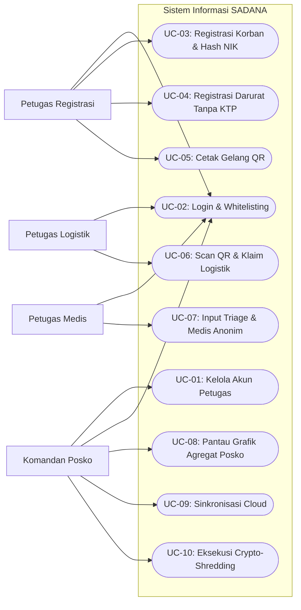
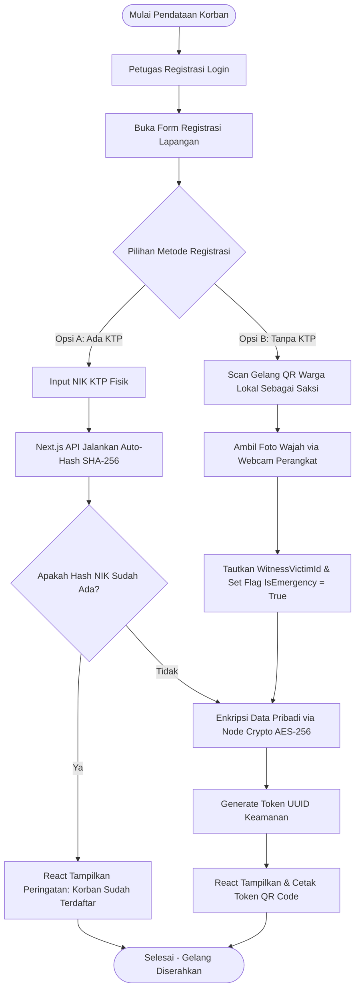
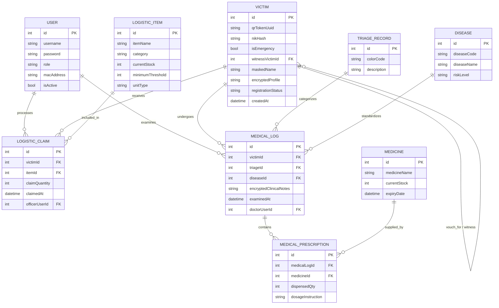
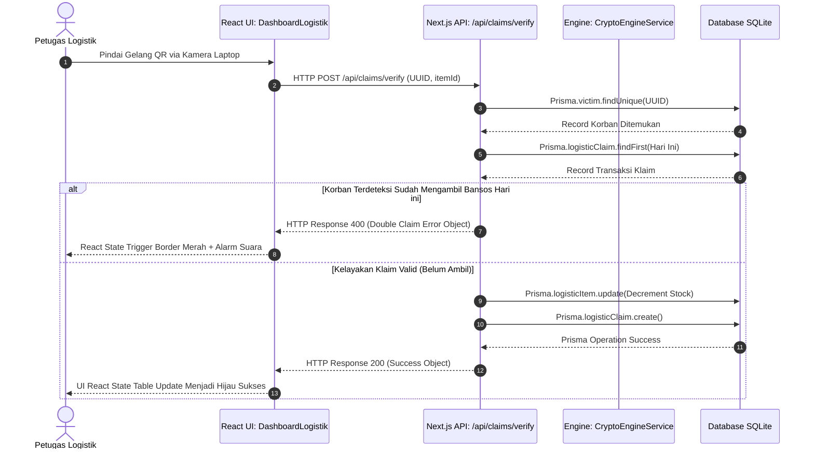
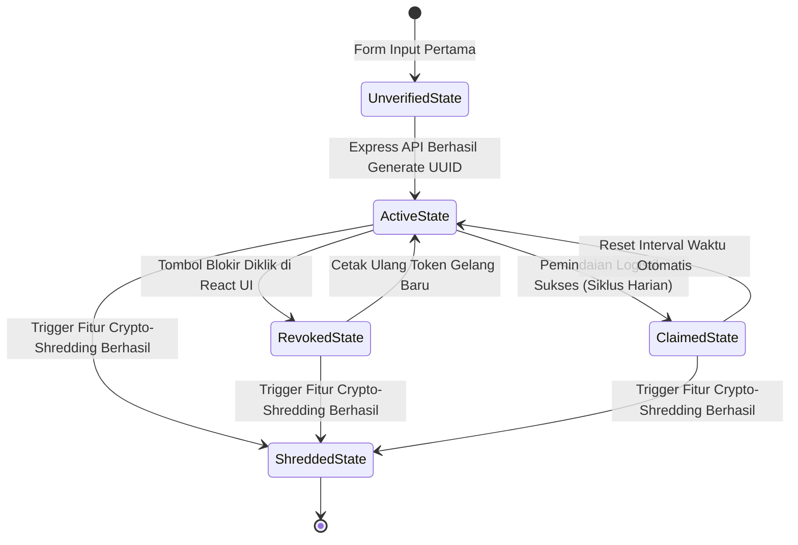
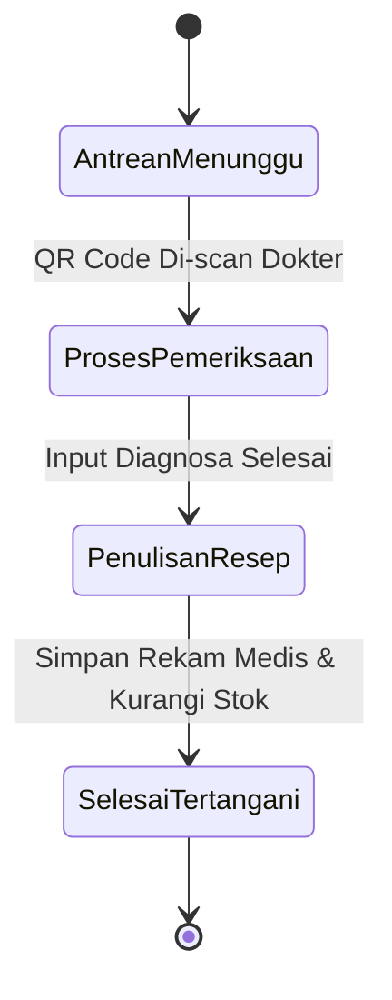

# PRD — Sistem Aman Distribusi Bantuan dan Manajemen Bencana (SADANA)

**Platform:** Web Application (Responsive Dashboard) menggunakan Next.js (App Router) + Tailwind CSS + Context API </br>
**Database:** SQLite (Local Server Portable / Single-File Engine) menggunakan Prisma ORM </br>
**Tema UI:** High-Contrast Safety (Biru Tua Komando, Orange Penyelamatan, Putih Bersih, dan Hijau Indikator) </br>
**Role:** Komandan Posko (Admin), Petugas Registrasi, Petugas Logistik, Petugas Medis </br>

---

# 1. Ringkasan Produk

## 1.1 Nama Produk

**SADANA — Sistem Aman Distribusi Bantuan dan Manajemen Bencana**

## 1.2 Jenis Produk

SADANA adalah platform manajemen operasional penanggulangan bencana berbasis web dengan arsitektur *Offline-First* dan *Secure-by-Design*. Sistem ini dioperasikan sepenuhnya oleh petugas di lapangan secara internal menggunakan jaringan *mesh* atau lokal tanpa ketergantungan internet penuh untuk mengelola pendaftaran korban, distribusi bantuan logistik, rekam medis darurat, dan analitik data terenkripsi demi mencegah eksploitasi data populasi rentan.

## 1.3 Tujuan Utama

Meningkatkan efisiensi dan keamanan tata kelola posko bencana melalui implementasi:

1. **Registrasi Anonim Berbasis Kriptografi:** Petugas registrasi mendata korban menggunakan NIK/IKD/Paspor yang langsung diubah menjadi hash unik sekali pakai menggunakan fungsi satu arah agar meminimalkan risiko eksploitasi identitas.
2. **Identifikasi Berbasis Token Fisik (QR Wristband):** Korban mendapatkan gelang identitas QR Code yang berfungsi sebagai kunci otorisasi anonim untuk mengklaim logistik bantuan dan layanan medis harian.
3. **Pemisahan Hak Akses Ketat (RBAC):** Petugas logistik hanya dapat melihat kelayakan klaim bantuan, sedangkan petugas medis hanya memiliki akses ke rekam medis darurat tanpa mengetahui identitas asli korban.
4. **Mekanisme Pasca-Bencana Aman (Crypto-Shredding):** Sistem menyediakan fitur penghancuran kunci enkripsi secara instan setelah masa tanggap darurat selesai untuk memastikan tidak ada jejak digital data sensitif yang tertinggal pada perangkat lokal lapangan.
5. **Arsitektur Jaringan Tangguh (Offline-First):** Memastikan sistem dapat bekerja 100% menggunakan server lokal portabel (seperti laptop utama atau Raspberry Pi) yang dihubungkan melalui router Wi-Fi lokal di area bencana tanpa koneksi internet.

---

# 2. Latar Belakang

Pada situasi darurat pascabencana alam atau krisis kemanusiaan, alur birokrasi distribusi bantuan sosial (bansos) konvensional sering kali mewajibkan pengumpulan dokumen fisik berupa fotokopi KTP atau Kartu Keluarga (KK). Lembaran dokumen fisik ini biasanya menumpuk secara acak di posko-posko darurat tanpa sistem pengamanan yang memadai. Petugas lapangan yang kurang terlatih juga kerap mencatat data pribadi korban menggunakan media digital publik seperti Google Sheets yang dibagikan secara bebas melalui grup WhatsApp.

Kondisi tersebut menciptakan celah eksploitasi data yang sangat masif bagi oknum tidak bertanggung jawab. Kasus pencurian identitas (*identity theft*) terhadap korban bencana untuk keperluan pengajuan pinjaman online (pinjol) ilegal, pemerasan, hingga penipuan terstruktur marak terjadi karena minimnya pengamanan data pada sektor akar rumput kemanusiaan.

Di sisi lain, tantangan infrastruktur di area bencana seperti putusnya aliran listrik dan hilangnya sinyal telekomunikasi membuat aplikasi berbasis *cloud server* konvensional sama sekali tidak dapat diandalkan. Oleh karena itu, SADANA hadir menggunakan ekosistem Next.js sebagai solusi platform manajemen internal posko bencana yang menggabungkan kecepatan operasional lapangan, ketangguhan *offline*, dan proteksi enkripsi data tingkat tinggi untuk menjamin bantuan sampai ke tangan yang tepat tanpa mengorbankan privasi para korban.

---

# 3. Visi Produk

Menyediakan sistem informasi internal penanggulangan bencana yang:

* **Zero-Trust Data Protection:** Mengutamakan privasi korban melalui metode enkripsi end-to-end, minimalisasi data, dan pemisahan role petugas secara absolut.
* **Disaster-Ready Architecture:** Mampu beroperasi secara instan di area minim infrastruktur menggunakan pendekatan *Offline-First* berbasis jaringan lokal.
* **High-Speed Operations:** Mengurangi antrean fisik posko melalui integrasi pemindaian QR Code yang cepat.
* **Academic & Competitive Power:** Menjadi proyek perangkat lunak unggulan yang mendemonstrasikan penerapan konsep Object-Oriented Programming (OOP) tingkat lanjut, manajemen basis data relasional yang aman, serta implementasi nyata dari kriteria *Track III (Eksploitasi Identitas dan Data)* pada FIT Competition 2026.

---

# 4. Tujuan Produk

## 4.1 Tujuan Operasional

* Mempercepat proses pendataan korban di posko darurat menggunakan metode digital terenkripsi.
* Menyediakan fitur *vouching* (penjaminan) terstruktur untuk memvalidasi korban luar domisili atau tanpa identitas (turis/tamu/korban hanyut) tanpa mengabaikan aspek akuntabilitas.
* Mencegah terjadinya duplikasi klaim bantuan sosial harian melalui pencatatan transaksi berbasis token QR tunggal.
* Memfasilitasi pelayanan medis darurat yang cepat dengan integrasi rekam medis anonim.
* Memberikan visualisasi data agregat (grafik logistik dan statistik kesehatan) kepada Komandan Posko untuk mempermudah pengambilan keputusan taktis tanpa mengekspos data pribadi korban.

## 4.2 Tujuan Akademik

Menunjukkan keahlian tim dalam merekayasa perangkat lunak modern yang menerapkan prinsip:

* **Encapsulation:** Mengunci properti sensitif seperti kunci enkripsi melalui enkapsulasi class yang ketat.
* **Inheritance:** Mengatur variasi role petugas dan profil pengguna melalui hierarki kelas yang bersih atau padanan fungsionalnya dalam Next.js Context/Middleware.
* **Polymorphic Authorization:** Menentukan fungsionalitas menu dasbor secara dinamis berdasarkan payload role yang aktif.
* **Abstraction & Clean Architecture:** Memisahkan logika enkripsi data kemanusiaan dari lapisan presentasi UI dengan menggunakan *Pattern Service*, *Repository*, atau *Server Actions* Next.js.

---

# 5. Ruang Lingkup Sistem

## 5.1 Yang Termasuk dalam Sistem

1. Registrasi akun petugas lapangan oleh Komandan Posko.
2. Login multi-role dengan validasi MAC Address lokal perangkat.
3. Dashboard fungsional berdasarkan role (Komandan, Registrasi, Logistik, Medis).
4. Manajemen akun petugas lapangan oleh Komandan Posko.
5. Pendaftaran korban regular (menggunakan NIK/IKD) dan korban darurat tanpa dokumen (menggunakan skema penjaminan saksi warga lokal).
6. Modul penjaminan (*Vouching System*) korban luar domisili / tanpa dokumen.
7. Modul distribusi logistik (Scan QR -> validasi kelayakan klaim harian -> potong stok barang otomatis).
8. Modul penanganan medis (Scan QR -> pemeriksaan klinis darurat/triage -> rekam medis anonim).
9. Master data barang logistik bantuan (stok, kategori, ambang batas minimum).
10. Master data klasifikasi penyakit darurat posko (ICD-10 sederhana).
11. Master data obat-obatan apotek darurat posko.
12. Fitur resep atau pemberian obat darurat oleh petugas medis.
13. Fitur penangguhan/revokasi token QR gelang yang dilaporkan hilang.
14. Fitur simulasi sinkronisasi data lokal-ke-cloud ketika koneksi pulih.
15. Fitur *Mnemonic Phrase Recovery* (pemulihan gelang hilang menggunakan 3 kata kunci).
16. Fitur *Crypto-Shredding* (Penghancuran Master Key) di memori RAM server Next.js.
17. Fitur *Client-Side Canvas Pixelate* untuk pengubahan foto wajah menjadi mosaik siluet abstrak.

## 5.2 Yang Tidak Termasuk dalam Sistem

1. Pembayaran keuangan online atau pencairan BLT tunai secara langsung.
2. Integrasi BPJS atau sistem rujukan rumah sakit besar luar daerah.
3. Integrasi laboratorium klinis kompleks.
4. Notifikasi WhatsApp/SMS publik (demi mencegah pelacakan posisi korban).
5. Tanda tangan digital bersertifikasi nasional.
6. Multi-cabang posko lintas negara yang kompleks.
7. Aplikasi mobile native (sistem murni web-responsive dashboard).
8. Pelacakan lokasi GPS korban secara real-time (anti-surveillance).
9. Telemedicine jarak jauh.

---

# 6. Role Pengguna

## 6.1 Komandan Posko (Admin Utama)

Komandan bertanggung jawab terhadap seluruh operasional taktis, pemantauan logistik, dan keamanan data di posko darurat.

### Tugas Utama Komandan

* Login ke sistem dan memverifikasi kesesuaian MAC Address perangkat server.
* Mengelola akun dan otorisasi hak akses petugas lapangan.
* Memantau dashboard agregat (Recharts grafik penyakit dan sisa stok bantuan).
* Mengatur ambang batas kuota harian logistik dan pasokan obat.
* Mengizinkan sinkronisasi data lokal ke cloud pusat.
* Mengeksekusi perintah *Crypto-Shredding* ketika misi tanggap darurat resmi ditutup.

## 6.2 Petugas Registrasi

Petugas front-office yang bertugas mendata korban selamat saat pertama kali datang ke posko.

### Tugas Utama Petugas Registrasi

* Melakukan verifikasi fisik wajah korban dan mencocokkannya dengan dokumen yang dibawa.
* Menginput data korban reguler (NIK di-hash instan, data dienkripsi AES-256).
* Menginput data korban tanpa dokumen menggunakan skema penjaminan saksi warga lokal (*Witness Vouching*).
* Mengambil tangkapan gambar wajah darurat (sistem canvas client-side otomatis mengubah menjadi mosaik siluet kabur).
* Melakukan cetak gelang fisik berisi token QR Code UUID v4.
* Melakukan pemulihan token gelang jika dilaporkan hilang menggunakan verifikasi *Mnemonic Phrase*.

## 6.3 Petugas Logistik

Petugas gudang atau tenda pembagian bahan makanan, pakaian, dan perlengkapan tidur.

### Tugas Utama Petugas Logistik

* Mengelola master data stok barang logistik masuk dari para donatur.
* Memindai gelang QR korban menggunakan webcam laptop atau barcode scanner.
* Memeriksa status kelayakan klaim bantuan korban pada sistem (mencegah klaim ganda).
* Memeriksa visual siluet mosaik wajah korban yang tampil di dashboard saat gelang di-scan.
* Melakukan konfirmasi penyerahan bantuan (stok gudang otomatis berkurang).

## 6.4 Petugas Medis (Dokter / Perawat)

Tenaga kesehatan darurat yang berjaga di tenda kesehatan posko bencana.

### Tugas Utama Petugas Medis

* Memindai gelang QR pasien untuk membuka dashboard pemeriksaan medis.
* Melihat riwayat medis masa lalu pasien secara anonim (alergi obat dan penyakit kronis).
* Mengisi keluhan kesehatan saat ini dan menentukan status warna *Triage* (Merah/Kuning/Hijau/Hitam).
* Memilih kode penyakit dari klasifikasi penyakit darurat.
* Memasukkan resep obat yang diberikan kepada pasien (mengurangi stok apotek darurat).

---

# 7. Matriks Hak Akses

| Fitur Utama | Komandan Posko | Petugas Registrasi | Petugas Logistik | Petugas Medis |
| --- | --- | --- | --- | --- |
| Registrasi akun petugas baru | **Ya** | Tidak | Tidak | Tidak |
| Login & Whitelisting Perangkat | **Ya** | **Ya** | **Ya** | **Ya** |
| Melihat Grafik Analitik Agregat | **Ya** | Tidak | Tidak | Tidak |
| Kelola Akun Petugas | **Ya** | Tidak | Tidak | Tidak |
| Pendaftaran Korban Baru (KTP) | Tidak | **Ya** | Tidak | Tidak |
| Pendaftaran Darurat (Tanpa KTP) | Tidak | **Ya** | Tidak | Tidak |
| Cetak Gelang QR Wristband | Tidak | **Ya** | Tidak | Tidak |
| Blokir / Re-issue Gelang Hilang | Tidak | **Ya** | Tidak | Tidak |
| Kelola Master Stok Logistik | **Ya** | Tidak | **Ya** | Tidak |
| Pemindaian QR Klaim Logistik | Tidak | Tidak | **Ya** | Tidak |
| Deteksi Klaim Ganda | Tidak | Tidak | **Ya** | Tidak |
| Input Hasil Pemeriksaan Medis | Tidak | Tidak | Tidak | **Ya** |
| Menentukan Kategori Triage | Tidak | Tidak | Tidak | **Ya** |
| Input Resep & Kurangi Stok Obat | Tidak | Tidak | Tidak | **Ya** |
| Mengakses Riwayat Medis Pasien | Tidak | Tidak | Tidak | **Ya** |
| Trigger Fitur Crypto-Shredding | **Ya** | Tidak | Tidak | Tidak |

---

# 8. Gambaran Umum Alur Sistem

1. Korban mendatangi pos pendaftaran utama di area bencana.
2. Petugas Registrasi membuka Form Pendaftaran SADANA lokal di browser Next.js.
3. Jika korban membawa dokumen, petugas menginput NIK. Sistem melakukan hash SHA-256 Salted dinamis di memori RAM server.
4. Jika korban tidak membawa dokumen, petugas memindai QR gelang saksi lokal, menginput nama alias random, dan mengklik capture wajah (canvas client-side otomatis mengubah menjadi mosaik siluet).
5. Sistem menyimpan data ke SQLite terenkripsi AES-256 melalui Prisma ORM.
6. Sistem menerbitkan token gelang berisi UUID v4 dan mencetak gelang QR korban beserta struk 3 kata kunci *Mnemonic Phrase*.
7. Korban membawa gelang QR ke tenda logistik untuk klaim sembako, kamera membaca token UUID, sistem memvalidasi klaim ganda, dan memotong stok gudang harian secara otomatis jika valid.
8. Jika korban membutuhkan penanganan klinis, gelang QR di-scan di pos kesehatan, sistem me-render rekam medis anonim, dokter menetapkan status warna Triage, serta menginput resep obat yang langsung memotong stok apotek posko.
9. Komandan Posko memantau grafik analitik Recharts dan mengeksekusi fitur *Crypto-Shredding* ketika masa penanganan bencana resmi berakhir.

---

# 9. Fitur Utama Sistem

## 9.1 Registrasi dan Login Petugas

Fitur gerbang pengamanan masuk aplikasi SADANA yang mencocokkan kredensial petugas dan memvalidasi alamat fisik MAC Address laptop operasional yang digunakan di lapangan.

* Registrasi akun petugas lapangan dengan penetapan role kerja.
* Proteksi password menggunakan library hash `bcryptjs` di hulu Server Actions.
* Middleware Route Guard untuk menyaring akses URL browser berdasarkan tipe role JWT token.
* Deteksi dan whitelisting MAC Address fisik laptop yang diizinkan memproses data posko.
* Force-logout otomatis (*Session Timeout*) jika sistem tidak mendeteksi aktivitas petugas selama 15 menit.

## 9.2 Dashboard Berdasarkan Role

Tampilan visual dashboard dirancang terpisah menggunakan dynamic layout Next.js untuk menyajikan informasi taktis yang spesifik.

### 9.2.1 Dasbor Komandan Posko (Pusat Kendali)

* Summary Cards: Total korban terdata (Regular vs Darurat Tanpa Dokumen), total komoditas bantuan aman (durasi hari ketahanan pangan), grafik tren infeksi penyakit tertinggi harian (menggunakan Recharts), dan jumlah petugas aktif.
* Tabel Cepat: Notifikasi barang logistik di bawah ambang batas minimum, log aktivitas penyerahan bansos harian, dan log penanganan medis darurat.
* Fitur Taktis: Tombol darurat merah *Crypto-Shredding* dengan otorisasi password ganda, tombol sinkronisasi biner data terenkripsi lokal ke cloud pusat.

### 9.2.2 Dasbor Petugas Registrasi

* Summary Cards: Korban terdaftar hari ini, gelang QR aktif tercetak, sisa kuota voucher darurat offline.
* Form Utama: Form Registrasi Regular (Input NIK -> auto-hashing SHA-256) dan Form Registrasi Darurat (Tanpa KTP -> Verifikasi saksi penjamin + Capture wajah mosaik).
* Panel Pemulihan (Recovery): Input verifikasi 3 kata kunci *Mnemonic Phrase* untuk cetak ulang gelang hilang.

### 9.2.3 Dasbor Petugas Logistik

* Summary Cards: Total paket bansos keluar hari ini, sisa stok sembako di posko, antrean logistik yang belum terlayani.
* Komponen Utama: Jendela pemindai kamera aktif (`<QrReader/>` React component) terintegrasi library `html5-qrcode`, panel pop-up status verifikasi (Warna Hijau = Klaim Valid, Warna Merah = Double Claim / Gelang Ditangguhkan), panel foto siluet mosaik wajah korban pembawa gelang.

### 9.2.4 Dasbor Petugas Medis

* Summary Cards: Pasien menanti antrean kesehatan, pasien selesai tertangani dokter hari ini, ketersediaan obat kritis di apotek darurat.
* Tabel Antrean: Nomor antrean pasien medis berdasarkan token gelang QR anonim.
* Form Rekam Medis: Input diagnosa rekam medis, status warna triage, dan input resep obat darurat.

## 9.3 Manajemen Akun Petugas

Digunakan Komandan Posko untuk mengontrol pembuatan kredensial baru petugas lapangan dan mendaftarkan whitelist hardware laptop operasional.

* Tambah akun petugas baru (dengan penetapan role).
* Edit data profil operasional petugas.
* Menonaktifkan akun petugas secara instan.
* Memasukkan alamat fisik MAC Address laptop petugas.

## 9.4 Registrasi Korban & Hashing NIK

Fitur pendataan di gerbang utama posko yang mengonversi nomor NIK secara otomatis menggunakan kriptografi satu arah SHA-256.

* Validasi format panjang digit NIK (harus tepat 16 digit).
* Enkripsi hash satu arah SHA-256 dengan *Master Salt Key* di RAM server sebelum dikirimkan ke database SQLite.
* Enkripsi simetris AES-256-CBC untuk kolom alamat dan nomor telepon korban.

## 9.5 Vouching Saksi Komunitas (Web of Trust)

Mengakomodasi penanganan pendaftaran bagi korban yang kehilangan seluruh dokumen identitas melalui jaminan saksi tetangga yang sah.

* Pemindaian QR gelang milik warga lokal terdaftar sebagai saksi penjamin.
* Perekaman relasi `witnessVictimId` pada database.
* Pembatasan kuota penjaminan maksimal 3 orang korban darurat per satu saksi warga lokal.

## 9.6 Pemindaian QR & Bansos

Pemrosesan asinkronus scan gelang QR untuk pencairan barang logistik darurat.

* Decoding string token UUID v4 dari gambar pemindaian kamera.
* Pencocokan asinkronus token ke database SQLite.
* Validasi status token (harus berstatus `Lokal` atau `Emergency_Unverified`).

## 9.7 Triage Medis & Rekam Medis Anonim

Klasifikasi kegawatan pasien bencana dan penyimpanan rekam jejak klinis darurat secara anonim.

* Pilihan Kategori Triage Berwarna (Merah = Kritis, Kuning = Sedang, Hijau = Ringan, Hitam = Meninggal Dunia).
* Enkripsi AES-256 pada kolom catatan klinis pasien.
* Pengikatan catatan medis ke token UUID gelang anonim korban, bukan identitas nama aslinya.

## 9.8 Manajemen Penyakit (ICD-10 Sederhana)

Master data klasifikasi jenis penyakit darurat bencana untuk mempermudah input dokter.

* Tambah master jenis penyakit posko.
* Validasi kode penyakit ICD-10 unik.
* Dropdown pencarian penyakit aktif pada form rekam medis dokter.

## 9.9 Manajemen Obat

Master data inventaris pasokan obat-obatan di apotek posko darurat.

* Input stok obat masuk.
* Validasi tanggal kedaluwarsa (*expiry date*) obat darurat.
* Alert stok obat rendah di dashboard medis.

## 9.10 Resep & Pengurangan Stok Otomatis

Integrasi pemberian obat darurat oleh dokter dengan pengurangan stok riil apotek posko.

* Input kuantitas buotir/botol obat pada rekam medis.
* Validasi ketersediaan stok apotek.
* Pengurangan stok obat secara aman memanfaatkan database transaction Prisma (`$transaction`).

## 9.11 Emergency Mnemonic Phrase

Sistem pemulihan gelang hilang tanpa menggunakan data nama atau dokumen korban.

* Generator acak 3 kata kunci dari kamus bahasa sederhana saat pertama kali korban mendaftar.
* Pencetakan kata kunci pemulihan pada struk kertas kecil terpisah.
* Kueri pencarian record korban berdasarkan input 3 kata kunci pemulihan.

## 9.12 Crypto-Shredding

Mekanisme pertahanan aktif yang memusnahkan kemampuan dekripsi database SQLite lokal.

* Penghapus file kunci master dari RAM server lokal.
* Overwrite acak sebanyak 3 siklus berturut-turut pada sektor penyimpanan fisik kunci master.
* Force-logout semua sesi petugas lapangan.

## 9.13 Local Hot-Standby Replication

Sistem cadangan asinkronus lokal untuk menjamin operasional posko bebas dari kendala *single point of failure*.

* Penyerapan asinkronus data SQLite terenkripsi harian di latar belakang browser laptop petugas logistik.
* Deklarasi otomatis laptop petugas lapangan menjadi Master Server baru jika server pusat padam.

## 9.14 SOP Kertas Kriptografis

Voucher fisik penjamin distribusi bansos manual saat seluruh komputer posko lumpuh total.

* Generator kode numerik unik voucher menggunakan algoritma HOTP (HMAC-Based One-Time Password).
* Sinkronisasi data kueri numerik voucher saat komputer menyala kembali.

## 9.15 Riwayat

* Riwayat pendaftaran petugas lapangan dan log perangkat internal.
* Riwayat pengambilan bansos harian korban (mencegah klaim ganda).
* Riwayat rekam medis darurat (membantu penanganan klinis berikutnya).
* Riwayat penjaminan saksi warga lokal.

## 9.16 Laporan Sederhana

Penyusunan data agregat operasional posko bencana dalam bentuk tabel visual di dashboard Komandan.

* Grafik trend penyakit menular (ICD-10) harian posko.
* Laporan total bansos terdistribusi berdasarkan kategori waktu.
* Laporan stok barang kritis logistik dan obat apotek.

---

# 10. Use Case Utama

1. **UC-01:** Registrasi Petugas Lapangan Baru oleh Komandan.
2. **UC-02:** Login Petugas Lapangan & Whitelisting MAC Address.
3. **UC-03:** Registrasi Korban Regular (Auto-Hash NIK).
4. **UC-04:** Registrasi Darurat Tanpa KTP (Saksi Komunitas / Witness Vouching).
5. **UC-05:** Pembuatan & Pencetakan Gelang QR Token Kemanusiaan.
6. **UC-06:** Pemindaian Gelang QR & Klaim Logistik Bantuan harian.
7. **UC-07:** Input Triage Medis & Rekam Medis Anonim pasien.
8. **UC-08:** Pemantauan Grafik Agregat Logistik & Medis oleh Komandan.
9. **UC-09:** Sinkronisasi Manual Database Lokal ke Cloud Pusat.
10. **UC-10:** Eksekusi Fitur Crypto-Shredding Pasca-Bencana oleh Komandan.

---

# 11. Diagram Use Case



---

# 12. Alur Kerja Sistem

## 12.1 Alur Registrasi Korban (Regular & Darurat)

1. Korban mendatangi pos pendaftaran utama.
2. Petugas Registrasi membuka Form Pendaftaran SADANA lokal di browser.
3. Jika korban membawa dokumen, petugas menginput NIK. Next.js melakukan hash SHA-256 Salted dinamis di memori RAM server.
4. Jika korban tidak membawa dokumen, petugas memindai QR gelang saksi lokal, menginput nama alias random, dan mengklik capture wajah (canvas client-side otomatis mengubah menjadi mosaik siluet).
5. Sistem menyimpan data ke SQLite terenkripsi AES-256.
6. Sistem menerbitkan token gelang berisi UUID v4 dan mencetak gelang QR korban beserta struk 3 kata kunci *Mnemonic Phrase*.

## 12.2 Alur Distribusi Logistik & Validasi Klaim Ganda

1. Korban membawa gelang QR ke tenda logistik.
2. Petugas Logistik mengaktifkan kamera scanner di halaman dashboard logistik.
3. Kamera membaca token UUID dari gelang QR.
4. API Next.js memeriksa status kelayakan token pada hari itu ke tabel `LogisticClaim`.
5. Jika terdeteksi klaim ganda, API mengembalikan response status 400. Dashboard logistik memicu border merah, membunyikan alarm suara, dan menampilkan peringatan "Double Claim Detected!".
6. Jika valid, sistem memproses penyerahan barang bantuan, memotong stok gudang secara transaksional, dan mencatat klaim logistik.

## 12.3 Alur Dashboard

1. Petugas melakukan proses login ke aplikasi.
2. Sistem mengekstrak data role dari muatan JWT token.
3. Router Next.js mengalihkan halaman petugas ke layout dashboard yang bersesuaian.
4. Komponen memanggil fungsi `fetch` asinkronus lokal untuk memuat widget ringkasan data taktis secara real-time.

## 12.4 Alur Laporan

1. Komandan membuka menu Laporan Analitik pada dashboard pusat.
2. Komandan mengatur filter jenis komoditas barang logistik atau klasifikasi penyakit.
3. Sistem memproses penarikan kueri agregat dari database SQLite lokal.
4. Hasil pengolahan data ditampilkan dalam bentuk grafik interaktif Recharts dan ringkasan angka tabel berkontras tinggi.

---

# 13. Diagram Aktivitas Registrasi & Vouching



---

# 14. Diagram Aktivitas Pelayanan Medis Darurat


---

# 15. Kebutuhan Fungsional

## 15.1 Modul Registrasi & Autentikasi Petugas

* Sistem harus menerima input username, password, dan MAC Address untuk otorisasi login.
* Password wajib di-hash menggunakan algoritma `bcryptjs` sebelum disimpan di basis data SQLite lokal.
* Route Guard Next.js middleware harus membatasi akses petugas berdasarkan JWT token yang valid.

## 15.2 Modul Kriptografi Lapangan (Security Engine)

* Sistem harus melakukan Hashing SHA-256 Salted dinamis di memori RAM server pada NIK korban saat proses registrasi.
* Sistem harus mengenkripsi kolom data profil dan gambar siluet wajah menggunakan algoritma AES-256-CBC.
* Sistem harus mengintegrasikan pengolahan canvas pixelate mosaik di sisi front-end React sebelum gambar wajah dikirimkan ke backend.

## 15.3 Modul Manajemen Logistik & Apotek Posko

* Sistem harus mencatat kuantitas stok barang logistik dan pasokan obat-obatan posko.
* Pengurangan stok logistik harian dan obat-obatan medis harus menggunakan transaksi database aman (`$transaction`) untuk mencegah *data race conditions*.
* Sistem harus mendeteksi secara otomatis jika sisa stok di database berada di bawah batas minimum (*minimum threshold*).

---

# 16. Kebutuhan Non-Fungsional

1. **Kompatibilitas Browser:** Aplikasi web SADANA harus berjalan mulus di browser modern (Google Chrome, Firefox) pada laptop petugas lapangan.
2. **Kesiapan Jaringan Offline:** Sistem harus dapat berjalan 100% secara lokal pada protokol HTTP tanpa ketergantungan pada koneksi WAN internet.
3. **Response Time Verifikasi:** Proses pemindaian QR gelang hingga validasi kelayakan logistik di database SQLite lokal tidak boleh melebihi durasi 1.5 detik.
4. **Desain UI Responsif:** Menggunakan Tailwind CSS tema kontras tinggi yang ramah untuk pencahayaan darurat di area bencana.
5. **Keamanan Local Storage:** Kunci enkripsi utama wajib diisolasi di memori RAM server Next.js dan tidak boleh ditulis dalam file konfigurasi SSD lokal.

---

# 17. Aturan Bisnis (Business Rules)

1. Kredensial login petugas lapangan hanya sah jika diakses dari perangkat laptop dengan alamat MAC Address yang di-whitelist oleh Komandan.
2. NIK korban regular yang dimasukkan wajib di-hash satu arah secara instan dan NIK asli dibuang dari memori RAM server.
3. Korban berstatus darurat tanpa dokumen identitas wajib memiliki relasi penjamin saksi warga lokal (`witnessVictimId`).
4. Satu orang warga lokal pemilik KTP sah hanya diperbolehkan menjadi penjamin saksi maksimal untuk 3 orang korban darurat.
5. Transaksi penyerahan bansos harian dibatasi kuota 1 paket per barang untuk 1 token UUID gelang korban setiap harinya.
6. Perintah penghancuran data (*Crypto-Shredding*) bersifat mutlak dan merusak kunci dekripsi secara permanen (tidak dapat dibatalkan).

---

# 18. Validasi Data

* Username petugas lapangan tidak boleh kosong dan harus unik di database.
* Format NIK korban regular wajib tervalidasi tepat berisi 16 digit angka numerik.
* Sistem harus menolak scan gelang QR jika token UUID di database SQLite terdeteksi berstatus `REVOKED` atau `EXPIRED`.
* Input pengurangan stok logistik dan obat darurat apotek posko tidak boleh bernilai negatif.
* Form rekam medis darurat dokter wajib diisi dengan status klasifikasi warna Triage sebelum disimpan.

---

# 19. Use Case Specification

## 19.1 Use Case — Registrasi Korban (Auto-Hash NIK)

| Elemen Spesifikasi | Deskripsi Detail |
| --- | --- |
| **Nama Use Case** | Registrasi Korban (Auto-Hash NIK) |
| **Aktor Utama** | Petugas Registrasi |
| **Tujuan** | Mendaftarkan identitas korban bencana secara aman tanpa mengeksploitasi data pribadi asli. |
| **Prasyarat** | Petugas telah login ke sistem lokal SADANA dan komputer terhubung ke printer gelang. |
| **Alur Utama Kerja** | 1. Petugas membuka form input pendaftaran korban krisis pada aplikasi Next.js.<br>

<br>2. Petugas memasukkan nama inisial, tanggal lahir, dan nomor NIK asli.<br>

<br>3. Next.js Server Actions mendeteksi input NIK dan melakukan konversi enkripsi satu arah SHA-256 menggunakan `crypto.createHash` yang dipadukan dengan Master RAM Salt.<br>

<br>4. Sistem memeriksa apakah string hash tersebut sudah ada di tabel database lokal.<br>

<br>5. Jika unik, data pribadi dienkripsi dengan AES-256-CBC dan disimpan ke database SQLite.<br>

<br>6. Sistem menerbitkan UUID v4 baru sebagai representasi token gelang digital korban. |
| **Kondisi Akhir** | Profil korban tersimpan dengan aman, identitas asli tersembunyi, dan gelang QR siap dicetak. |

## 19.2 Use Case — Registrasi Darurat Tanpa Dokumen (Saksi Komunitas)

| Elemen Spesifikasi | Deskripsi Detail |
| --- | --- |
| **Nama Use Case** | Registrasi Darurat Tanpa Dokumen (Saksi Komunitas) |
| **Aktor Utama** | Petugas Registrasi |
| **Tujuan** | Mendaftarkan korban yang tidak memiliki / kehilangan dokumen identitas agar tetap mendapatkan penanganan kemanusiaan yang terstruktur dan akuntabel. |
| **Prasyarat** | Petugas telah login ke sistem, dan terdapat warga lokal penjamin yang memiliki gelang QR aktif terverifikasi. |
| **Alur Utama Kerja** | 1. Petugas mengaktifkan mode "Registrasi Darurat (Tanpa Dokumen)" pada form Next.js.<br>

<br>2. Petugas memindai gelang QR warga lokal yang bertindak sebagai saksi penjamin.<br>

<br>3. Sistem melakukan validasi terhadap token saksi dan memeriksa sisa kuota vouching saksi tersebut.<br>

<br>4. Jika kuota aman, petugas menginput inisial nama korban darurat dan menyalakan webcam untuk mengambil foto wajah korban.<br>

<br>5. Sistem mengenkripsi data gambar wajah dan menyimpannya bersama data tautan `witnessVictimId` dengan flag `isEmergency = true`.<br>

<br>6. Sistem mencetak gelang QR dengan token UUID baru berstatus `Emergency_Unverified`. |
| **Kondisi Akhir** | Korban tanpa dokumen berhasil terdata dalam sistem Web of Trust dan mendapatkan hak akses bantuan darurat tanpa risiko kebocoran identitas. |

---

# 20. Desain Database

## 20.1 Daftar Tabel Utama Sistem

Sistem SADANA beroperasi menggunakan **11 tabel relasional utama** berikut:

1. `User`: Menyimpan kredensial otentikasi akun internal petugas posko.
2. `Victim`: Menyimpan data profil korban yang telah di-hash dan di-masking.
3. `witnessedVictims` (Self-relation model relasi pada tabel Victim): Mencatat data relasi penjaminan korban darurat tanpa dokumen.
4. `LogisticItem`: Menyimpan daftar komoditas barang bantuan logistik kemanusiaan di gudang.
5. `LogisticClaim`: Mencatat log histori pemindaian klaim komoditas logistik harian korban.
6. `Disease`: Master data klasifikasi jenis penyakit darurat krisis di posko lapangan.
7. `TriageRecord`: Mencatat pengelompokan tingkat kegawatan pasien medis bencana.
8. `MedicalLog`: Menyimpan detail hasil pemeriksaan rekam medis darurat anonim oleh dokter.
9. `Medicine`: Menyimpan master data obat-obatan medis darurat di apotek posko.
10. `MedicalPrescription`: Menghubungkan rekam medis dengan obat-obatan yang diserahkan ke korban.
11. `SystemKey`: Menyimpan data parameter enkripsi lokal yang dikunci di dalam memori RAM server.

---

## 20.2 Tabel `User`

| Nama Kolom | Tipe Data | Aturan / Keterangan |
| --- | --- | --- |
| id | Int (PK) | Auto Increment |
| username | String | Unik, digunakan untuk login petugas |
| password | String | Terenkripsi menggunakan algoritma bcryptjs |
| role | String | Komandan / Registrasi / Logistik / Medis |
| macAddress | String | Validasi fisik perangkat keras laptop petugas |
| isActive | Boolean | Status keaktifan akun petugas di lapangan |

## 20.3 Tabel `Victim`

| Nama Kolom | Tipe Data | Aturan / Keterangan |
| --- | --- | --- |
| id | Int (PK) | Auto Increment |
| qrTokenUuid | String | Unik, token acak UUID v4 yang dicetak ke gelang |
| nikHash | String | Hasil enkripsi satu arah SHA-256 dari NIK korban (Nullable) |
| isEmergency | Boolean | Menandai alur darurat tanpa dokumen |
| witnessVictimId | Int (FK) | Berelasi ke tabel `Victim` sendiri (Nullable) |
| maskedName | String | Nama inisial samaran korban (contoh: Korban_KS) |
| encryptedProfile | Text | Data alamat, telepon, dan mosaik foto terenkripsi AES-256 |
| registrationStatus | String | Lokal / Luar_Domisili / Emergency_Unverified |
| createdAt | DateTime | Waktu pendaftaran pertama di posko |

## 20.4 Tabel `witnessedVictims`

| Nama Kolom | Tipe Data | Aturan / Keterangan |
| --- | --- | --- |
| id | Int (PK) | Auto Increment |
| victimId | Int (FK) | Merujuk ke korban darurat tanpa dokumen |
| witnessId | Int (FK) | Merujuk ke korban lokal pemilik KTP sah selaku saksi |
| vouchNotes | Text | Catatan deskripsi alasan penjaminan darurat |

## 20.5 Tabel `LogisticItem`

| Nama Kolom | Tipe Data | Aturan / Keterangan |
| --- | --- | --- |
| id | Int (PK) | Auto Increment |
| itemName | String | Nama komoditas barang bantuan logistik |
| category | String | Pangan / Sandang / Perlengkapan Tidur |
| currentStock | Int | Jumlah kuantitas fisik riil sisa di gudang |
| minimumThreshold | Int | Batas minimum stok sebelum memicu alarm sistem |
| unitType | String | Satuan barang (KG / Dus / Pcs / Paket) |

## 20.6 Tabel `LogisticClaim`

| Nama Kolom | Tipe Data | Aturan / Keterangan |
| --- | --- | --- |
| id | Int (PK) | Auto Increment |
| victimId | Int (FK) | Berelasi ke tabel `Victim` |
| itemId | Int (FK) | Berelasi ke tabel `LogisticItem` |
| claimQuantity | Int | Kuantitas jatah barang bantuan yang diserahkan |
| claimedAt | DateTime | Waktu pemindaian entitas transaksi bansos |
| officerUserId | Int (FK) | Berelasi ke tabel `User` selaku operator logistik |

## 20.7 Tabel `Disease`

| Nama Kolom | Tipe Data | Aturan / Keterangan |
| --- | --- | --- |
| id | Int (PK) | Auto Increment |
| diseaseCode | String | Unik, Kode ringkas penanda ICD-10 posko krisis |
| diseaseName | String | Nama jenis penyakit darurat tanggap krisis |
| riskLevel | String | Tingkat keparahan (Rendah / Sedang / Menular Tinggi) |

## 20.8 Tabel `TriageRecord`

| Nama Kolom | Tipe Data | Aturan / Keterangan |
| --- | --- | --- |
| id | Int (PK) | Auto Increment |
| colorCode | String | Kode klasifikasi internasional (Merah/Kuning/Hijau/Hitam) |
| description | Text | Indikator klinis penentu tingkat keparahan medis |

## 20.9 Tabel `MedicalLog`

| Nama Kolom | Tipe Data | Aturan / Keterangan |
| --- | --- | --- |
| id | Int (PK) | Auto Increment |
| victimId | Int (FK) | Berelasi anonim ke token UUID tabel `Victim` |
| triageId | Int (FK) | Berelasi ke tabel `TriageRecord` |
| diseaseId | Int (FK) | Berelasi ke tabel `Disease` |
| encryptedClinicalNotes | Text | Catatan rekam rekam medis darurat terenkripsi AES-256 |
| examinedAt | DateTime | Waktu penanganan klinis darurat oleh dokter |
| doctorUserId | Int (FK) | Berelasi ke tabel `User` penanda dokter pemeriksa |

## 20.10 Tabel `Medicine`

| Nama Kolom | Tipe Data | Aturan / Keterangan |
| --- | --- | --- |
| id | Int (PK) | Auto Increment |
| medicineName | String | Nama pasokan obat-obatan apotek darurat posko |
| currentStock | Int | Jumlah sisa kuantitas butir/botol stok obat |
| expiryDate | DateTime | Tanggal batas kedaluwarsa pasokan obat |

## 20.11 Tabel `MedicalPrescription`

| Nama Kolom | Tipe Data | Aturan / Keterangan |
| --- | --- | --- |
| id | Int (PK) | Auto Increment |
| medicalLogId | Int (FK) | Berelasi ke tabel `MedicalLog` |
| medicineId | Int (FK) | Berelasi ke tabel `Medicine` |
| dispensedQty | Int | Jumlah volume obat yang diberikan ke pasien |
| dosageInstruction | String | Aturan regulasi takaran pakai obat harian |

## 20.12 Tabel `SystemKey`

| Nama Kolom | Tipe Data | Aturan / Keterangan |
| --- | --- | --- |
| id | Int (PK) | Auto Increment |
| keyTokenCipher | Text | Parameter enkripsi master lokal di RAM server |
| keyStatus | String | Indikator status (Aktif_Komando / Terhancurkan_Sadd) |

---

# 21. Entity Relationship Diagram (ERD)



---

# 22. Desain Berorientasi Objek (OOP Design)

## 22.1 Encapsulation (Enkapsulasi)

Seluruh kelas dan modul penanganan database Next.js tidak diizinkan mengekspos variabel internalnya secara bebas. Perubahan data inventaris stok obat atau data status token gelang hanya dapat dimodifikasi melalui method enkapsulasi terstruktur di dalam file `/services/databaseService.ts`. Keamanan enkripsi master key diisolasi secara internal di memori RAM dan tidak ditulis ke media SSD.

## 22.2 Component Composition (Padanan Inheritance)

Pewarisan rute dan otorisasi menu visual di sisi React Next.js diselesaikan menggunakan pola komposisi komponen (*Component Composition*) untuk mewarisi fungsionalitas menu navigasi dan keamanan dasbor secara dinamis:

* `<DashboardLayout>` (Root Component)
* `<RoleProtectedRoute role="Komandan">` -> Menampilkan panel komandan
* `<RoleProtectedRoute role="Logistik">` -> Menampilkan scanner logistik


## 22.3 Polymorphism (Polimorfisme)

Polimorfisme diterapkan pada element antarmuka dashboard. Fungsi routing di Next.js middleware me-render menu navigasi, tombol aksi, dan grafik analitik yang berbeda secara dinamis berdasarkan penguraian payload role JWT token yang terdeteksi aktif saat sesi login petugas.

## 22.4 Abstraction (Abstraksi)

Abstraksi diwujudkan melalui arsitektur pemisahan *Interface Service Layer* dan *Prisma Client*. Handler UI Next.js (Server Actions) tidak pernah mengetahui bagaimana kueri SQL ditulis atau bagaimana database melakukan enkripsi. Presentasi UI murni hanya memanggil rute aksi asinkronus abstrak seperti `registerVictimAction()` atau `processClaimAction()`.

---

# 23. Daftar Class Utama Sistem

## 23.1 BaseUserAccount (Abstract Class / Padanan Model)

* **Atribut:** `id: number`, `username: string`, `role: string`, `macAddress: string`, `isActive: boolean`
* **Method:** `abstract renderDashboardInterface(): void`, `validateDeviceBound(): boolean`

## 23.2 SecureVictimProfile (Class)

* **Atribut:** `qrTokenUuid: string`, `nikHash: string`, `isEmergency: boolean`, `maskedName: string`, `encryptedProfile: string`
* **Method:** `generateTokenWristband(): string`, `applyDataMasking(): void`, `decryptProfileData(ramKey: string): string`

## 23.3 HighSecurityCryptoEngine (Class)

* **Atribut:** `private cipherAlgorithm: string`, `private masterKeySystem: Buffer`
* **Method:** `static computeSha256(input: string): string`, `encryptSymmetric(plaintext: string): string`, `executeCryptoShredding(): void`

## 23.4 EmergencyMedicalUnit (Class)

* **Atribut:** `medicalLogId: number`, `triageLevel: string`, `clinicalDiagnosisCode: string`
* **Method:** `assignTriageColor(): string`, `appendPrescription(medicineId: number, qty: number): void`

---

# 24. Diagram Class


---

# 25. Diagram Sequence

## 25.1 Sequence — Pemindaian & Otorisasi Klaim Logistik Bantuan



---

# 26. Diagram Status (State Diagram)

## 26.1 State Management Status Gelang Korban pada React



## 26.2 Status Kunjungan Posko Kesehatan Lapangan



---

# 27. Struktur Arsitektur Proyek (Next.js Clean Stack)

```text
SADANA_NEXTJS/
├── app/
│   ├── api/
│   │   ├── auth/
│   │   │   └── route.ts         # Endpoint login & otentikasi JWT
│   │   ├── claims/
│   │   │   └── verify/
│   │   │       └── route.ts     # API validasi klaim ganda bansos
│   │   └── medical/
│   │       └── route.ts         # API rekam medis anonim
│   ├── command/
│   │   ├── layout.tsx           # Layout navigasi khusus komandan
│   │   └── page.tsx             # Dasbor grafik Recharts admin
│   ├── logistic/
│   │   └── page.tsx             # Halaman scanner web petugas logistik
│   ├── medical/
│   │   └── page.tsx             # Halaman triage & input obat dokter
│   ├── registration/
│   │   └── page.tsx             # Halaman form pendaftaran korban
│   ├── layout.tsx               # Root layout HTML & Font config
│   ├── middleware.ts            # Route guard JWT global Next.js
│   └── page.tsx                 # Halaman login petugas utama
├── components/
│   ├── ui/
│   │   ├── alert-modal.tsx      # Modal notifikasi error/sukses
│   │   ├── button.tsx           # Komponen tombol standard Tailwind
│   │   └── table.tsx            # Komponen tabel visual kontras tinggi
│   ├── QrScanner.tsx            # Modul kamera html5-qrcode
│   └── TriageRadio.tsx          # Komponen radio button triage medis
├── hooks/
│   └── useIndexedDb.ts          # Sinkronisasi antrean data offline
├── prisma/
│   ├── sadana_local.db          # File SQLite database utama lokal
│   └── schema.prisma            # Skema relasional data model
├── services/
│   ├── cryptoEngine.ts          # Mesin enkripsi & hashing SHA-256
│   └── databaseService.ts       # Service layer penanganan kueri database
├── package.json
├── tailwind.config.js
└── vite.config.js

```

---

# 28. Desain Tampilan UI

## 28.1 Konsep UI

Tampilan sistem menggunakan konsep *high-contrast safety UI* yang bersih, modern, kontras tinggi, mudah dibaca di bawah sinar matahari posko lapangan darurat, serta fokus penuh pada keterbacaan data taktis.

## 28.2 Palet Warna Keselamatan & Keamanan Posko

```javascript
// tailwind.config.js
module.exports = {
  theme: {
    extend: {
      colors: {
        primaryBlue: '#0B1E36',   // Biru Navy Tua Komando
        rescueOrange: '#FF6B00',  // Orange Penyelamatan BNPB
        safetyGreen: '#10B981',   // Hijau Status Valid
        alertRed: '#EF4444',      // Merah Triage Kritis
        brightPanel: '#FFFFFF',   // Putih Bersih Kontras
        darkText: '#050F1A'       // Hitam Pekat Keterbacaan Tinggi
      }
    }
  }
}

```

## 28.3 Komponen UI yang Disarankan

* Sidebar menu vertikal navigasi taktis berwarna gelap.
* Header panel status whitelisting perangkat keras.
* Card statistik Recharts ringkasan komoditas logistik.
* Badge status fungsional dengan warna indikator keselamatan.
* DataGridView ringkasan log claims harian posko.

## 28.4 Warna Status Indikator Lapangan

* Status Aman / Klaim Valid / Triage Hijau: `#10B981` (badge hijau)
* Peringatan / Klaim Ganda Terdeteksi / Triage Kuning: `#F59E0B` (badge kuning)
* Bahaya Kritis / Stok Habis / Triage Merah: `#EF4444` (badge merah)
* Token Ditangguhkan / Korban Meninggal (Triage Hitam): `#111827` (badge hitam)

---

# 29. Rekomendasi Layout Dashboard

## 29.1 Layout Dashboard Komandan Posko (Pusat Kendali)

```text
+-----------------------------------------------------------------------------+
| SADANA | DASBOR KOMANDAN PUSAT KENDALI                   [Admin: Budi_Kom]  |
+-----------------------------------------------------------------------------+
| METRIK UTAMA:                                                               |
| [ Total Korban: 1,420 ]    [ Regular: 1,120 ]    [ Emergency Mode: 300 ]    |
| [ Ketahanan Pangan: 12 Hari ]                     [ Petugas Aktif: 8 Org ]  |
|-----------------------------------------------------------------------------|
| TREN EPIDEMIOLOGI PENYAKIT (RECHARTS):     | ALERT LOGISTIK KRITIS:         |
| (Grafik batang sebaran penyakit tertinggi) | - Beras Posko 1 : Sisa 10 KG!  |
| - ISPA   : [====================] 124 Ksus | - Vaksin Tetanus: Sisa 5 Vial! |
| - Diare  : [==============] 85 Kasus       |                                |
| - DBD    : [========] 40 Kasus             | [ TOMBOL: SINKRONISASI CLOUD ] |
|-----------------------------------------------------------------------------|
| PANEL DARURAT KEAMANAN:                                                     |
| [ !!! TOMBOL MERAH: AKHIRI MISI & HANCURKAN KUNCI KRIPTOGRAFI LOKAL !!! ]   |
+-----------------------------------------------------------------------------+

```

## 29.2 Layout Dashboard Petugas Medis (Tenda Kesehatan)

```text
+-----------------------------------------------------------------------------+
| SADANA | POS KESEHATAN LAPANGAN DARURAT                  [Dokter: Rian_Med] |
+-----------------------------------------------------------------------------+
| ANTRIAN PASIEN MEDIS:                                                       |
| No | Token Gelang QR  | Status Triage  | Status Antrean | Aksi              |
| 1  | #f81d4fae-7dec   | Merah (Kritis) | Menunggu       | [ PROSES PERIKSA ]|
| 2  | #a765-00a0c91e   | Hijau (Ringan) | Sedang Periksa | [ LIHAT DETAIL ]  |
|-----------------------------------------------------------------------------|
| [PANEL PEMERIKSAAN AKTIF - PASIEN #f81d4fae-7dec]                           |
| Inisial: Korban_KS    | Umur: 42 Thn   | Alergi Obat: [ Penisilin ]         |
|                                                                             |
| Tingkat Triage: [ (O) MERAH ]   [ ( ) KUNING ]   [ ( ) HIJAU ]   [ ( ) HITAM ]|
| Diagnosis Penyakit: [ ISPA-01 - Infeksi Saluran Pernapasan Akut          | ]|
| Catatan Tindakan  : [ Oksigenasi kanula hidung 3 lpm, injeksi antipiretik  ]|
|                                                                             |
| Resep Obat Lapangan:                                                        |
| [ Parasetamol 500mg ] -> Jumlah: [ 10 ] Butir -> Aturan: [ 3x1 Sesudah Mkn ]|
|                                                                             |
| [ TOMBOL: SIMPAN REKAM MEDIS DARURAT & KURANGI STOK APOTEK LOKAL ]          |
+-----------------------------------------------------------------------------+

```

## 29.3 Layout Dashboard Petugas Logistik (Tenda Pembagian Bansos)

```text
+-----------------------------------------------------------------------------+
| SADANA | OPERASIONAL LOGISTIK POSKO 01                   [Petugas: Budi_Log] |
+-----------------------+-----------------------------------------------------+
| MENU NAVIGASI         | ZONA LIVE SCANNER WEBCAM (AKTIF)                     |
| [*] Dasbor Utama      | +-------------------------------------------------+ |
| [ ] Master Stok       | | [KAMERA COMPONENT REACT HTML5-QRCODE ACTIVE...] | |
| [ ] Log Klaim Harian  | +-------------------------------------------------+ |
|                       | Status Deteksi Terakhir: [ KLAIM VALID - HIJAU ]    |
|-----------------------+-----------------------------------------------------|
| SUMMARY STOK GUDANG   | TABEL UTAMA HISTORI PENYERAHAN BANTUAN HARI INI     |
| - Beras: 420 KG [Aman]| ID Token | Inisial Korban | Komoditas | Waktu Klaim |
| - Air: 12 Dus  [KRITIS| #QR-0912 | Korban_AH      | Paket Semb| 13:14:02 WIB|
| - Tenda: 5 Pcs  [Aman]| #QR-0841 | Korban_LM      | Selimut   | 13:10:55 WIB|
+-----------------------+-----------------------------------------------------+

```

---

# 30. Query Data Dasbor yang Disarankan

Akselerasi kueri asinkronus Next.js API Routes / Server Actions untuk pengolahan transaksional aman:

## 30.1 Perhitungan Metrik Ringkas Dasbor Komandan (Server Action)

```typescript
import { PrismaClient } from '@prisma/client';
const prisma = new PrismaClient();

export async function getCommanderMetrics() {
  // Hitung jumlah korban berhak menerima bantuan harian
  const totalVictims = await prisma.victim.count({
    where: { registrationStatus: { not: 'Ditangguhkan' } }
  });

  // Ambil data logistik kritis di bawah ambang batas minimum threshold
  const criticalItems = await prisma.logisticItem.findMany({
    where: {
      currentStock: { lte: prisma.logisticItem.fields.minimumThreshold }
    }
  });

  return { totalVictims, criticalItems };
}

```

## 30.2 API Endpoint Pencegahan Klaim Ganda pada Server Next.js

```typescript
// app/api/claims/verify/route.ts
import { NextResponse } from 'next/server';
import { PrismaClient } from '@prisma/client';
const prisma = new PrismaClient();

export async function POST(request: Request) {
  const { scannedToken, requestedItemId, officerId } = await request.json();

  const victim = await prisma.victim.findUnique({
    where: { qrTokenUuid: scannedToken }
  });

  if (!victim) {
    return NextResponse.json({ status: 'ERROR', message: 'Token Gelang Tidak Valid!' }, { status: 404 });
  }

  // Cek duplikasi klaim harian memanfaatkan tanggal hari ini
  const todayStart = new Date();
  todayStart.setHours(0,0,0,0);

  const alreadyClaimed = await prisma.logisticClaim.findFirst({
    where: {
      victimId: victim.id,
      itemId: requestedItemId,
      claimedAt: { gte: todayStart }
    }
  });

  if (alreadyClaimed) {
    return NextResponse.json({ status: 'WARNING', message: 'Double Claim Terdeteksi!' }, { status: 400 });
  }

  // Jalankan Transaction Database Aman untuk mengamankan data stok gudang lokal
  const claimResult = await prisma.$transaction(async (tx) => {
    const item = await tx.logisticItem.findUnique({ where: { id: requestedItemId } });
    if (!item || item.currentStock < 1) throw new Error('Stok komoditas habis!');

    await tx.logisticItem.update({
      where: { id: requestedItemId },
      data: { currentStock: item.currentStock - 1 }
    });

    return await tx.logisticClaim.create({
      data: {
        victimId: victim.id,
        itemId: requestedItemId,
        claimQuantity: 1,
        officerUserId: officerId
      }
    });
  });

  return NextResponse.json({ status: 'SUCCESS', data: claimResult });
}

```

---

# 31. Pembagian Tugas Kelompok (2 Orang + AI Agent)

## 31.1 Anggota Tim 1 — Core Architect, Security & Prisma Database

* **Fokus Kerja:**
* Inisialisasi framework Next.js, penulisan file `schema.prisma`, dan generate database lokal SQLite.
* Penulisan modul backend `cryptoEngine.ts` (SHA-256 Hashing NIK & Enkripsi AES-256 untuk Blob gambar wajah darurat).
* Pembuatan Next.js API Routes untuk otorisasi klaim bansos logistik dan rekam medis darurat.
* Pembuatan fungsi destruktif Server Actions *Crypto-Shredding* untuk Admin utama.


## 31.2 Anggota Tim 2 — Front-End React Component & Scanner Integrator

* **Fokus Kerja:**
* Setup file konfigurasi Tailwind CSS sesuai palet warna kontras tinggi keselamatan.
* Slicing layout dashboard responsive Next.js untuk semua variasi role petugas lapangan.
* Mengintegrasikan webcam client-side capture pada Form Registrasi Darurat dan component QR Scanner menggunakan library html5-qrcode.
* Mengelola sinkronisasi local state React UI terhadap data endpoints API via Fetch/Axios.


---

# 32. Skenario Jalannya Demo Presentasi Juri FIT Competition 2026

## Skenario 1 — Jalur Petugas Registrasi (Registrasi Korban Tanpa Dokumen)

1. Anggota Tim 2 menyamar sebagai pengungsi yang hanyut dan kehilangan KTP.
2. Anggota Tim 1 memilih mode "Registrasi Darurat (Saksi Komunitas)", memindai gelang QR warga lokal penjamin, lalu mengambil gambar wajah Tim 2 via webcam.
3. Next.js secara instan menghasilkan QR Code token gelang baru.
4. Juri diperlihatkan database SQLite di mana wajah korban terbukti langsung berubah menjadi mosaik Base64 abstrak terenkripsi.

## Skenario 2 — Jalur Petugas Logistik (Validasi Klaim Ganda)

1. Token gelang QR tersebut dibawa ke pos logistik untuk mencairkan bantuan sembako.
2. Pemindaian pertama sukses dan memotong stok gudang secara otomatis.
3. Petugas langsung mencoba memindai ulang gelang yang sama untuk kedua kalinya.
4. Component UI Next.js langsung memicu suara alarm peringatan merah tebal akibat respon error status 400 dari server, membuktikan keandalan sistem proteksi.

## Skenario 3 — Jalur Petugas Medis (Pelayanan Medis Anonim)

1. Gelang dibawa ke pos kesehatan darurat posko.
2. Dokter memindai QR gelang tersebut menggunakan webcam di dashboard medis.
3. Next.js otomatis me-render rekam medis darurat secara anonim tanpa membuka identitas asli korban untuk menjaga privasi rekam jejak kesehatan.

## Skenario 4 — Jalur Akhir Komandan Posko (Crypto-Shredding Trigger)

1. Komandan masuk ke dasbor pengaturan khusus keamanan tingkat tinggi.
2. Komandan menekan tombol merah darurat, server Next.js seketika menghapus master key dari memori RAM server lokal.
3. Buka kembali aplikasi Prisma Studio/DB Browser di depan mata juri. Seluruh baris data di database SQLite terbukti terkunci permanen menjadi teks acak tidak terbaca selamanya di hadapan juri.

---

# 33. Risiko dan Solusi

## 33.1 Risiko Operasional Lapangan

* Kerusakan fisik perangkat laptop server pusat posko darurat akibat tertimpa runtuhan atau terkena air krisis.
* Hilangnya pasokan daya listrik generator utama posko yang memicu matinya laptop server (*hard shutdown*) dan lenyapnya kunci master di memori RAM.
* Sensor kamera rewel akibat cuaca ekstrem hujan badai, lensa berembun, atau gelang QR sobek kotor berlumpur.

## 33.2 Solusi Aktif Kontingensi (Fail-Safe)

* **Local Hot-Standby Replication:** Menggunakan jaringan Wi-Fi lokal posko secara peer-to-peer. Setiap 30 detik laptop logistik melakukan background replication data SQLite terenkripsi sehingga bisa menggantikan server utama jika hancur.
* **Shamir's Secret Sharing:** Kunci master enkripsi dipecah menjadi 3 token biner terpisah dengan skema ambang batas `2-of-3`. Penggabungan minimal 2 token fisik dari para pemegang otoritas saat menyalakan komputer kembali akan merekonstruksi ulang kunci master di dalam RAM secara instan.
* **SOP Kertas Kriptografis HOTP:** Jika komputer posko padam total, petugas logistik membagikan bansos secara manual menggunakan kertas voucher fisik berbasis rumus matematika deterministik algoritma HOTP.

---

# 34. Rekomendasi Implementasi Bertahap

Urutan eksekusi taktis 2 programmer dalam pengerjaan 10 jam live coding:

1. Inisialisasi boilerplate Vite Next.js, instalasi Tailwind CSS, dan inisialisasi skema database Prisma SQLite.
2. Penulisan modul logika hashing SHA-256 Salted NIK dan enkripsi AES-256 di hulu Server Actions.
3. Pembuatan Route Guard middleware Next.js untuk otentikasi role-based petugas lapangan.
4. Slicing layout dinamis dashboard operasional petugas registrasi.
5. Slicing layout dinamis dashboard operasional petugas logistik.
6. Slicing layout dinamis dashboard operasional petugas medis.
7. Slicing layout dinamis dashboard operasional Komandan Posko.
8. Integrasi komponen kamera pemindai `html5-qrcode` di sisi front-end React.
9. Implementasi modul kamera capture wajah client-side terikat elemen HTML5 Canvas pixelate.
10. Pembuatan endpoint API transaksional klaim logistik harian dan penanganan status ganda.
11. Pembuatan endpoint API rekam medis darurat dan status klasifikasi warna Triage.
12. Sinkronisasi pengurangan stok logistik gudang secara transaksional menggunakan kueri Prisma.
13. Sinkronisasi pengurangan stok obat apotek darurat posko secara transaksional menggunakan kueri Prisma.
14. Pembuatan fungsi generator acak 3 kata kunci *Mnemonic Phrase* pada database registrasi.
15. Pembuatan tombol trigger darurat Crypto-Shredding penghancuran master key di server-side Next.js.
16. Implementasi visualisasi data agregat menggunakan chart interaktif Recharts di panel Komandan.
17. Integrasi local state management React UI terhadap penanganan response status error API.
18. Pengujian sistem whitelisting hardware berbasis alamat fisik MAC Address.
19. Pembersihan sisa bug rendering, penanganan enkapsulasi kode, dan optimasi kueri basis data.
20. Simulasi gladi bersih jalannya skenario demo "Aha! Moment" di hadapan juri.

---

# 35. Kesimpulan

SADANA Next.js Edition menghadirkan keandalan teknologi web modern Single Page Application (SPA) berbasis server lokal Next.js dengan keandalan pengamanan data kemanusiaan tingkat tinggi (*Zero-Knowledge Storage*). Melalui inovasi sistem registrasi darurat saksi komunitas (*Web of Trust*), teknik visual mosaik di sisi front-end React, dan pemulihan gelang menggunakan protokol mnemonic, platform ini membuktikan bahwa efisiensi distribusi bantuan logistik skala masif dapat dicapai tanpa harus mengorbankan hak privasi dan keamanan identitas para korban bencana yang berada dalam kondisi rentan.
