# PRODUCT REQUIREMENT DOCUMENT

## Sistem Aman Distribusi Bantuan dan Manajemen Bencana

### Secure Offline-First Disaster Aid Distribution & Identity Protection System

---

## Document Control

| Item            | Keterangan                                                                         |
| --------------- | ---------------------------------------------------------------------------------- |
| Nama Produk     | SADANA                                                                             |
| Platform        | Web Application SPA                                                                |
| Frontend        | React Vite, Tailwind CSS, React Router, Context API                                |
| Backend         | Node.js Express.js, Prisma ORM                                                     |
| Database        | SQLite Portable Single-File Database                                               |
| Mode Operasi    | Offline-First Local Area Network                                                   |
| Prinsip Desain  | Secure-by-Design, Privacy-by-Design, Data Minimization, Field-Level Encryption     |
| Target Pengguna | Posko bencana, petugas registrasi, petugas logistik, petugas medis, komandan posko |

---

# 1. Ringkasan Produk

## 1.1 Nama Produk

**SADANA — Sistem Aman Distribusi Bantuan dan Manajemen Bencana**

SADANA adalah sistem informasi operasional posko bencana berbasis web lokal yang dirancang untuk membantu proses pendaftaran pengungsi, distribusi bantuan, pencatatan medis darurat, pengelolaan stok logistik, dan audit keamanan data secara aman dalam kondisi infrastruktur terbatas.

Sistem ini berjalan dalam jaringan lokal posko menggunakan satu perangkat utama sebagai **Local Command Server**. Perangkat tersebut menjalankan backend Express, Prisma ORM, dan database SQLite. Perangkat petugas lainnya mengakses sistem melalui browser menggunakan React SPA melalui jaringan Wi-Fi lokal atau mesh lokal tanpa membutuhkan koneksi internet luar.

---

## 1.2 Latar Belakang

Pada kondisi bencana, pengumpulan data korban sering dilakukan menggunakan kertas, foto KTP, fotokopi KK, spreadsheet publik, atau grup komunikasi yang tidak aman. Praktik ini berisiko menyebabkan kebocoran data pribadi korban, pencurian identitas, penyalahgunaan NIK untuk pinjaman ilegal, pemalsuan klaim bantuan, dan manipulasi data distribusi oleh pihak internal maupun eksternal.

Selain itu, area bencana sering mengalami gangguan listrik, jaringan seluler, dan internet. Sistem berbasis cloud murni tidak selalu dapat diandalkan. Oleh karena itu, SADANA dirancang sebagai sistem lokal yang tetap dapat berjalan secara offline, tetapi tetap menerapkan keamanan data yang kuat.

---

## 1.3 Tujuan Utama

Tujuan utama SADANA adalah:

1. Mempercepat pendaftaran korban bencana secara aman.
2. Mengurangi penyimpanan data pribadi mentah.
3. Mencegah klaim bantuan ganda.
4. Menjaga kerahasiaan data medis korban.
5. Menyediakan audit log forensik yang sulit dimanipulasi.
6. Menyediakan sistem distribusi bantuan yang transparan dan akuntabel.
7. Menjamin sistem tetap berjalan di lingkungan tanpa internet.
8. Meminimalkan risiko eksploitasi identitas korban bencana.

---

# 2. Masalah yang Ingin Diselesaikan

## 2.1 Masalah Operasional

1. Registrasi korban masih lambat karena bergantung pada dokumen fisik.
2. Korban tanpa dokumen sulit didata secara adil.
3. Distribusi bantuan rawan klaim ganda.
4. Stok logistik sulit dipantau real-time.
5. Data medis korban tidak terdokumentasi dengan baik.
6. Pengambilan keputusan komandan posko kurang berbasis data.

## 2.2 Masalah Keamanan

1. NIK, alamat, nomor telepon, dan riwayat medis korban rawan bocor.
2. QR gelang dapat difoto atau disalahgunakan.
3. Petugas internal dapat menyalahgunakan akses.
4. Audit log biasa mudah dihapus atau diedit.
5. Perangkat petugas dapat dipakai oleh pihak tidak sah.
6. Database lokal berisiko dicuri dari perangkat posko.

---

# 3. Visi Produk

SADANA menjadi sistem posko bencana yang:

1. **Offline-First**
   Tetap berjalan tanpa internet menggunakan jaringan lokal posko.

2. **Privacy-by-Design**
   Data pribadi tidak disimpan dalam bentuk mentah apabila tidak diperlukan.

3. **Secure-by-Design**
   Setiap modul dirancang dengan validasi, otorisasi, enkripsi, dan audit trail.

4. **Operationally Practical**
   Sistem tetap realistis digunakan oleh petugas lapangan dalam situasi darurat.

5. **Accountable**
   Semua aksi penting seperti login, pencarian data, klaim bantuan, koreksi stok, reissue gelang, dan crypto-shredding dicatat dalam audit log.

---

# 4. Ruang Lingkup Sistem

## 4.1 Termasuk dalam Sistem

SADANA mencakup:

1. Login petugas berbasis role.
2. Device binding perangkat petugas.
3. Dashboard berdasarkan role.
4. Registrasi korban dengan dokumen.
5. Registrasi korban darurat tanpa dokumen.
6. Deteksi potensi duplikasi korban darurat berbasis biometric risk signal.
7. Penerbitan gelang QR anonim.
8. Pemulihan atau reissue gelang hilang.
9. Distribusi bantuan otomatis berdasarkan jendela waktu.
10. Pencegahan klaim bantuan ganda.
11. Pengelolaan stok logistik.
12. Pencatatan stok masuk, koreksi stok, dan mutasi stok.
13. Pencatatan triage medis.
14. Pencatatan riwayat medis terenkripsi.
15. Pemberian obat dan pemotongan stok obat.
16. Global search terbatas untuk Komandan.
17. Audit log HMAC-chain.
18. Crypto-shredding kunci data.
19. Dashboard agregat logistik dan medis.
20. Export database terenkripsi untuk arsip pascabencana.

---

## 4.2 Tidak Termasuk dalam Sistem

SADANA tidak mencakup:

1. Pembayaran online.
2. Pencairan bantuan tunai langsung.
3. Integrasi WhatsApp atau SMS publik.
4. Pelacakan GPS korban real-time.
5. Manajemen multi-posko lintas daerah secara online real-time.
6. Sinkronisasi cloud otomatis.
7. Pengenalan wajah untuk identifikasi hukum.
8. Penyimpanan foto wajah asli korban.
9. Penyimpanan NIK mentah.
10. Sistem e-KYC resmi kependudukan.

---

# 5. Stakeholder

| Stakeholder        | Kepentingan                                                       |
| ------------------ | ----------------------------------------------------------------- |
| Korban Bencana     | Mendapat bantuan dengan cepat tanpa data pribadinya terekspos     |
| Petugas Registrasi | Mendaftarkan korban dan menerbitkan gelang QR                     |
| Petugas Logistik   | Menyerahkan bantuan sesuai hak korban                             |
| Petugas Medis      | Mencatat kondisi medis dan pemberian obat                         |
| Komandan Posko     | Mengawasi data agregat, audit, petugas, dan keputusan strategis   |
| Tim IT Posko       | Menjalankan server lokal, backup terenkripsi, dan maintenance     |
| Panitia Lomba/Juri | Menilai kualitas ide, keamanan, implementasi, dan relevansi track |

---

# 6. Role Pengguna

## 6.1 Komandan Posko

Komandan Posko adalah admin utama. Hak akses:

1. Mengelola akun petugas.
2. Melakukan pairing perangkat petugas.
3. Melihat dashboard agregat.
4. Melakukan global search terbatas.
5. Melihat audit log.
6. Menyetujui koreksi stok kritis.
7. Menyetujui reissue gelang pada kasus tertentu.
8. Mengeksekusi crypto-shredding pascabencana.
9. Melakukan export database terenkripsi.

## 6.2 Petugas Registrasi

Petugas Registrasi bertugas:

1. Mendaftarkan korban dengan dokumen.
2. Mendaftarkan korban tanpa dokumen.
3. Mencetak gelang QR.
4. Mencetak mnemonic recovery phrase.
5. Memproses reissue gelang hilang.
6. Melakukan verifikasi saksi.
7. Melihat data korban terbatas sesuai kebutuhan registrasi.

## 6.3 Petugas Logistik

Petugas Logistik bertugas:

1. Memindai gelang QR korban.
2. Memproses klaim bantuan.
3. Melihat status kelayakan bantuan.
4. Menginput stok masuk.
5. Melihat sisa stok.
6. Mengajukan koreksi stok.
7. Tidak dapat mengubah hak bantuan secara manual.

## 6.4 Petugas Medis

Petugas Medis bertugas:

1. Memindai gelang QR pasien.
2. Melihat profil medis anonim.
3. Menginput triage.
4. Menginput catatan klinis.
5. Memberikan obat.
6. Memotong stok obat secara transaksional.
7. Tidak dapat melihat detail NIK atau alamat kecuali dibutuhkan dan diotorisasi.

---

# 7. Matriks Hak Akses

| Fitur                     | Komandan | Registrasi | Logistik |    Medis |
| ------------------------- | -------: | ---------: | -------: | -------: |
| Login                     |       Ya |         Ya |       Ya |       Ya |
| Device Binding            |       Ya |      Tidak |    Tidak |    Tidak |
| Kelola Akun Petugas       |       Ya |      Tidak |    Tidak |    Tidak |
| Dashboard Agregat         |       Ya |   Terbatas | Terbatas | Terbatas |
| Registrasi Korban KTP     |    Tidak |         Ya |    Tidak |    Tidak |
| Registrasi Korban Darurat |    Tidak |         Ya |    Tidak |    Tidak |
| Cetak Gelang QR           |    Tidak |         Ya |    Tidak |    Tidak |
| Reissue Gelang            | Approval |         Ya |    Tidak |    Tidak |
| Scan Klaim Bantuan        |    Tidak |      Tidak |       Ya |    Tidak |
| Kelola Stok Masuk         |       Ya |      Tidak |       Ya |    Tidak |
| Koreksi Stok              | Approval |      Tidak |   Ajukan |    Tidak |
| Input Triage              |    Tidak |      Tidak |    Tidak |       Ya |
| Input Rekam Medis         |    Tidak |      Tidak |    Tidak |       Ya |
| Input Resep Obat          |    Tidak |      Tidak |    Tidak |       Ya |
| Global Search             |       Ya |      Tidak |    Tidak |    Tidak |
| Audit Log                 |       Ya |      Tidak |    Tidak |    Tidak |
| Export Terenkripsi        |       Ya |      Tidak |    Tidak |    Tidak |
| Crypto-Shredding          |       Ya |      Tidak |    Tidak |    Tidak |

---

# 8. Arsitektur Sistem

## 8.1 Model Arsitektur

SADANA menggunakan model **Single Local Command Server**.

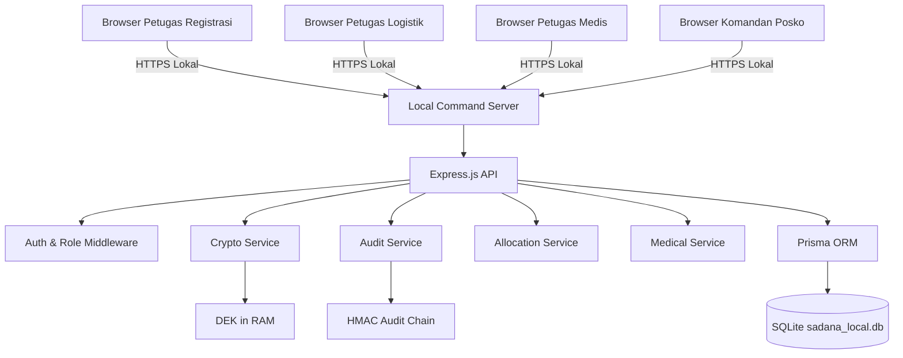

## 8.2 Komponen Utama

| Komponen               | Fungsi                              |
| ---------------------- | ----------------------------------- |
| React Vite SPA         | Antarmuka pengguna                  |
| Tailwind CSS           | Styling dan desain responsif        |
| React Router           | Routing halaman berdasarkan role    |
| Context API            | State login sementara di browser    |
| Express.js             | Backend API lokal                   |
| Prisma ORM             | Pengelolaan database SQLite         |
| SQLite                 | Penyimpanan lokal portable          |
| Crypto Service         | HMAC, AES-GCM, key handling         |
| Audit Service          | Pencatatan audit log berantai       |
| Allocation Service     | Validasi hak bantuan dan klaim      |
| Medical Service        | Triage, medical log, resep          |
| Device Binding Service | Pairing perangkat petugas           |
| QR Service             | Pembuatan dan validasi token gelang |

---

# 9. Prinsip Keamanan

## 9.1 Data Minimization

Sistem hanya menyimpan data yang benar-benar dibutuhkan. NIK mentah tidak disimpan. Nama asli tidak dipakai sebagai identitas operasional utama. Data sensitif disimpan terenkripsi.

## 9.2 Field-Level Encryption

Field sensitif seperti alamat, kontak, profil darurat, dan catatan medis dienkripsi menggunakan AES-256-GCM.

## 9.3 HMAC-Based Identity Index

NIK diproses menjadi index pencarian menggunakan:

```text
nikIndex = HMAC-SHA256(masterPepper, normalizedNIK)
```

NIK mentah tidak ditulis ke database.

## 9.4 Device Binding

Sistem tidak bergantung pada MAC address browser. Setiap perangkat petugas harus dipairing oleh Komandan dan mendapatkan `deviceId` serta `deviceSecret`.

## 9.5 Role-Based Access Control

Setiap endpoint backend wajib memverifikasi:

1. Session valid.
2. Device valid.
3. Role sesuai.
4. Permission sesuai aksi.
5. Request body valid.

## 9.6 Audit Log HMAC-Chain

Setiap aktivitas penting dicatat ke AuditLog. Hash log dihitung menggunakan:

```text
logChainHash = HMAC-SHA256(auditSecret, canonicalPayload + previousHash)
```

## 9.7 QR Token Anonim

QR gelang hanya berisi token acak. Tidak ada NIK, nama asli, alamat, atau data medis di dalam QR.

## 9.8 Crypto-Shredding

Crypto-shredding menghancurkan Data Encryption Key, bukan sekadar menghapus variabel RAM.

---

# 10. Authentication & Session Design

## 10.1 Login Flow

1. Petugas membuka halaman login.
2. Petugas memasukkan username dan password.
3. Browser mengirim login request ke server lokal.
4. Server memvalidasi password menggunakan bcrypt.
5. Server memvalidasi perangkat melalui device binding.
6. Server membuat session.
7. Server mengembalikan access token pendek atau httpOnly session cookie.
8. Semua aktivitas penting masuk AuditLog.

## 10.2 Session Timeout

Session timeout berlaku di dua sisi:

1. Frontend: logout otomatis jika idle 15 menit.
2. Backend: menolak request jika session sudah idle/melewati expiry.

## 10.3 Device Pairing

Device pairing dilakukan oleh Komandan:

1. Komandan membuat akun petugas.
2. Petugas login pertama kali.
3. Sistem menampilkan kode pairing.
4. Komandan menyetujui pairing.
5. Server membuat device record.
6. Device tersebut menjadi trusted.

---

# 11. User Flow Umum

## 11.1 Flow Login Petugas

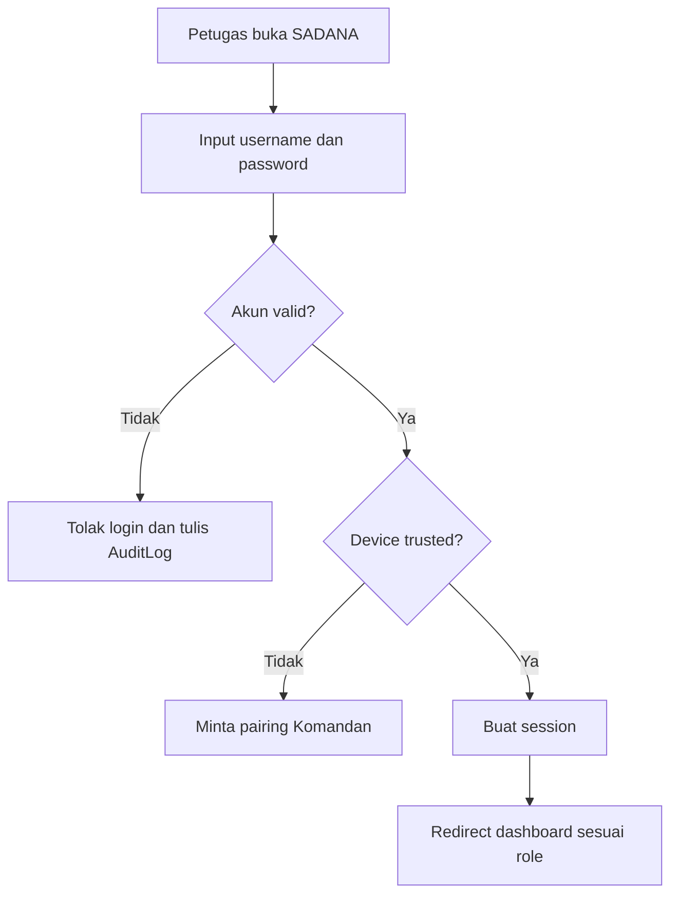

## 11.2 Flow Registrasi Korban dengan KTP

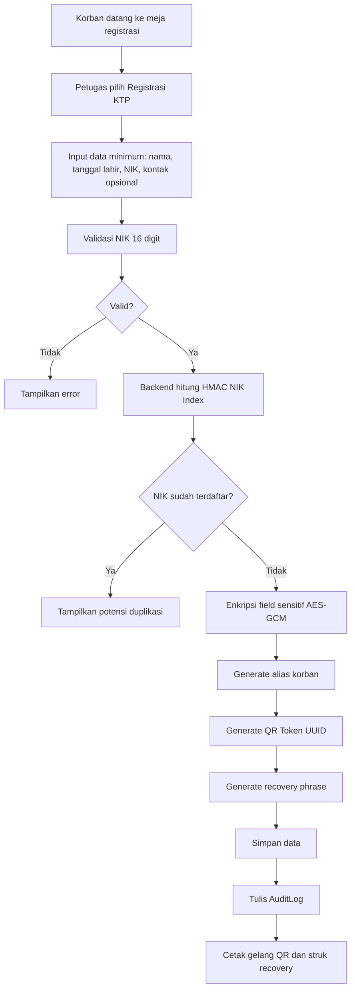

## 11.3 Flow Registrasi Darurat Tanpa Dokumen

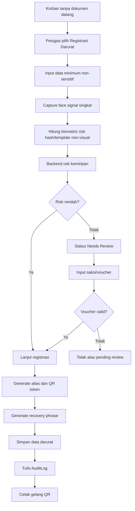

## 11.4 Flow Distribusi Bantuan

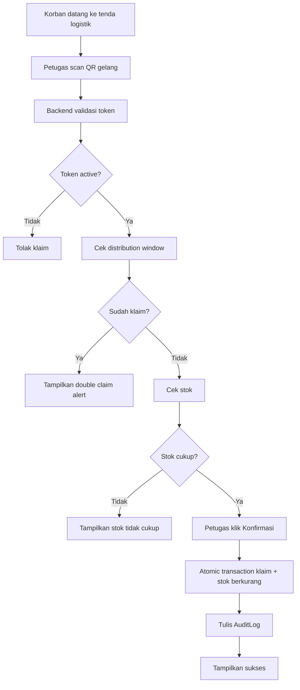

## 11.5 Flow Pelayanan Medis

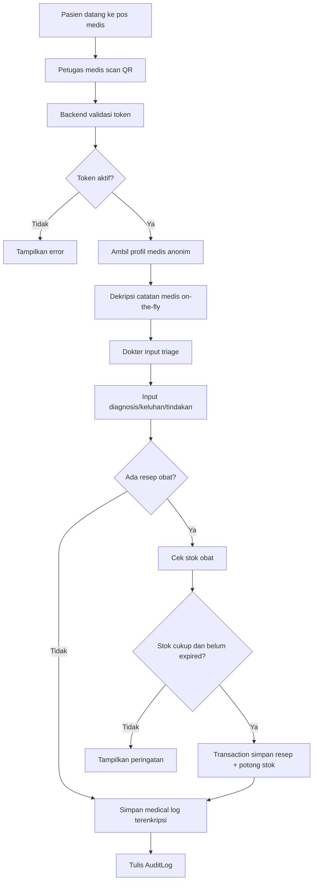

## 11.6 Flow Global Search Komandan

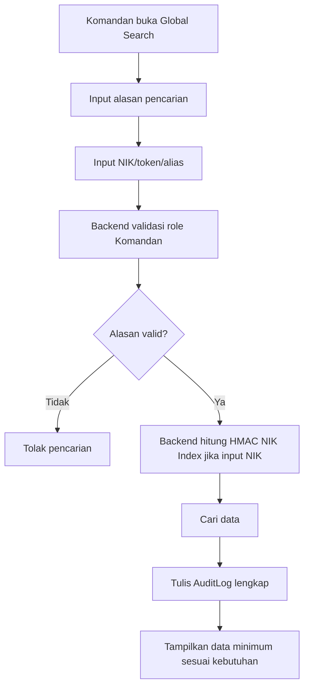

## 11.7 Flow Reissue Gelang Hilang

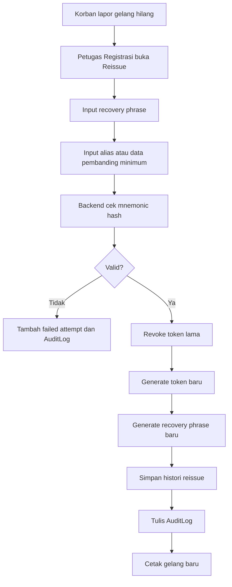

## 11.8 Flow Crypto-Shredding

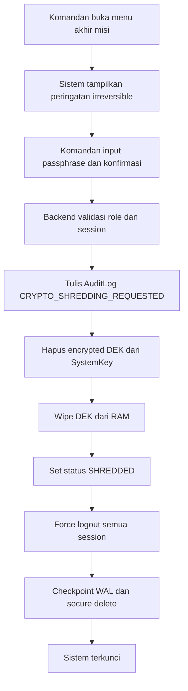

---

# 12. Use Case Diagram

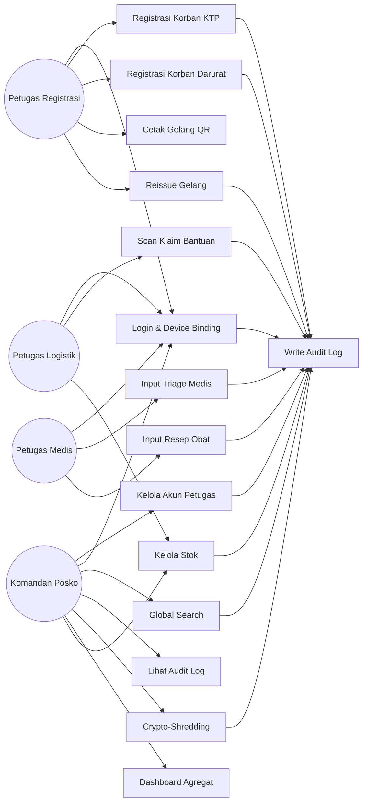

---

# 13. Daftar Use Case

| Kode  | Use Case                    | Aktor                | Prioritas |
| ----- | --------------------------- | -------------------- | --------- |
| UC-01 | Kelola Akun Petugas         | Komandan             | High      |
| UC-02 | Login & Device Binding      | Semua Role           | High      |
| UC-03 | Registrasi Korban KTP       | Registrasi           | High      |
| UC-04 | Registrasi Korban Darurat   | Registrasi           | High      |
| UC-05 | Cetak Gelang QR             | Registrasi           | High      |
| UC-06 | Reissue Gelang Hilang       | Registrasi, Komandan | High      |
| UC-07 | Scan Klaim Bantuan          | Logistik             | High      |
| UC-08 | Kelola Stok Logistik        | Logistik, Komandan   | High      |
| UC-09 | Input Triage Medis          | Medis                | High      |
| UC-10 | Input Resep Obat            | Medis                | Medium    |
| UC-11 | Global Search               | Komandan             | High      |
| UC-12 | Lihat Audit Log             | Komandan             | High      |
| UC-13 | Crypto-Shredding            | Komandan             | High      |
| UC-14 | Export Database Terenkripsi | Komandan             | Medium    |
| UC-15 | Dashboard Agregat           | Komandan             | Medium    |

---

# 14. Use Case Specification

## 14.1 UC-01 Kelola Akun Petugas

| Elemen           | Keterangan                                                      |
| ---------------- | --------------------------------------------------------------- |
| Aktor            | Komandan Posko                                                  |
| Tujuan           | Membuat, menonaktifkan, dan mengatur role petugas               |
| Precondition     | Komandan sudah login                                            |
| Trigger          | Komandan membuka menu Petugas                                   |
| Main Flow        | Komandan input username, role, password sementara, status aktif |
| Alternative Flow | Username sudah dipakai, sistem menolak                          |
| Postcondition    | Akun petugas tersimpan                                          |
| Audit            | `USER_CREATED`, `USER_DISABLED`, `ROLE_UPDATED`                 |

## 14.2 UC-02 Login & Device Binding

| Elemen           | Keterangan                                                                     |
| ---------------- | ------------------------------------------------------------------------------ |
| Aktor            | Semua role                                                                     |
| Tujuan           | Mengamankan akses sistem                                                       |
| Precondition     | Akun aktif                                                                     |
| Main Flow        | Input username/password, validasi bcrypt, validasi device, buat session        |
| Alternative Flow | Device belum trusted, minta pairing                                            |
| Postcondition    | User masuk dashboard sesuai role                                               |
| Audit            | `LOGIN_SUCCESS`, `LOGIN_FAILED`, `DEVICE_PAIR_REQUEST`, `DEVICE_PAIR_APPROVED` |

## 14.3 UC-03 Registrasi Korban KTP

| Elemen          | Keterangan                                                 |
| --------------- | ---------------------------------------------------------- |
| Aktor           | Petugas Registrasi                                         |
| Tujuan          | Mendaftarkan korban dengan dokumen                         |
| Input           | Nama, tanggal lahir, NIK, kontak opsional, alamat opsional |
| Validasi        | NIK 16 digit, tidak boleh duplikat                         |
| Proses Keamanan | HMAC NIK Index, AES-GCM field encryption                   |
| Output          | Alias korban, QR token, recovery phrase                    |
| Audit           | `VICTIM_REGISTERED_KTP`                                    |

## 14.4 UC-04 Registrasi Korban Darurat

| Elemen   | Keterangan                                                           |
| -------- | -------------------------------------------------------------------- |
| Aktor    | Petugas Registrasi                                                   |
| Tujuan   | Mendaftarkan korban tanpa dokumen                                    |
| Input    | Nama panggilan/alias awal, perkiraan usia, cluster, saksi jika perlu |
| Validasi | Biometric risk signal, witness voucher                               |
| Output   | Alias, QR token, recovery phrase                                     |
| Audit    | `VICTIM_REGISTERED_EMERGENCY`, `DUPLICATE_RISK_DETECTED`             |

## 14.5 UC-07 Scan Klaim Bantuan

| Elemen   | Keterangan                                                             |
| -------- | ---------------------------------------------------------------------- |
| Aktor    | Petugas Logistik                                                       |
| Tujuan   | Menyerahkan bantuan sesuai jatah                                       |
| Input    | QR token                                                               |
| Validasi | Token aktif, window aktif, belum klaim, stok cukup                     |
| Output   | Klaim berhasil atau alert                                              |
| Audit    | `LOGISTIC_CLAIM_SUCCESS`, `DOUBLE_CLAIM_BLOCKED`, `STOCK_INSUFFICIENT` |

## 14.6 UC-09 Input Triage Medis

| Elemen   | Keterangan                                 |
| -------- | ------------------------------------------ |
| Aktor    | Petugas Medis                              |
| Tujuan   | Mencatat kondisi medis korban              |
| Input    | QR token, triage, penyakit, catatan klinis |
| Validasi | Token aktif, triage wajib                  |
| Output   | Medical log terenkripsi                    |
| Audit    | `MEDICAL_LOG_CREATED`                      |

## 14.7 UC-11 Global Search

| Elemen   | Keterangan                           |
| -------- | ------------------------------------ |
| Aktor    | Komandan                             |
| Tujuan   | Melacak data korban secara terbatas  |
| Input    | NIK/token/alias dan alasan pencarian |
| Validasi | Role Komandan, alasan wajib          |
| Output   | Data minimum sesuai kebutuhan        |
| Audit    | `GLOBAL_SEARCH_EXECUTED`             |

## 14.8 UC-13 Crypto-Shredding

| Elemen   | Keterangan                                                |
| -------- | --------------------------------------------------------- |
| Aktor    | Komandan                                                  |
| Tujuan   | Mengunci permanen database setelah misi selesai           |
| Input    | Passphrase konfirmasi                                     |
| Validasi | Role Komandan, session valid, konfirmasi irreversible     |
| Output   | DEK dihancurkan, semua session logout                     |
| Audit    | `CRYPTO_SHREDDING_REQUESTED`, `CRYPTO_SHREDDING_EXECUTED` |

---

# 15. Sequence Diagram

## 15.1 Sequence Login

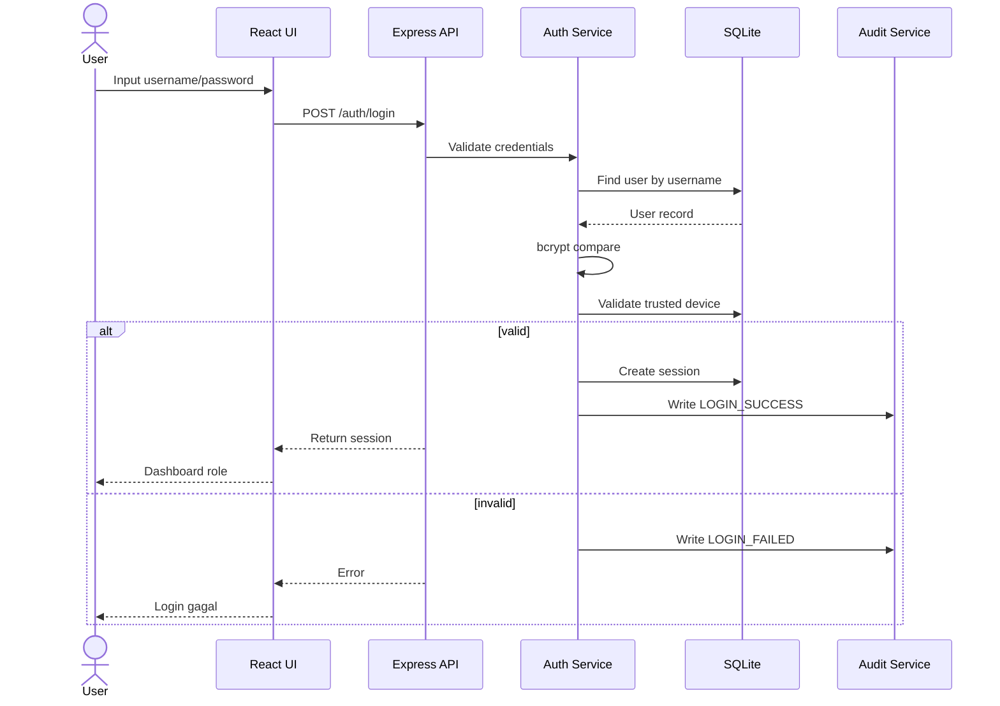

## 15.2 Sequence Registrasi Korban KTP

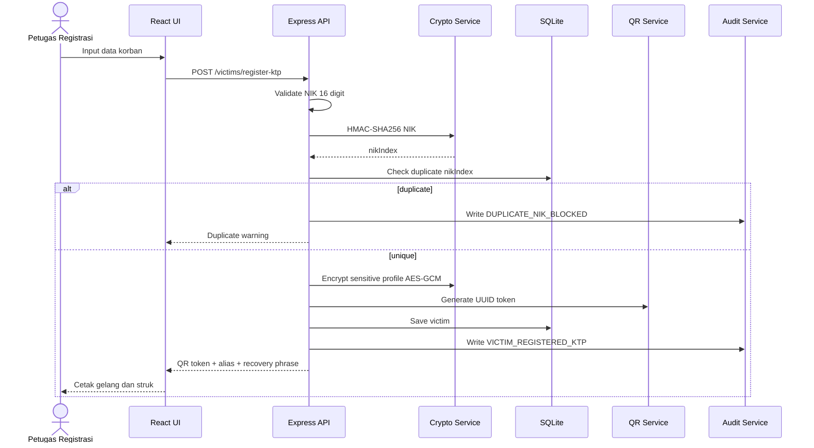

## 15.3 Sequence Registrasi Darurat

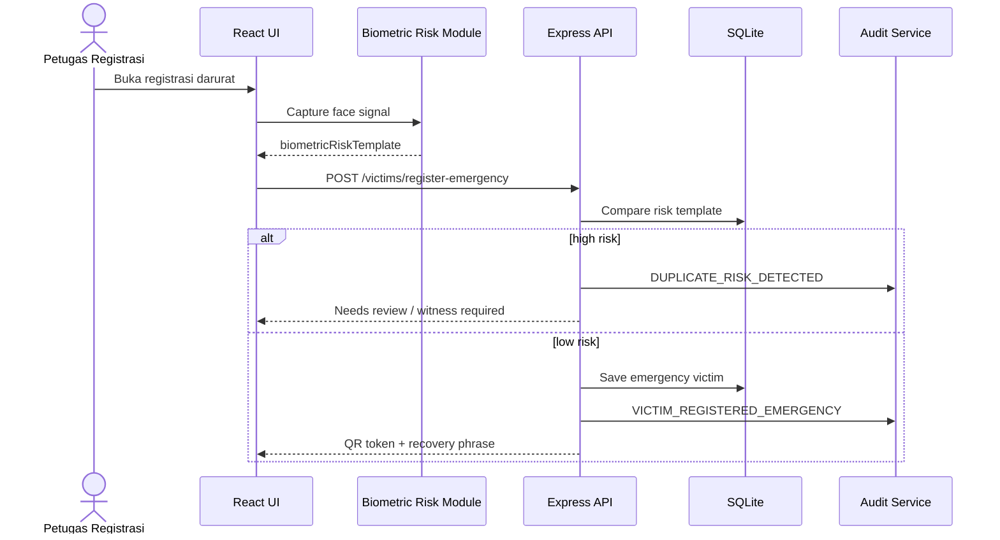

## 15.4 Sequence Klaim Bantuan

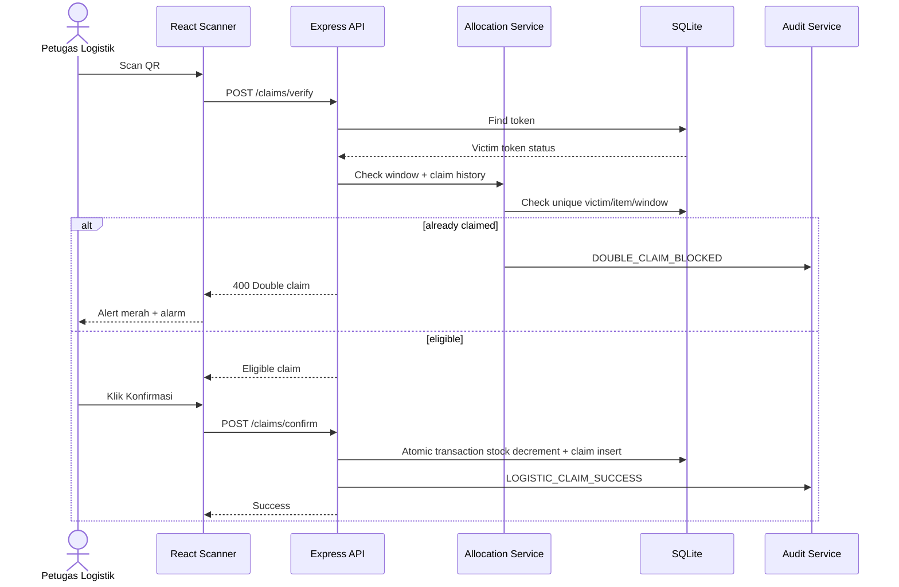

## 15.5 Sequence Medical Log

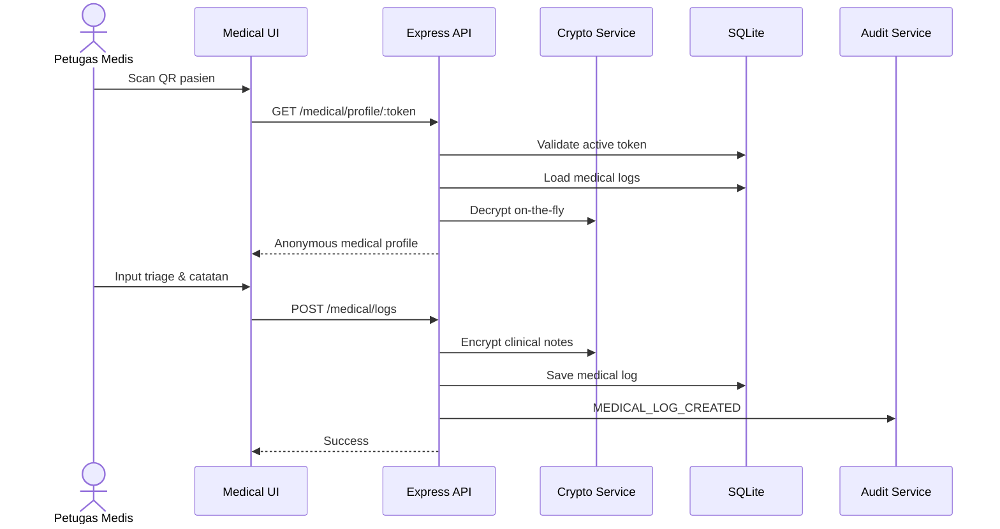

## 15.6 Sequence Crypto-Shredding

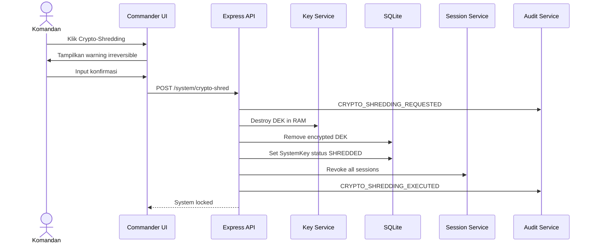

---

# 16. State Diagram

## 16.1 State Token Gelang QR

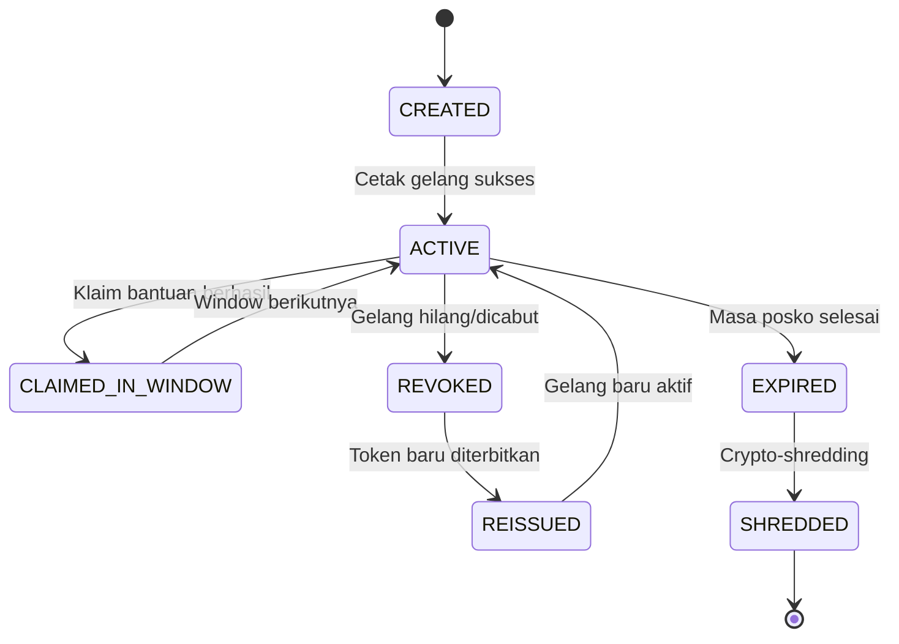

## 16.2 State Audit Log

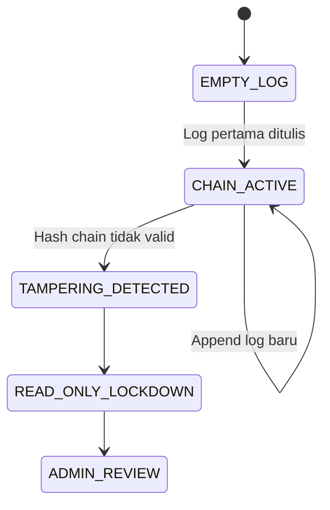

## 16.3 State Session User

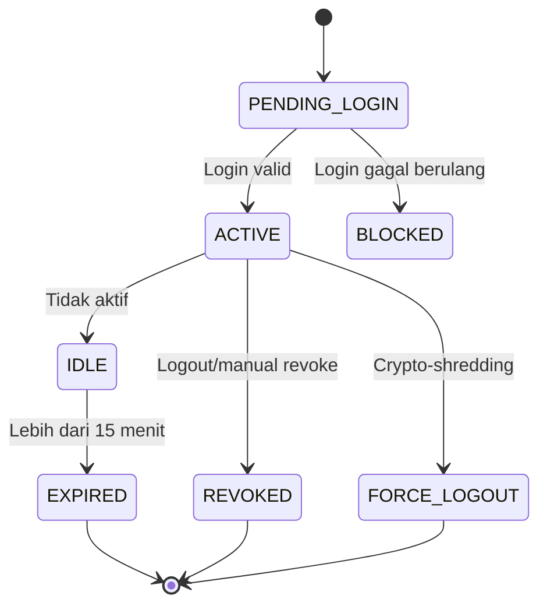

---

# 17. Entity Relationship Diagram

```mermaid
erDiagram
    User ||--o{ Session : owns
    User ||--o{ Device : paired
    User ||--o{ AuditLog : creates
    User ||--o{ LogisticClaim : processes
    User ||--o{ MedicalLog : writes
    User ||--o{ StockMutation : records
    User ||--o{ WitnessVoucher : validates

    Victim ||--o{ LogisticClaim : receives
    Victim ||--o{ MedicalLog : has
    Victim ||--o{ TokenReissue : has
    Victim ||--o{ WitnessVoucher : emergencyVictim
    Victim ||--o{ WitnessVoucher : witnessVictim

    LogisticItem ||--o{ LogisticClaim : claimed
    LogisticItem ||--o{ StockMutation : mutated

    DistributionWindow ||--o{ LogisticClaim : controls

    TriageRecord ||--o{ MedicalLog : classifies
    Disease ||--o{ MedicalLog : diagnosed
    MedicalLog ||--o{ MedicalPrescription : includes
    Medicine ||--o{ MedicalPrescription : dispensed

    SystemKey ||--o{ CryptoShredEvent : usedBy
    AuditAnchor ||--o{ AuditLog : anchors

    User {
        int id PK
        string username
        string passwordHash
        string role
        boolean isActive
        datetime createdAt
        datetime updatedAt
    }

    Device {
        int id PK
        int userId FK
        string deviceId
        string deviceSecretHash
        string deviceName
        boolean isTrusted
        datetime lastSeenAt
    }

    Session {
        int id PK
        int userId FK
        int deviceId FK
        string sessionTokenHash
        datetime expiresAt
        datetime lastActivityAt
        datetime revokedAt
    }

    Victim {
        int id PK
        string qrTokenUuid UK
        string nikIndex UK
        boolean isEmergency
        string maskedName
        string encryptedProfile
        string tokenStatus
        int tokenVersion
        string registrationStatus
        float biometricRiskScore
        string reviewStatus
        datetime createdAt
    }

    WitnessVoucher {
        int id PK
        int witnessVictimId FK
        int emergencyVictimId FK
        string clusterCode
        string voucherType
        string status
        int createdByUserId FK
        string reason
        datetime createdAt
        datetime revokedAt
    }

    TokenReissue {
        int id PK
        int victimId FK
        string oldTokenHash
        string newTokenHash
        string reason
        int processedByUserId FK
        datetime createdAt
    }

    LogisticItem {
        int id PK
        string itemName
        string category
        int currentStock
        int minimumThreshold
        string unitType
        boolean isActive
    }

    DistributionWindow {
        int id PK
        string windowCode
        string startTime
        string endTime
        boolean isActive
    }

    LogisticClaim {
        int id PK
        int victimId FK
        int itemId FK
        int distributionWindowId FK
        string claimDate
        string windowCode
        int claimQuantity
        string claimStatus
        int officerUserId FK
        datetime claimedAt
    }

    StockMutation {
        int id PK
        int itemId FK
        string mutationType
        int quantity
        string reason
        int createdByUserId FK
        int approvedByUserId FK
        datetime createdAt
    }

    Disease {
        int id PK
        string diseaseCode
        string diseaseName
        string riskLevel
    }

    TriageRecord {
        int id PK
        string colorCode
        string description
    }

    MedicalLog {
        int id PK
        int victimId FK
        int triageId FK
        int diseaseId FK
        string encryptedClinicalNotes
        int doctorUserId FK
        datetime examinedAt
    }

    Medicine {
        int id PK
        string medicineName
        int currentStock
        datetime expiryDate
        boolean isActive
    }

    MedicalPrescription {
        int id PK
        int medicalLogId FK
        int medicineId FK
        int dispensedQty
        string dosageInstruction
    }

    SystemKey {
        int id PK
        string encryptedDek
        string keyStatus
        string keyVersion
        datetime createdAt
        datetime shreddedAt
    }

    CryptoShredEvent {
        int id PK
        int systemKeyId FK
        int executedByUserId FK
        string confirmationHash
        datetime executedAt
    }

    AuditLog {
        int id PK
        string actionType
        string description
        string ipAddress
        string deviceId
        int officerUserId FK
        datetime createdAt
        string previousHash
        string logChainHash
    }

    AuditAnchor {
        int id PK
        string lastAuditHash
        datetime sealedAt
        int sealedByUserId FK
    }
```

---

# 18. Database Design

## 18.1 Prinsip Database

1. Tidak menyimpan NIK mentah.
2. Tidak menyimpan foto wajah asli.
3. Tidak menyimpan recovery phrase plaintext.
4. Field sensitif dienkripsi AES-GCM.
5. QR token disimpan sebagai token hash untuk validasi.
6. Klaim bantuan dicegah menggunakan unique constraint.
7. AuditLog bersifat append-only di level aplikasi dan trigger database.
8. Semua mutasi stok memiliki histori.

---

## 18.2 Prisma Schema Draft

```prisma
datasource db {
  provider = "sqlite"
  url      = "file:./sadana_local.db"
}

generator client {
  provider = "prisma-client-js"
}

model User {
  id           Int      @id @default(autoincrement())
  username     String   @unique
  passwordHash String
  role         String
  isActive     Boolean  @default(true)
  createdAt    DateTime @default(now())
  updatedAt    DateTime @updatedAt

  devices        Device[]
  sessions       Session[]
  auditLogs      AuditLog[]
  logisticClaims LogisticClaim[]
  medicalLogs    MedicalLog[]
  stockMutations StockMutation[] @relation("CreatedStockMutation")
}

model Device {
  id               Int      @id @default(autoincrement())
  userId           Int
  deviceId         String   @unique
  deviceSecretHash String
  deviceName       String?
  isTrusted        Boolean  @default(false)
  lastSeenAt       DateTime?

  user     User      @relation(fields: [userId], references: [id])
  sessions Session[]
}

model Session {
  id               Int       @id @default(autoincrement())
  userId           Int
  deviceId         Int
  sessionTokenHash String    @unique
  expiresAt        DateTime
  lastActivityAt   DateTime
  revokedAt        DateTime?

  user   User   @relation(fields: [userId], references: [id])
  device Device @relation(fields: [deviceId], references: [id])
}

model Victim {
  id                 Int      @id @default(autoincrement())
  qrTokenUuid        String   @unique
  qrTokenHash        String   @unique
  nikIndex           String?  @unique
  isEmergency        Boolean  @default(false)
  maskedName         String
  encryptedProfile   String
  tokenStatus        String   @default("ACTIVE")
  tokenVersion       Int      @default(1)
  registrationStatus String
  biometricRiskScore Float?
  reviewStatus       String   @default("APPROVED")
  recoveryPhraseHash String
  createdAt          DateTime @default(now())

  claims              LogisticClaim[]
  medicalLogs          MedicalLog[]
  tokenReissues        TokenReissue[]
  emergencyVouchers    WitnessVoucher[] @relation("EmergencyVictim")
  witnessGivenVouchers WitnessVoucher[] @relation("WitnessVictim")
}

model WitnessVoucher {
  id                Int       @id @default(autoincrement())
  witnessVictimId   Int
  emergencyVictimId Int
  clusterCode       String
  voucherType       String
  status            String    @default("ACTIVE")
  createdByUserId   Int
  reason            String?
  createdAt         DateTime  @default(now())
  revokedAt         DateTime?

  witnessVictim   Victim @relation("WitnessVictim", fields: [witnessVictimId], references: [id])
  emergencyVictim Victim @relation("EmergencyVictim", fields: [emergencyVictimId], references: [id])
  createdBy       User   @relation(fields: [createdByUserId], references: [id])
}

model TokenReissue {
  id                Int      @id @default(autoincrement())
  victimId          Int
  oldTokenHash      String
  newTokenHash      String
  reason            String
  processedByUserId Int
  createdAt         DateTime @default(now())

  victim Victim @relation(fields: [victimId], references: [id])
}

model LogisticItem {
  id               Int      @id @default(autoincrement())
  itemName         String
  category         String
  currentStock     Int
  minimumThreshold Int
  unitType         String
  isActive         Boolean  @default(true)

  claims         LogisticClaim[]
  stockMutations StockMutation[]
}

model DistributionWindow {
  id         Int     @id @default(autoincrement())
  windowCode String
  startTime  String
  endTime    String
  isActive   Boolean @default(true)

  claims LogisticClaim[]
}

model LogisticClaim {
  id                   Int      @id @default(autoincrement())
  victimId             Int
  itemId               Int
  distributionWindowId Int
  claimDate            String
  windowCode           String
  claimQuantity        Int
  claimStatus          String   @default("SUCCESS")
  officerUserId        Int
  claimedAt            DateTime @default(now())

  victim             Victim             @relation(fields: [victimId], references: [id])
  item               LogisticItem       @relation(fields: [itemId], references: [id])
  distributionWindow DistributionWindow @relation(fields: [distributionWindowId], references: [id])
  officer            User               @relation(fields: [officerUserId], references: [id])

  @@unique([victimId, itemId, claimDate, windowCode])
}

model StockMutation {
  id               Int      @id @default(autoincrement())
  itemId           Int
  mutationType     String
  quantity         Int
  reason           String
  createdByUserId  Int
  approvedByUserId Int?
  createdAt        DateTime @default(now())

  item      LogisticItem @relation(fields: [itemId], references: [id])
  createdBy User         @relation("CreatedStockMutation", fields: [createdByUserId], references: [id])
}

model Disease {
  id          Int    @id @default(autoincrement())
  diseaseCode String @unique
  diseaseName String
  riskLevel   String

  medicalLogs MedicalLog[]
}

model TriageRecord {
  id          Int    @id @default(autoincrement())
  colorCode   String
  description String

  medicalLogs MedicalLog[]
}

model MedicalLog {
  id                     Int      @id @default(autoincrement())
  victimId               Int
  triageId               Int
  diseaseId              Int
  encryptedClinicalNotes String
  examinedAt             DateTime @default(now())
  doctorUserId           Int

  victim        Victim                @relation(fields: [victimId], references: [id])
  triage        TriageRecord          @relation(fields: [triageId], references: [id])
  disease       Disease               @relation(fields: [diseaseId], references: [id])
  doctor        User                  @relation(fields: [doctorUserId], references: [id])
  prescriptions MedicalPrescription[]
}

model Medicine {
  id           Int      @id @default(autoincrement())
  medicineName String
  currentStock Int
  expiryDate   DateTime
  isActive     Boolean  @default(true)

  prescriptions MedicalPrescription[]
}

model MedicalPrescription {
  id                Int    @id @default(autoincrement())
  medicalLogId      Int
  medicineId        Int
  dispensedQty      Int
  dosageInstruction String

  medicalLog MedicalLog @relation(fields: [medicalLogId], references: [id])
  medicine   Medicine   @relation(fields: [medicineId], references: [id])
}

model SystemKey {
  id           Int       @id @default(autoincrement())
  encryptedDek String?
  keyStatus    String    @default("ACTIVE")
  keyVersion   String
  createdAt    DateTime  @default(now())
  shreddedAt   DateTime?
}

model CryptoShredEvent {
  id               Int      @id @default(autoincrement())
  systemKeyId       Int
  executedByUserId  Int
  confirmationHash  String
  executedAt        DateTime @default(now())
}

model AuditLog {
  id           Int      @id @default(autoincrement())
  actionType   String
  description  String
  ipAddress    String?
  deviceId     String?
  officerUserId Int?
  createdAt    DateTime @default(now())
  previousHash  String
  logChainHash  String

  officer User? @relation(fields: [officerUserId], references: [id])
}

model AuditAnchor {
  id             Int      @id @default(autoincrement())
  lastAuditHash  String
  sealedAt       DateTime @default(now())
  sealedByUserId Int
}
```

---

# 19. Business Rules

## 19.1 Registrasi Korban

1. NIK wajib 16 digit numerik.
2. NIK tidak boleh disimpan mentah.
3. Satu NIK hanya boleh memiliki satu korban aktif.
4. Korban tanpa dokumen boleh didaftarkan melalui jalur darurat.
5. Korban darurat dengan risiko duplikasi tinggi harus masuk review.
6. Korban darurat dapat membutuhkan saksi sesuai kondisi.
7. Satu saksi maksimal menjamin 3 korban darurat aktif.
8. Saksi harus berada dalam cluster posko yang sama.
9. Setiap korban mendapatkan alias anonim.
10. QR token tidak boleh berisi data pribadi.

## 19.2 Gelang QR

1. Satu QR token hanya terkait ke satu korban.
2. Token memiliki status: `ACTIVE`, `REVOKED`, `REISSUED`, `EXPIRED`, `SHREDDED`.
3. Token revoked tidak dapat dipakai untuk logistik atau medis.
4. Reissue token wajib mencabut token lama.
5. Recovery phrase tidak disimpan plaintext.
6. Percobaan recovery gagal dibatasi maksimal 3 kali.

## 19.3 Distribusi Bantuan

1. Klaim bantuan hanya dapat dilakukan dalam jendela distribusi aktif.
2. Satu korban hanya dapat klaim item tertentu satu kali per window.
3. Operator tidak dapat mengubah checkbox bantuan secara manual.
4. Stok tidak boleh negatif.
5. Klaim hanya sukses jika stok mencukupi.
6. Semua klaim dicatat ke AuditLog.
7. Koreksi stok wajib memiliki alasan.
8. Koreksi stok besar membutuhkan approval Komandan.

## 19.4 Medis

1. Triage wajib diisi sebelum medical log disimpan.
2. Catatan medis wajib dienkripsi.
3. Obat expired tidak boleh diberikan.
4. Stok obat tidak boleh negatif.
5. Petugas medis tidak boleh melihat NIK mentah.
6. Akses riwayat medis dicatat ke AuditLog.

## 19.5 Global Search

1. Hanya Komandan yang dapat menggunakan Global Search.
2. Komandan wajib memasukkan alasan pencarian.
3. Pencarian dicatat ke AuditLog.
4. Sistem tidak menyediakan export data mentah hasil search.
5. Hasil search harus menampilkan data minimum yang relevan.

## 19.6 Audit Log

1. AuditLog hanya boleh bertambah.
2. Update dan delete AuditLog dilarang.
3. Hash chain diverifikasi saat server boot.
4. Jika hash chain rusak, sistem masuk read-only lockdown.
5. Semua aksi kritis wajib dicatat.

## 19.7 Crypto-Shredding

1. Crypto-shredding hanya dapat dilakukan Komandan.
2. Crypto-shredding bersifat irreversible.
3. Sistem harus menampilkan peringatan sebelum eksekusi.
4. Setelah crypto-shredding, DEK dihapus dari RAM dan database.
5. Semua session dipaksa logout.
6. Sistem tidak dapat mendekripsi data sensitif setelah shredding.

---

# 20. Functional Requirements

## 20.1 Authentication & Authorization

| ID         | Requirement                                            | Priority |
| ---------- | ------------------------------------------------------ | -------- |
| FR-AUTH-01 | Sistem menyediakan login username/password             | High     |
| FR-AUTH-02 | Password disimpan menggunakan bcrypt                   | High     |
| FR-AUTH-03 | Sistem menerapkan device binding                       | High     |
| FR-AUTH-04 | Sistem menerapkan role-based access control di backend | High     |
| FR-AUTH-05 | Sistem melakukan session timeout 15 menit idle         | High     |
| FR-AUTH-06 | Sistem mencatat login sukses dan gagal                 | High     |

## 20.2 Registrasi Korban

| ID        | Requirement                                         | Priority |
| --------- | --------------------------------------------------- | -------- |
| FR-REG-01 | Sistem menyediakan registrasi korban KTP            | High     |
| FR-REG-02 | Sistem memvalidasi NIK 16 digit                     | High     |
| FR-REG-03 | Sistem membuat HMAC NIK index                       | High     |
| FR-REG-04 | Sistem menolak NIK duplikat                         | High     |
| FR-REG-05 | Sistem menyediakan registrasi darurat tanpa dokumen | High     |
| FR-REG-06 | Sistem menghasilkan alias korban                    | High     |
| FR-REG-07 | Sistem menghasilkan QR token                        | High     |
| FR-REG-08 | Sistem menghasilkan recovery phrase                 | High     |
| FR-REG-09 | Sistem mencetak gelang QR                           | Medium   |

## 20.3 Biometric Risk & Witness

| ID        | Requirement                                                      | Priority |
| --------- | ---------------------------------------------------------------- | -------- |
| FR-BIO-01 | Sistem mengambil biometric risk signal tanpa menyimpan foto asli | Medium   |
| FR-BIO-02 | Sistem memberikan risk score potensi duplikasi                   | Medium   |
| FR-BIO-03 | Sistem menandai korban sebagai Needs Review jika risiko tinggi   | High     |
| FR-WIT-01 | Sistem mendukung witness voucher                                 | Medium   |
| FR-WIT-02 | Sistem membatasi satu saksi maksimal 3 voucher aktif             | High     |

## 20.4 Logistik

| ID        | Requirement                                    | Priority |
| --------- | ---------------------------------------------- | -------- |
| FR-LOG-01 | Sistem dapat scan QR korban                    | High     |
| FR-LOG-02 | Sistem memvalidasi status token                | High     |
| FR-LOG-03 | Sistem memvalidasi distribution window         | High     |
| FR-LOG-04 | Sistem mencegah double claim                   | High     |
| FR-LOG-05 | Sistem memotong stok secara atomic transaction | High     |
| FR-LOG-06 | Sistem menampilkan alert double claim          | High     |
| FR-LOG-07 | Sistem mendukung stok masuk                    | Medium   |
| FR-LOG-08 | Sistem mendukung koreksi stok dengan alasan    | Medium   |

## 20.5 Medis

| ID        | Requirement                                    | Priority |
| --------- | ---------------------------------------------- | -------- |
| FR-MED-01 | Sistem dapat scan QR pasien                    | High     |
| FR-MED-02 | Sistem menampilkan profil medis anonim         | High     |
| FR-MED-03 | Sistem menyimpan catatan medis terenkripsi     | High     |
| FR-MED-04 | Sistem mewajibkan triage                       | High     |
| FR-MED-05 | Sistem mendukung pemberian obat                | Medium   |
| FR-MED-06 | Sistem memotong stok obat secara transaksional | Medium   |
| FR-MED-07 | Sistem menolak obat expired                    | High     |

## 20.6 Komandan

| ID        | Requirement                                 | Priority |
| --------- | ------------------------------------------- | -------- |
| FR-CMD-01 | Komandan dapat melihat dashboard agregat    | High     |
| FR-CMD-02 | Komandan dapat mengelola akun petugas       | High     |
| FR-CMD-03 | Komandan dapat melakukan global search      | High     |
| FR-CMD-04 | Komandan wajib mengisi alasan global search | High     |
| FR-CMD-05 | Komandan dapat melihat AuditLog             | High     |
| FR-CMD-06 | Komandan dapat melakukan crypto-shredding   | High     |
| FR-CMD-07 | Komandan dapat export database terenkripsi  | Medium   |

## 20.7 Audit & Security

| ID        | Requirement                                      | Priority |
| --------- | ------------------------------------------------ | -------- |
| FR-AUD-01 | Sistem mencatat semua aksi kritis                | High     |
| FR-AUD-02 | Sistem menghitung HMAC chain setiap log          | High     |
| FR-AUD-03 | Sistem memverifikasi audit chain saat boot       | High     |
| FR-AUD-04 | Sistem lockdown jika audit chain rusak           | High     |
| FR-SEC-01 | Sistem mengenkripsi field sensitif AES-GCM       | High     |
| FR-SEC-02 | Sistem tidak menyimpan NIK plaintext             | High     |
| FR-SEC-03 | Sistem tidak menyimpan recovery phrase plaintext | High     |

---

# 21. Non-Functional Requirements

| ID     | Requirement                    | Target                              |
| ------ | ------------------------------ | ----------------------------------- |
| NFR-01 | Sistem berjalan tanpa internet | 100% LAN/offline                    |
| NFR-02 | Response scan QR               | Maksimal 1,5 detik                  |
| NFR-03 | Login response                 | Maksimal 2 detik                    |
| NFR-04 | Database portable              | SQLite single file                  |
| NFR-05 | Uptime lokal                   | Selama server posko menyala         |
| NFR-06 | Enkripsi data sensitif         | AES-256-GCM                         |
| NFR-07 | Password hashing               | bcrypt minimal 12 rounds            |
| NFR-08 | NIK index                      | HMAC-SHA256                         |
| NFR-09 | Audit integrity                | HMAC chain                          |
| NFR-10 | UI readability                 | Kontras tinggi                      |
| NFR-11 | Browser support                | Chrome/Edge terbaru                 |
| NFR-12 | Data export                    | Encrypted manual export             |
| NFR-13 | Session idle timeout           | 15 menit                            |
| NFR-14 | Backup                         | Manual encrypted backup             |
| NFR-15 | Error recovery                 | Read-only lockdown jika audit rusak |

---

# 22. API Contract

## 22.1 Auth API

| Method | Endpoint                    | Role     | Deskripsi              |
| ------ | --------------------------- | -------- | ---------------------- |
| POST   | `/api/auth/login`           | Public   | Login                  |
| POST   | `/api/auth/logout`          | All      | Logout                 |
| POST   | `/api/auth/refresh`         | All      | Refresh session        |
| POST   | `/api/devices/pair-request` | All      | Request device pairing |
| POST   | `/api/devices/approve`      | Komandan | Approve device         |

## 22.2 User API

| Method | Endpoint         | Role     | Deskripsi           |
| ------ | ---------------- | -------- | ------------------- |
| GET    | `/api/users`     | Komandan | List petugas        |
| POST   | `/api/users`     | Komandan | Buat petugas        |
| PATCH  | `/api/users/:id` | Komandan | Update role/status  |
| DELETE | `/api/users/:id` | Komandan | Nonaktifkan petugas |

## 22.3 Victim API

| Method | Endpoint                          | Role                      | Deskripsi                 |
| ------ | --------------------------------- | ------------------------- | ------------------------- |
| POST   | `/api/victims/register-ktp`       | Registrasi                | Registrasi korban KTP     |
| POST   | `/api/victims/register-emergency` | Registrasi                | Registrasi korban darurat |
| GET    | `/api/victims/:token/basic`       | Registrasi/Logistik/Medis | Profil minimum            |
| POST   | `/api/victims/reissue`            | Registrasi                | Reissue gelang            |
| POST   | `/api/victims/revoke`             | Registrasi                | Revoke token              |

## 22.4 Logistic API

| Method | Endpoint                                      | Role              | Deskripsi        |
| ------ | --------------------------------------------- | ----------------- | ---------------- |
| POST   | `/api/claims/verify`                          | Logistik          | Verifikasi klaim |
| POST   | `/api/claims/confirm`                         | Logistik          | Konfirmasi klaim |
| GET    | `/api/logistics/items`                        | Logistik/Komandan | List stok        |
| POST   | `/api/logistics/stock-in`                     | Logistik          | Input stok masuk |
| POST   | `/api/logistics/stock-correction`             | Logistik          | Ajukan koreksi   |
| POST   | `/api/logistics/stock-correction/:id/approve` | Komandan          | Approve koreksi  |

## 22.5 Medical API

| Method | Endpoint                      | Role  | Deskripsi           |
| ------ | ----------------------------- | ----- | ------------------- |
| GET    | `/api/medical/profile/:token` | Medis | Profil medis anonim |
| POST   | `/api/medical/logs`           | Medis | Input medical log   |
| POST   | `/api/medical/prescriptions`  | Medis | Input resep         |
| GET    | `/api/medical/diseases`       | Medis | Master penyakit     |
| GET    | `/api/medical/triage`         | Medis | Master triage       |

## 22.6 Commander API

| Method | Endpoint                   | Role     | Deskripsi          |
| ------ | -------------------------- | -------- | ------------------ |
| GET    | `/api/dashboard/summary`   | Komandan | Dashboard agregat  |
| POST   | `/api/search/global`       | Komandan | Global search      |
| GET    | `/api/audit-logs`          | Komandan | Lihat audit        |
| POST   | `/api/system/export`       | Komandan | Export terenkripsi |
| POST   | `/api/system/crypto-shred` | Komandan | Crypto-shredding   |

---

# 23. UI/UX Requirement

## 23.1 Prinsip UI

1. Kontras tinggi.
2. Tombol utama besar.
3. Status sukses/gagal sangat jelas.
4. Warna peringatan mudah dikenali.
5. Cocok untuk kondisi posko yang ramai.
6. Form singkat dan tidak bertele-tele.
7. Tidak menampilkan data pribadi berlebihan.

## 23.2 Halaman Utama

| Halaman              | Role       | Isi                                        |
| -------------------- | ---------- | ------------------------------------------ |
| Login                | Semua      | Username, password, status perangkat       |
| Dashboard Komandan   | Komandan   | Ringkasan korban, stok, medis, audit alert |
| Dashboard Registrasi | Registrasi | Registrasi KTP, darurat, reissue           |
| Dashboard Logistik   | Logistik   | Scanner QR, stok, klaim                    |
| Dashboard Medis      | Medis      | Scanner pasien, triage, catatan medis      |
| Audit Log            | Komandan   | Daftar log dan status chain                |
| Global Search        | Komandan   | Form pencarian dengan alasan               |
| Crypto-Shredding     | Komandan   | Konfirmasi akhir misi                      |

## 23.3 Token Warna

| Nama           | Hex       | Penggunaan          |
| -------------- | --------- | ------------------- |
| Command Navy   | `#0B1E36` | Sidebar, header     |
| Rescue Orange  | `#FF6B00` | CTA utama           |
| Safe Green     | `#16A34A` | Status sukses       |
| Alert Red      | `#DC2626` | Error/double claim  |
| Warning Yellow | `#FACC15` | Needs review        |
| Neutral Gray   | `#64748B` | Teks sekunder       |
| Background     | `#F8FAFC` | Background aplikasi |

---

# 24. Data Validation

## 24.1 Validasi Input

| Field           | Validasi                                   |
| --------------- | ------------------------------------------ |
| Username        | 4–50 karakter, unik                        |
| Password        | Minimal 8 karakter                         |
| NIK             | Tepat 16 digit angka                       |
| QR Token        | UUID format valid                          |
| Stok            | Integer >= 0                               |
| Klaim Quantity  | Integer > 0                                |
| Triage          | Wajib salah satu: Merah/Kuning/Hijau/Hitam |
| Recovery Phrase | Jumlah kata sesuai konfigurasi             |
| Alasan Search   | Wajib, minimal 10 karakter                 |
| Catatan Medis   | Maksimal panjang sesuai konfigurasi        |
| Obat            | Tidak expired, stok cukup                  |

## 24.2 Validasi Keamanan

1. Semua request body divalidasi dengan schema validator.
2. Semua endpoint dicek role backend.
3. Semua input teks disanitasi sebelum dirender.
4. Semua aksi kritis wajib disertai session valid.
5. Rate limit untuk login, recovery, dan global search.
6. CSRF protection jika menggunakan cookie.
7. CSP header untuk mencegah XSS.

---

# 25. Error Handling

| Kondisi              | Response Sistem                               |
| -------------------- | --------------------------------------------- |
| Login gagal          | Tampilkan pesan umum tanpa membocorkan detail |
| Device tidak dikenal | Minta pairing Komandan                        |
| NIK duplikat         | Tampilkan potensi duplikasi                   |
| Token revoked        | Tolak scan                                    |
| Double claim         | Alert merah dan audio                         |
| Stok tidak cukup     | Tampilkan stok tidak cukup                    |
| Obat expired         | Tolak pemberian obat                          |
| Audit chain rusak    | Sistem read-only lockdown                     |
| DEK tidak tersedia   | Sistem tidak dapat membuka data terenkripsi   |
| Server offline       | Client tampilkan status koneksi lokal gagal   |

---

# 26. Threat Model & Mitigasi

| Ancaman                       | Dampak                   | Mitigasi                                         |
| ----------------------------- | ------------------------ | ------------------------------------------------ |
| Database dicuri               | Data korban bocor        | Field encryption AES-GCM                         |
| NIK brute force               | Identitas korban terbuka | HMAC NIK index dengan secret pepper              |
| QR difoto                     | Klaim palsu              | Token status, reissue, audit, alert double claim |
| Petugas menyalahgunakan akses | Data bocor/manipulasi    | RBAC, audit log, reason code                     |
| AuditLog diedit manual        | Jejak hilang             | HMAC chain, boot verification, lockdown          |
| Device dicuri                 | Akses ilegal             | Device binding, session timeout, revoke device   |
| XSS mencuri token             | Account takeover         | httpOnly cookie/memory token, CSP, sanitasi      |
| Race condition stok           | Stok negatif             | Atomic transaction + constraint                  |
| Komandan abuse search         | Privacy violation        | Mandatory reason, audit, rate limit              |
| Recovery phrase dicuri        | Reissue palsu            | Hash phrase, attempt limit, data pembanding      |

---

# 27. Struktur Folder Proyek

```text
sadana/
├── backend/
│   ├── prisma/
│   │   └── schema.prisma
│   ├── src/
│   │   ├── app.js
│   │   ├── server.js
│   │   ├── config/
│   │   │   ├── env.js
│   │   │   └── security.js
│   │   ├── controllers/
│   │   │   ├── authController.js
│   │   │   ├── userController.js
│   │   │   ├── victimController.js
│   │   │   ├── claimController.js
│   │   │   ├── logisticController.js
│   │   │   ├── medicalController.js
│   │   │   ├── commanderController.js
│   │   │   └── systemController.js
│   │   ├── middleware/
│   │   │   ├── authMiddleware.js
│   │   │   ├── roleMiddleware.js
│   │   │   ├── deviceMiddleware.js
│   │   │   ├── validateMiddleware.js
│   │   │   └── rateLimitMiddleware.js
│   │   ├── services/
│   │   │   ├── cryptoService.js
│   │   │   ├── auditService.js
│   │   │   ├── allocationService.js
│   │   │   ├── qrService.js
│   │   │   ├── medicalService.js
│   │   │   ├── deviceService.js
│   │   │   └── exportService.js
│   │   ├── routes/
│   │   │   ├── authRoutes.js
│   │   │   ├── userRoutes.js
│   │   │   ├── victimRoutes.js
│   │   │   ├── claimRoutes.js
│   │   │   ├── logisticRoutes.js
│   │   │   ├── medicalRoutes.js
│   │   │   ├── commanderRoutes.js
│   │   │   └── systemRoutes.js
│   │   └── utils/
│   │       ├── validators.js
│   │       ├── constants.js
│   │       └── timeWindow.js
│   └── package.json
│
├── frontend/
│   ├── src/
│   │   ├── main.jsx
│   │   ├── App.jsx
│   │   ├── api/
│   │   │   └── axiosClient.js
│   │   ├── context/
│   │   │   └── AuthContext.jsx
│   │   ├── routes/
│   │   │   └── ProtectedRoute.jsx
│   │   ├── layouts/
│   │   │   └── DashboardLayout.jsx
│   │   ├── pages/
│   │   │   ├── LoginPage.jsx
│   │   │   ├── CommanderDashboard.jsx
│   │   │   ├── RegistrationDashboard.jsx
│   │   │   ├── LogisticDashboard.jsx
│   │   │   ├── MedicalDashboard.jsx
│   │   │   ├── AuditLogPage.jsx
│   │   │   └── CryptoShredPage.jsx
│   │   ├── components/
│   │   │   ├── QRScanner.jsx
│   │   │   ├── StatusBadge.jsx
│   │   │   ├── AlertModal.jsx
│   │   │   ├── StockCard.jsx
│   │   │   └── TriageSelector.jsx
│   │   └── styles/
│   │       └── index.css
│   └── package.json
└── README.md
```

---

# 28. Testing Plan

## 28.1 Functional Testing

| Modul         | Skenario                                             |
| ------------- | ---------------------------------------------------- |
| Login         | Login valid, salah password, device tidak dikenal    |
| Registrasi    | NIK valid, NIK invalid, NIK duplikat                 |
| Darurat       | Risk rendah, risk tinggi, voucher saksi valid        |
| QR            | Token active, revoked, expired                       |
| Klaim         | Klaim pertama, double claim, stok kosong             |
| Medis         | Input triage valid, triage kosong, resep stok kurang |
| Global Search | Search dengan alasan, tanpa alasan, role tidak sah   |
| Audit         | Log bertambah, chain valid                           |
| Crypto-Shred  | Konfirmasi benar, session logout, key hilang         |

## 28.2 Security Testing

1. Coba akses endpoint tanpa login.
2. Coba akses endpoint beda role.
3. Coba manipulasi token QR.
4. Coba double submit klaim.
5. Coba input stok negatif.
6. Coba brute force login.
7. Coba brute force recovery phrase.
8. Coba edit AuditLog langsung di SQLite.
9. Coba akses data terenkripsi tanpa DEK.
10. Coba XSS di field catatan medis.

## 28.3 Performance Testing

| Skenario                  | Target                 |
| ------------------------- | ---------------------- |
| Scan QR ke hasil validasi | <= 1,5 detik           |
| Registrasi korban         | <= 3 detik             |
| Global search             | <= 2 detik             |
| Dashboard load            | <= 3 detik             |
| Klaim bantuan bersamaan   | Tidak ada stok negatif |

---

# 29. Acceptance Criteria

## 29.1 MVP Dinyatakan Selesai Jika

1. User dapat login sesuai role.
2. Device binding berjalan.
3. Korban KTP dapat didaftarkan tanpa menyimpan NIK plaintext.
4. Korban darurat dapat didaftarkan.
5. QR token dapat dibuat dan discan.
6. Klaim bantuan berhasil memotong stok.
7. Double claim ditolak.
8. Medical log dapat disimpan terenkripsi.
9. Komandan dapat melihat dashboard agregat.
10. Komandan dapat melakukan global search dengan alasan.
11. AuditLog mencatat aksi penting.
12. Audit chain dapat diverifikasi.
13. Crypto-shredding membuat data sensitif tidak dapat dibuka lagi.

---

# 30. Roadmap Implementasi

## Phase 1 — Core System

1. Setup React Vite.
2. Setup Express + Prisma + SQLite.
3. Login dan role middleware.
4. Device binding sederhana.
5. Registrasi korban KTP.
6. QR token generation.
7. Dashboard dasar.

## Phase 2 — Logistik

1. QR scanner.
2. Distribution window.
3. Claim verification.
4. Atomic stock decrement.
5. Double claim prevention.
6. Stock dashboard.

## Phase 3 — Medis

1. Medical profile anonim.
2. Triage input.
3. AES-GCM medical notes.
4. Medicine stock.
5. Prescription transaction.

## Phase 4 — Security Hardening

1. HMAC NIK index.
2. AuditLog HMAC chain.
3. Audit verification on boot.
4. Device revocation.
5. Rate limit.
6. Crypto-shredding.

## Phase 5 — Competition Polish

1. UI high contrast.
2. Dashboard Recharts.
3. Demo seed data.
4. Demo attack scenario.
5. Documentation.
6. Pitch deck teknis.

---

# 31. Demo Scenario untuk Lomba

## Scenario 1: Korban Daftar dengan KTP

1. Petugas registrasi input NIK.
2. Sistem menolak jika NIK salah.
3. Sistem menyimpan HMAC index.
4. Gelang QR tercetak.
5. Komandan melihat jumlah korban bertambah.

## Scenario 2: Double Claim Ditolak

1. Petugas logistik scan QR korban.
2. Klaim makan siang berhasil.
3. QR yang sama discan lagi.
4. Sistem menolak dan menampilkan alert merah.
5. AuditLog mencatat percobaan double claim.

## Scenario 3: Rekam Medis Anonim

1. Petugas medis scan QR.
2. Sistem menampilkan alias korban.
3. Dokter input triage kuning.
4. Catatan medis tersimpan terenkripsi.
5. Role logistik tidak dapat membuka data medis.

## Scenario 4: Audit Tampering

1. Database dibuka manual.
2. Salah satu baris AuditLog diubah.
3. Server direstart.
4. Sistem mendeteksi hash chain rusak.
5. Sistem masuk read-only lockdown.

## Scenario 5: Crypto-Shredding

1. Komandan klik crypto-shredding.
2. Sistem meminta konfirmasi irreversible.
3. DEK dihapus.
4. Semua session logout.
5. Data sensitif tidak dapat didekripsi.

---

# 32. Risiko dan Mitigasi

| Risiko                                  | Level  | Mitigasi                                        |
| --------------------------------------- | ------ | ----------------------------------------------- |
| Implementasi biometric terlalu kompleks | High   | Jadikan risk signal, bukan identifikasi absolut |
| Device binding sulit di browser         | Medium | Gunakan deviceId dan secret lokal               |
| SQLite raw file bisa diedit             | High   | HMAC audit chain dan encryption                 |
| Crypto-shredding disalahpahami          | Medium | Jelaskan sebagai penghancuran DEK               |
| Petugas tidak paham UI                  | Medium | UI sederhana dan high contrast                  |
| QR token difoto                         | Medium | Token lifecycle, revoke, reissue                |
| Race condition stok                     | High   | Atomic update dan unique constraint             |
| Search disalahgunakan                   | Medium | Mandatory reason dan audit                      |
| Offline server mati                     | High   | Manual fallback dan backup terenkripsi          |

---

# 33. Glossary

| Istilah              | Definisi                                                |
| -------------------- | ------------------------------------------------------- |
| Offline-First        | Sistem tetap berjalan tanpa internet                    |
| Local Command Server | Server utama lokal posko                                |
| HMAC                 | Hash berbasis secret key                                |
| NIK Index            | Hasil HMAC dari NIK untuk pencarian aman                |
| AES-GCM              | Algoritma enkripsi dengan autentikasi integritas        |
| DEK                  | Data Encryption Key                                     |
| Device Binding       | Pengikatan akun ke perangkat terpercaya                 |
| AuditLog             | Catatan aktivitas sistem                                |
| HMAC Chain           | Rantai integritas log berbasis HMAC                     |
| QR Token             | Token acak pada gelang korban                           |
| Crypto-Shredding     | Penghancuran kunci enkripsi agar data tidak bisa dibuka |
| Distribution Window  | Jendela waktu distribusi bantuan                        |
| Triage               | Klasifikasi kegawatan medis                             |
| Witness Voucher      | Bukti penjaminan korban tanpa dokumen                   |

---

# 34. Penutup

SADANA v3.0 dirancang sebagai sistem posko bencana yang aman, realistis, dan relevan dengan Track III eksploitasi identitas dan data. Sistem ini tidak hanya berfokus pada fitur distribusi bantuan, tetapi juga pada perlindungan korban sebagai kelompok rentan. Melalui HMAC NIK index, field-level encryption, QR token anonim, device binding, audit log berantai, dan crypto-shredding, SADANA berupaya meminimalkan risiko kebocoran data, fraud klaim bantuan, serta penyalahgunaan akses internal dalam kondisi bencana yang serba terbatas.
